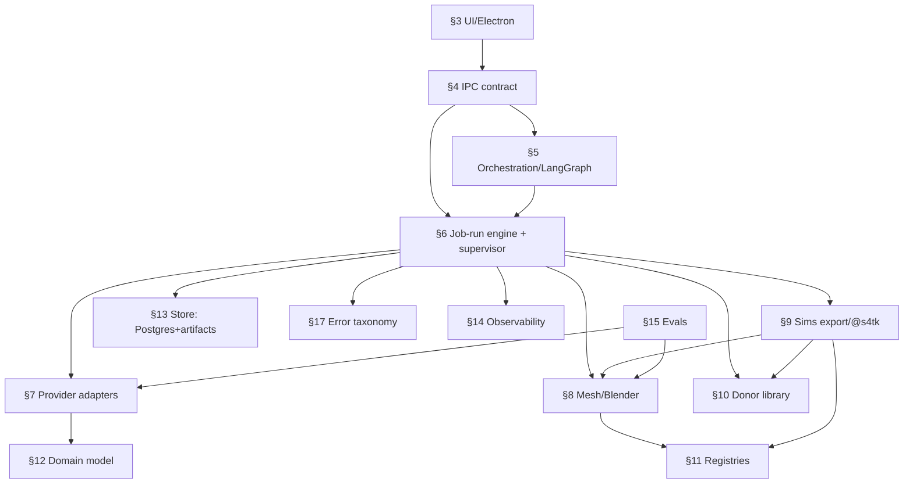

# ARCHITECTURE — AI Sims Creator

> **Build posture:** **production-grade** on a deliberately **open** product surface. Architecturally-correct
> choices are baseline — auth-not-applicable (local single-user), but input validation, error paths,
> idempotency, observability, secrets handling, durability/resumability, and a deploy/rollback path are
> **in-scope requirements**, not deferrable. **Scope guardrail note:** the PRD's anti-overbuild guardrails
> (§27.18, §28.6) are **deliberately loosened by the owner** — the *first target* is full-fidelity
> **real, in-game-placeable export for ALL items + as many functional archetypes as feasible** (not a reduced
> vertical slice). Load-bearing safety/correctness invariants are never cut.
>
> **Build contract:** This is the **binding** design contract (finalized by `/arch-finalize` from
> `docs/planning/*` + `PRD.md` + the gap audit in `docs/gap-audits/`). Downstream (`/tasks-gen` →
> `IMPLEMENTATION_PLAN.md`, the `/tdd` engine, cross-doc-invariant tables) treats this file as source of
> truth and binds to its `§<N>` anchors. Loaded **on demand** per section, never whole.
>
> **Companion docs:** `docs/planning/{PRESEARCH,RESEARCH,DECISIONS,DATA_MODEL,USER_FLOWS,RISKS,DIAGRAM_PLAN}.md`;
> gap audit in `docs/gap-audits/{findings.json,SUMMARY.md,prd-req-coverage.md,anchor-remap.md}`.

## Executive summary
A **local-first macOS desktop studio** that turns a prompt into **installable, in-game-placeable Sims 4
Build/Buy custom content** via a staged, observable, resumable, **LangGraph**-orchestrated pipeline. Four
runtimes: an **Electron UI** (thin, reconnectable observer), a **Python/FastAPI sidecar** (the durable job
owner — graph, engine, repositories, supervisors), a **Blender 5.1 CLI** mesh worker, and a **Node `@s4tk`**
export worker; plus cloud **provider adapters** (concept-image, image-to-3D, LLM) that are async submit/poll
and reconcilable after a crash. **Postgres** (app-managed, pgvector) is the single authoritative store;
artifacts are files on disk referenced by path; **LangSmith** is a fail-open observability + eval mirror.
Everything that could be a fixed list is an **open registry** (placement-types, functional-archetypes, donor
mappings). The two highest-risk subsystems — **Sims DBPF/GEOM export** (clone-an-EA-donor) and **EA
tuning-clone** — are gated behind **feasibility spikes (S1/S2/S3)** before breadth.

> The product is a structured creator studio, not a one-shot generator: AI plans/generates/repairs within
> bounded, observable, human-gated stages, and the unit of value is *one in-game-placeable Build/Buy object*.

## §1 — Goals & non-goals
**Goals:** (G1) prompt → installable Sims 4 Build/Buy collection; (G2) **real, in-game-placeable export for
ALL items** (verified by test-install); (G3) **extensible functional behaviors, as many as feasible** via
registry; (G4) full creator UI (11 screens + onboarding/Settings + dev panel); (G5) UI/pipeline decoupled via
mock+real adapters; (G6) observability + 9 eval harnesses from day one; (G7) resumable, recoverable,
cost-aware, multi-swatch generation.
**Non-goals:** CAS / animation / **arbitrary novel scripted gameplay** (feasibility wall — distinct from the
open archetype registry); multi-user/accounts/collaboration; marketplace; guaranteed any-prompt→any-object;
**public/commercial distribution** (MVP = non-commercial, few known users); broad Windows packaging
(architecture stays portable; validation deferred).

## §2 — System overview
End-to-end: *onboarding(keys/paths) → New Project → prompt → Collection Plan + Style Bible (LLM) → [gate] →
concept images (adapter+bakeoff) → [gate] → image-to-3D mesh (adapter+bakeoff) → mesh QA → Blender cleanup +
**game-ready GEOM** + preview → archetype map (registry+donor) → curate (multi-swatch) → optional functional
overlay (donor tuning-clone) → [gate] → validation (incl. DBPF round-trip) → DBPF export (clone-a-donor,
atomic) → [gate] → test-install → in-game verify.* The **sidecar** owns durable state; the **UI** observes
over SSE and can crash/reconnect without losing pipeline state. Five human review gates (plan/concept/mesh/
overlay/export) are LangGraph `interrupt()` points; an unsupported-item inline confirmation is a sixth,
per-item decision. Subsystems and their import directions are in §2.5.

## §2.5 — Subsystem dependency DAG & parallelization seams
**Import-direction rule:** `UI(§3) → IPC(§4) → {orchestration(§5), engine(§6)} → {providers(§7), mesh(§8),
export(§9), donor-lib(§10)} → {registries(§11), domain(§12), store(§13)}`; cross-cutting (§14 observability,
§16 security, §17 errors, §21 config) and the **frozen contracts** are imported by all. **No upward or
cross-sibling imports.** The sidecar (§5/§6) is the only writer of Postgres + the canonical artifact tree;
workers (§8/§9) write only to sidecar-provided scratch dirs and return paths.

**Independent (parallel) build TRACKS** (after the frozen contracts in §4/§7/§8/§9/§11/§17 are pinned):
- **A — UI** (§3, all screens + onboarding) against **mock adapters/sidecar**.
- **B — Pipeline core** (§5/§6/§12/§13 graph, engine, reconciler, repos, mock stages).
- **C — Sims export** (§9 @s4tk + atomic write) — *spike-gated (S1)*.
- **D — Mesh/Blender** (§8 cleanup + game-ready GEOM + render bridge) — *spike-gated (S1)*.
- **E — Providers** (§7 image-gen/image-to-3D/LLM adapters + bakeoffs).
- **F — Observability + evals** (§14/§15 LangSmith + metric layer).

**Corrected cross-edges (audit fixes):** **C and D are NOT fully independent** — they meet at the
**GEOM-bytes worker seam** and must be sequenced together for S1 placeability verification (mocked GEOM bytes
let C proceed pre-S1). **F→D**: mesh/image-fidelity evaluators depend on the **Blender render bridge** (§8), so
a *render-only* Blender capability is sequenced ahead of the S2 bakeoff; F's schema/dataset/CI scaffolding +
image-only metrics are independent. **B→C, B→D**: the engine integrates both worker subsystems (these are the
B↔(C,D) merge points the sidecar owns).

**Shared contracts across seams (freeze before tracks fork):** `ErrorEnvelope` (§17), IPC schema (§4),
provider interfaces (§7), `BlenderJob`/`ExportJob` worker contracts (§8/§9), registry-entry schemas (§11),
the **GEOM-bytes** worker payload (§8↔§9), and the domain types in **Appendix A**.

## §3 — UI / Frontend
Electron shell + web UI (React-class). **12 surfaces:** UI-001…011 (dashboard, wizard, plan review,
generation workspace, concept review, collection board, item detail, functional wizard, validation center,
export center, dev panel) **+ Onboarding/Settings (§18)**. **Creator vs Advanced mode** gate. **Thin
observer:** issues REST commands (§4), renders server-driven state from SSE; the **sidecar is the source of
truth** — UI holds no durable pipeline state and reconnects via `Last-Event-ID` replay after a crash.
Long jobs never block the UI (all progress over SSE); per-item+stage progress; cancel/skip surfaced. Cost
estimate + soft-budget warning shown. Error-surfacing states (warnings/blockers/partial/failed) are driven in
tests by mock failure injection (§15). Builds against **mock adapters** first (Track A). a11y/i18n: English-
only MVP, string-externalization seam left; keyboard + status-badge contrast baseline — **flagged deferral** (§20).

## §4 — IPC contract  *(frozen contract)*
FastAPI on a dynamically-chosen free localhost port, **loopback-bound only**, with a **per-launch shared
token** (sidecar generates a random token, hands it to the Electron renderer over the trusted parent→child
channel; every REST/SSE/cancel request must present it — rejects others; mitigates DNS-rebinding/local-process
attacks, §16). **`contractVersion`** negotiated at `/health`. Surfaces:
- **REST commands** (each: METHOD path · request schema · success response · error codes via `ErrorEnvelope`):
  `POST /projects`, `GET /projects`, `POST /projects/{id}/runs` (start/resume), `POST /runs/{id}/gate` (approve/
  reject/edit a gate), `POST /items/{id}/regenerate` (concept|mesh|cleanup), `POST /items/{id}/include`,
  `POST /items/{id}/functional`, `POST /projects/{id}/validate`, `POST /projects/{id}/export`,
  `POST /projects/{id}/test-install`, `POST /steps/{id}/rerun`, `DELETE /jobs/{id}` (cancel),
  `GET/PUT /settings`, `POST /settings/providers/{p}/test`. Commands carry an **idempotency key** (R9).
  Per-endpoint **success-response bodies** embed the §12 domain entities (`responses.py`: CREATE→`Project`,
  run/gate/regenerate/test-install→`PipelineRun`, include→`ItemSpec`, functional→`FunctionalOverlay`,
  validate→`list[ValidationResult]`, export→`ExportArtifact`, rerun→`Step`; protocol acks for cancel/settings/
  test-provider).
- **SSE event taxonomy** (`GET /projects/{id}/events`, resumable via `Last-Event-ID`), each a typed payload:
  `progress`, `step-state`, `log`, `validation`, `cost`, `gate-needed`, `done`, **`error`** (`ErrorEnvelope`).
  Domain-typed payload fields are the §12 enums (`step-state`/`done` status → `StepState`/run-terminal subset;
  `validation` severity+scope → `Severity`/`ValidationScope`; `gate-needed` gate → `GateKind`), not loose
  strings (0.4b/D15).
- **Cancel:** `DELETE /jobs/{id}` flips a cooperative cancel flag (see §17 cancel semantics).
**py↔ts sync (frozen guarantee):** pydantic models are the single source → JSON Schema → generated TS (UI) +
Node (worker) types; **CI drift gate** fails on divergence. All persisted entities carry `schemaVersion`.
**0.6 codegen (`python -m aisims_contracts.codegen`):** `models_json_schema` aggregates all 7 contracts → one
combined `$defs` → `json-schema-to-typescript` (pinned 15.0.4) emits `packages/contracts/generated/{contracts.ts,
helpers.ts}`, **deterministic** (fixed banner, sorted keys, no timestamps). `--check` (the pure-Python primary
gate) + a GitHub Actions job enforce drift; generated artifacts are committed + **never hand-edited** (the gate
enforces, forbidden-pattern 2). `ErrorCode` ships a `parseErrorCode→SYSTEM` tolerant-consumer helper. `packages/
contracts` carries a standalone `package.json` for the emitter (`pnpm install --ignore-workspace`).

## §5 — Pipeline orchestration (LangGraph)
`StateGraph`, one node/subgraph per stage; typed `State` (a pydantic model, reconciled with Appendix-A domain
types — State references domain entities by id, does not redefine them) carrying artifacts + provider job-refs
+ status. **Cloud steps = two-phase nodes:** `@task`-wrapped idempotent submit → persist `ProviderJobRef`
**before any side effect** → poll/reconcile node (prevents double-billing under replay, R9). Approval gates =
`interrupt()`/`Command(resume)` (survive process exit). `durability='sync'` for cloud/long stages,
`exit`/`async` for cheap deterministic ones. **Checkpointer = `langgraph-checkpoint-postgres`** (same DB as
§13; **ownership partition: the checkpoint is authoritative for in-flight graph-execution position ONLY**; the
app repository owns PipelineRun/Step/candidate/variant rows). *Verify `langgraph-checkpoint-postgres` parity
with the SQLite saver at build start (ADR-002 note); fall back to SQLite checkpointer in a separate file if
unavailable.*

**Phase-2 spine (2.1/2.2 skeleton — `services/pipeline/graph/`, core track).** The graph-runtime `PipelineState`
(`graph/state.py`) references §12 entities **by id** and imports their enums from `aisims_contracts` (never redefines
them): `{projectId, runId, itemStates: dict[str,ItemState], providerJobRefs, gateCursor: GateKind|None, artifactRefs,
pollErrors}`. The 5 ordered approval gates are `interrupt()`/`Command(resume)` with a `GateKind`-keyed ordered-gate
guard (`graph/gates.py`) as the **Inv5 enforcement point** (rejects an out-of-order / unknown-gate resume). Cloud
stages are **two-phase**: a `@task` submit node (result-checkpointed) persists the `ProviderJobRef` into State
**before any side effect**, then a `<stage>_poll` reconcile node (R9 no-double-submit on replay). **`durability='sync'`
is a runtime `invoke`/`stream` arg in langgraph 1.2.5 — NOT a `compile()` kwarg** — so `build_graph` compiles
checkpointer-only; the 'sync' convention is applied by the run-start caller. Checkpointer factory =
`langgraph-checkpoint-postgres` primary with a separate-module SQLite-saver fallback (ADR-002): SQLite = deterministic
unit path, PG = env-gated `AISIMS_TEST_DATABASE_URL`.

## §6 — Job/run engine + supervisor
Distinct from the graph. Schedules items **bounded-parallel** with **two separate caps** (a *cloud-submit*
concurrency cap and a *local-Blender-subprocess* cap — different hot paths; defaults are human-set config
knobs, §21), **one active project**; block-and-queue on saturation. Streams progress to §4. **Startup
reconciler** (decision-table, R-e): `job_id pollable → re-poll`; `job_id expired/GC'd → step failed + offer
regenerate`; `provider-succeeded-but-artifact-missing → re-fetch then regenerate`; all app-side writes in DB
transactions; **single-writer lock carries owner-PID + heartbeat** so a stale lock from a dead process is
reclaimable on reopen. **Supervisor** (REQ-O-103): free-port pick, spawn + `/health` poll + supervised
restart-with-backoff + **process-tree teardown** for Postgres, Python sidecar, Blender, @s4tk; no orphan
ports/processes.

**Supervisor + single-writer lock (0.9 skeleton — `engine/supervisor.py`, `engine/lock.py`).** The supervisor does
free-port pick → `spawn` → health-poll (a running-predicate in Phase 0; real HTTP `/health` Phase 2) → capped
deterministic **restart-with-backoff** → **process-tree teardown** (`start_new_session` + `killpg`; no orphan
child/grandchild/port). The **single-writer lock** is on-disk, carrying owner-PID + heartbeat/ttl: a **live owner
always holds**; reclaim is gated on a **dead owner PID only** (heartbeat/ttl ride as metadata for Phase-2 PID-reuse
disambiguation + fencing, *not* consulted by the reclaim gate — so a GC pause / swap can't trigger a double-writer
reclaim). `release()` is idempotent. Atomic-acquire (close the acquire TOCTOU) + a fencing token are Phase-2.

**Phase-2 scheduler + reconciler (2.3/2.4 — core track).** The **scheduler** (`engine/scheduler.py`, distinct from the
graph) bounds item work by two independent `ResourceKind`-tagged `asyncio.Semaphore` caps (cloud-submit /
local-Blender), block-and-queue on `acquire`, per-item failure isolation via a `dict[str,UnitResult]` map (catch
`Exception`, **not** `BaseException` — cancellation propagates), and a one-active-project **reject** guard
(`ProjectBusyError`, released in `finally`) — an in-memory guard **distinct** from the 0.9 on-disk `SingleWriterLock`.
The **startup reconciler** (`engine/reconciler.py`) is a pure decision-table `decide(poll_status, artifact_present) →
{RE_POLL, RESUME, RE_FETCH, REGENERATE}` with the re-fetch→regenerate escalation (re-fetch fails / no urls) and a
conservative human-gated REGENERATE on a poll-raise; FS/provider deps injected; decision-only (the transactional "step
FAILED" write + regenerate re-enqueue are the 2.7 run-start integration). `reclaim_stale_lock` reuses the 0.9
**dead-PID-only** reclaim on reopen (a LIVE owner is never reclaimed; atomic-acquire + fencing stay the Phase-2+
upgrade).

## §7 — Provider adapters  *(frozen contract)*
Three interfaces, mock+real behind each (PIPE-002/003), model-agnostic + **bakeoff** (no model lock-in):
- `Image3DProvider`: `submit(image,params)→ProviderJobRef · poll(ref)→{status∈PollStatus,progress,urls?} ·
  fetch(urls)→localArtifacts`. Seeds (co-primary): **Hunyuan3D-2.x + Tripo3D v2.5** via **fal** + **WaveSpeed**;
  bakeoff = EVAL-003.
- `ImageGenProvider`: same submit/poll/fetch; seed default **FLUX.2 [pro]** (`transparent_bg`); **WaveSpeed**
  default + Replicate/fal/OpenRouter alternates; rembg fallback; bakeoff = EVAL-002. *(OpenRouter image-to-3D
  coverage unverified → research-required, §22.)*
- `LLMProvider`: `complete()/structured()`; **Claude direct + OpenRouter** (both); default Claude class;
  **API-key auth** (Claude subscription/OAuth = research-required, likely unsupported for a custom app, §22).
`ProviderJobRef = {provider, model, jobId, submittedAt, expiresAt?}` persisted in graph State + Postgres
(reconcile spine). Webhook where available, poll-on-resume fallback. **Tripo 24h URL expiry**: download
promptly; happy-path expiry race → re-submit; reconcile → re-download if not persisted. Results carry
**cost+latency** (latency MUST be recorded for every cloud op; cost SHOULD, with a per-model price-table
estimate fallback from §21 config). **Provider-output validation (§16):** max-bytes streaming cap +
magic-byte/content-type check + path sanitization before persisting/feeding Blender.

**Mock framework (0.8 — `services/pipeline/adapters/mock/`).** A mock implements each of the three Protocols
(exposed as constructors + a thin factory helper; **no global self-registration** — provider *selection* is Phase-2
via the registry seam §11, the load-time validator is 0.5c). Mocks are **seeded-deterministic** (every output a pure
function of `(seed, call-seq)`; **no wall-clock** — fixed epoch + offset, `expiresAt = submittedAt + 24h`). The async
lifecycle polls `SUBMITTED→RUNNING→SUCCEEDED` (default `succeed_after_polls=3`, so both non-terminal states are
poll-observable for a Phase-2 resume); `usage.latencyMs` is always set. `fetch()` writes placeholder bytes **only**
under the sidecar-provided scratch dir and returns sanitized, scratch-guarded basenames (rule 3). Deterministic
**failure injection** (`FailurePlan` / `FailureRule` over a `MockOp` set {POLL, COMPLETE, STRUCTURED, BLENDER_RUN,
EXPORT_RUN}; SUBMIT/FETCH have no contract error channel, so a submit-class failure surfaces at first poll) spans the
full §17 taxonomy — see §17.

## §8 — Mesh / Blender subsystem  *(frozen `BlenderJob` worker contract)*
**Blender 5.1.x + Python 3.13, Apple-Silicon**, invoked as a **CLI subprocess** (`blender --background
--factory-startup --python`; GPL boundary clean; crash isolation; decouples sidecar Python from Blender's
3.13) — the production path. **Spike arms (S1, EVAL-004, honoring PRD §15.4/§17.2):** {CLI-subprocess
(default) vs bpy-in-process} × {deterministic-core vs deterministic+**agentic-MCP-repair** hybrid} — MCP is
evaluated as an arm for judgment-heavy repair (PRD forbids premature rejection), not pre-excluded; outcome
recorded. **Game-ready gate** (the hard gate before export): rescale to donor bbox, floor-centered origin,
**normal recalc/transfer** (S4S drops normals → invisible meshes), UV validation (uv_0 + uv_1), meshgroup-count
match, **3–4 LOD + shadow-LOD generation**, per-tile poly budget (~2000 tris/tile LOD0). **GEOM export = a
distinct stage with immediate structural validation** (fast GEOM check before packaging — fail at GEOM, not at
install). **Render bridge:** `blender --background` multi-view render (headless GPU offscreen is broken on
Apple Silicon → Blender is the only viable renderer) — also serves EVAL-002/003 (render-only capability
sequenced before S2). `BlenderJob{input: meshPath, params, donorBBox, jobId} → BlenderReport{geomBytesRef,
previewRef, gateMetrics{normals,uv,lods,polyByTile,meshgroups}, status, error?}` over a job-file/result-file
envelope. **Hang watchdog (§17):** wall-clock deadline + heartbeat → kill+retry-once → structured error.

## §9 — Sims export subsystem  *(frozen `ExportJob` worker contract)*
**Node `@s4tk`** worker (vendor-pinned), **clone-an-EA-donor**: open donor `.package` (from the Donor Library,
§10) → swap **GEOM** (bytes from §8) + DST/DDS textures + thumbnail + COBJ catalog → **preserve OBJD→tuning,
FTPT, RIG, SLOT** for functional clones → re-serialize. Required resource set asserted in validation: OBJD,
COBJ, MODL, MLOD, GEOM/LOD, FTPT, RIG, _IMG/DST, thumbnails; OBJD tuning instance resolves. **Atomic write
(R-e):** write to temp → fsync → **DBPF round-trip + structural validation** → atomic rename into the app
output dir; **test-install copies** the validated artifact into the Mods folder (never builds in place; no
clobber without confirm; donors opened read-only). `ExportJob{donorRef, geomBytesRef, textures, tuningEdits,
targetTGIKeys, jobId} → ExportJobReport{packagePath, includedItems, resourceManifest, status, error?}`
(the worker result — named `ExportJobReport` to stay distinct from the §12 domain `ExportReport` summary; the
report's `status`↔outputs consistency is contract-enforced — deterministic worker-output validation, rule 6).
**Partial success = per-item packages each individually complete-and-valid**, never a half-written file. The
mesh→GEOM half (§8) is the #1 risk; this packager half is feasible on Mac (@s4tk). Functional behavior =
which donor archetype is cloned (§10/§11), not extra mesh work.

## §10 — Donor Library subsystem
Clone-a-donor's foundation. **Scan/index** the user's Sims 4 install (FullBuild packages) into a local donor
catalog; **resolve + validate** every active DonorMapping (§11) against the indexed catalog; **missing/DLC-
gated/unowned donor behavior** (R-m, PRD §10.3): offer **convert-to-nearest registered placement/archetype**
(inline user confirmation = the 6th gate) or **mark item `unsupported`** with a creator-friendly reason.
Maintainer browse/validate/repair in the dev panel. Donor index entities persisted in Postgres; donor
`.package` bytes never modified. **Licensing:** non-commercial, user owns the game, donors from their own
install — standard Sims-modding posture (RISKS + research-required note; not a blocker for few-known-users).

## §11 — Registries  *(frozen entry schemas)*
Open, data-driven, **version-controlled config files = source of truth**, loaded + validated into Postgres as a
read cache/index at startup (each carries a `registryVersion`). Three registries with specified entry JSON +
rule sub-grammars: **PlacementType** `{id,name,donorRef,footprintRules}`; **FunctionalArchetype**
`{id,name,donorRef,tuningGraftRules[],eligibilityRules[],validationRules[]}`; **DonorMapping**
`{key,donorObjectKey,requiredResources[],tuningKeys[],preserveKeys[]}`. Adding an entry = config + donor +
test (no engine rewrite, ADR-010). The tuning-graft + eligibility sub-grammars are pinned by **spike S3**
(one archetype proves the schema) — the 0.5c contract freezes each rule list as `list[RuleSpec{kind,params}]`
(open) pending S3, and `validate_registry` is Inv6's eventual load-time enforcement point. Decorative generation
is unconstrained by item type.

## §12 — Domain model & data/state
Entities, relationships, **state machines**, invariants: `docs/planning/DATA_MODEL.md` (the canonical domain
artifact, reconciled to this contract). **Audit-added states (R-d):** item `skipped` (≠ `excluded`, re-entry →
`concept-pending`), item `unsupported` (→ convert/`planned` via inline confirm, or terminal), item user-
`cancelled` (→ prior `*-pending`); **`AssetVariant` state machine** `candidate→selected→locked` (`selected→
superseded` on re-select; confirmation-gated exit from `locked`, Invariant 4); Project `exporting→{exported|
export-failed}` (+ cancel/fail → `curating`); FunctionalOverlay `invalid→draft` (reconfigure-revalidate);
verification states `test-installed→{in-game-verified|in-game-failed}` + a `ReviewEvent` capturing the manual
result. **Source-of-truth (R-a, single binding pick):** **Postgres = authoritative** for all relational/state
(incl. authoritative Trace summaries + ReviewEvents for OBS-004/EVAL-009); **filesystem = artifact bytes
only**, referenced by path; **LangSmith = derived, fail-open mirror** for the dev/observability UX.

## §13 — Data store & artifacts
**App-managed local Postgres** (pgvector, JSONB, **Alembic**) = single relational/state store + LangGraph
checkpoint (§5). **Artifacts (meshes/images/packages) = files on disk**, canonical layout by
project/item/candidate, **write-bytes-then-commit-row ordering** (a crash leaves an orphan file, never a
dangling ref); the **sidecar repo layer is the only writer** of the canonical tree (workers write scratch +
return paths, §6). **Migration & versioning (R-i):** project folders stamped with `schemaVersion` +
`registryVersion`; a migration runner on project-open (Alembic DB + on-disk layout + registry content);
"dependency changed (Blender/@s4tk/GEOM-exporter pin) → re-validate cached donors/GEOM" path. Backup = copy
project folder + `pg_dump`. Secrets: **OS keychain** (encrypted-file fallback), never in DB/logs/traces.
**0.7 store skeleton:** the sidecar **repository layer** (`services/pipeline/store/`; `Repository[T]` + per-aggregate
concretes) is the SOLE writer (rule 3) — persistence is **hybrid** (key/indexed columns + the versioned entity as
**JSONB** carrying `schemaVersion`; SQLAlchemy 2.0 async + Alembic; `JSONB().with_variant(JSON,"sqlite")` for the
test layer). `open_store` stamps {schemaVersion, registryVersion, appVersion, dataDirVersion} + **REFUSES** an
incompatible store on re-open (`IncompatibleStoreError`). The write-ordering helper `commit_artifact` does
bytes→`fsync(file+dir)`→repo-owned commit-row (crash ⇒ orphan, never a dangling row) and holds **no DB handle**
(structural sole-writer guard) + sanitizes canonical path segments (rule 4). Migrate-runner + the full per-entity
repos are Phase-2.

## §14 — Observability
**LangSmith** (hosted) via env-var/callback, instrumented over a **thin tracing seam** (Phoenix/Langfuse =
low-cost swap; eval-backbone portability is a *separate* seam from observability-backend portability, ADR-007/
008 reconciled). **Fail-open (R-, non-blocking):** trace export is a background queue with a short export
timeout + drop-on-timeout — a slow/hanging *or* offline LangSmith never stalls or fails a generation run; a
trace-loss counter is surfaced in the dev panel. **Egress:** only traces/metadata + artifact *references*
(binaries stay local); the **redaction chokepoint (§16)** guarantees no secrets/PII leave. Authoritative
Trace summaries + ReviewEvents live in Postgres (§12); LangSmith is the derived mirror. Privacy disclosure +
opt-out in Onboarding/Settings (§18).

**Fail-open tracing seam (0.9 skeleton — `obs/tracing.py`).** A background export queue + worker; each export runs in
a fresh daemon thread with `join(timeout)` so one hung export can't clog the next. `emit` is `put_nowait` on an
unbounded Phase-0 queue (never blocks/raises); a timeout / exporter-error ⟹ **drop + bump the trace-loss counter**,
never raising into the caller. The exporter is injected/pluggable (backend-portable — Phoenix/Langfuse swap; real
LangSmith config Phase 8). **Spans are redacted (§16) before export** — no unredacted egress even on success. Queue +
in-flight-thread **bounding (drop-on-full) is Phase-8**.

## §15 — Evals & testing
**Backbone = LangSmith-native** (datasets, `evaluate()`/`evaluate_comparative()` for the bakeoffs, annotation
queues for human-preference, `@pytest.mark.langsmith` CI gating, `agentevals` trajectory). **Metric component
layer (framework-agnostic):** mesh = trimesh + Open3D 0.19 (Chamfer/Hausdorff/F-score, ARM64) + PyMeshLab;
image = torchmetrics (LPIPS/SSIM/PSNR/CLIPScore) + IQA-PyTorch; silhouette = rembg/BiRefNet IoU; image-to-3D
fidelity = **Blender render bridge** (§8, hard prerequisite of EVAL-002/003 — render-only Blender before S2);
subjective = Claude-vision judge (vendor-neutral). **9 harnesses (EVAL-001…009):** EVAL-004 restated =
{CLI vs bpy} × {deterministic vs **+MCP-repair** hybrid} (MCP arm restored per PRD); **EVAL-006** golden
mappings → reframed as **registry-seed test set** (not fixed archetypes); **EVAL-007/008 split** into an
**automatable tier** (DBPF round-trip → reparse with @s4tk → assert required resource set + OBJD-tuning
resolves + GEOM normals/UV/meshgroup) and a **manual in-game tier** (test-install placeability/behavior →
ReviewEvent). **Reference meshes:** a named 5–10-item CC0/hand-authored benchmark set (license + DVC location)
for Chamfer/Hausdorff; **live** generations score via render-compare + self-consistency (no ground truth).
**Mock parity (R):** each mock adapter exposes a deterministic **failure-injection mode** spanning the
`ErrorEnvelope` taxonomy; an acceptance bullet requires every error-surfacing UI state to be driven by a mock
failure. **Contract tests** on IPC/provider/worker/registry/error schemas. Aesthetic/IQA scores are
directional, **never hard gates**. Pin judge model + metric weights for CI determinism; `LANGSMITH_TEST_CACHE`
+ `LANGSMITH_TEST_TRACKING=false` for offline/cheap CI. Evals = dev/CI only, not shipped.

## §16 — Security & trust boundaries
Six boundaries (full table: `RISKS.md`): **UI↔sidecar** (loopback bind + per-launch token + schema-validate
every command; sidecar = sole writer); **sidecar↔cloud** (keys from keychain at call time only; **provider-
output validation** — bytes cap, magic-byte/content-type, path sanitize — before feeding Blender/persisting;
cost/rate handling); **sidecar↔LangSmith** (fail-open; redaction; refs not binaries); **sidecar↔workers**
(validate in/out; **deterministic validation gate before any state write** — LLM outputs → pydantic; Blender
game-ready params + GEOM output → structural check; @s4tk → DBPF round-trip; MCP/agent outputs never written
unvalidated, MCP-003/ORCH-004); **export↔game install** (donors read-only; atomic temp-write+rename into Mods;
no clobber without confirm + backup). **Redaction chokepoint (R-h):** a single secrets accessor (keys never
enter LangGraph State/logs) + a structured-logging redactor + an enumerated secret/PII set, applied at every
egress (logs, traces, error envelopes).

**Redaction chokepoint impl (0.9 — `obs/redaction.py`, `obs/secrets.py`; safety rule 5).** A single `SecretsAccessor`
(get-by-name + `active_values`; values never persisted; `repr`/`str` are redacted; real OS-keychain accessor Phase 7).
The redactor scrubs (a) active secret **values** (substring `re.sub`, every occurrence) + (b) a best-effort
case-insensitive secret/PII **pattern** set — **the GUARANTEE is accessor registration; the patterns are a
defense-in-depth net** for unregistered tokens. **PINNED (non-waivable):** `redact_envelope` scrubs **both**
`ErrorEnvelope.creatorMessage` and `maintainerDetail` (+ `suggestedAction`, defense-in-depth) before any egress,
**fail-closed** (a redactor error ⟹ placeholder, never raw). `redact_span` is **recursive** (nested dicts/lists) so no
nested value bypasses the chokepoint. `traceRef` is not an egress surface yet (Phase-2 check when populated). Egress
sites wired now: the tracing exporter + structured logging; the SSE error-event call site is Phase-2/7.

## §17 — Error taxonomy & failure handling  *(frozen `ErrorEnvelope` contract)*
**`ErrorEnvelope` = the 6th frozen contract:** `{code (stable enum, namespaced per stage: PROVIDER_TIMEOUT,
PROVIDER_RATE_LIMIT, PROVIDER_AUTH_QUOTA, PROVIDER_OUTAGE, ARTIFACT_EXPIRED, MALFORMED_OUTPUT, MESH_QA_FAILED,
GEOM_EXPORT_FAILED, DBPF_WRITE_FAILED, TEST_INSTALL_FAILED, DISK_FULL, VALIDATION_FAILED, SYSTEM…), category
(provider|network|validation|geometry|packaging|budget|system), retryable:bool, creatorMessage,
maintainerDetail, traceRef, suggestedAction}`. Carried in the SSE `error` event, `Step.error`, and
`ValidationResult`; **every stage (mock+real) emits it**. **Redaction (safety rule 5, non-droppable):** `creatorMessage` and `maintainerDetail` are free-text egress surfaces — the §16 redaction chokepoint MUST scrub them on every egress (logs / traces / SSE) before the envelope leaves the process; the 0.9 redaction impl is **pinned** to cover these two fields. **Provider error classification:** transient
(retry/backoff) vs rate-limited (honor Retry-After, queue) vs **terminal-config** (401/402 → stop, don't burn
retries, creator-friendly "check Settings"); defined run/item terminal state when all configured adapters are
exhausted. **Hang/no-progress watchdog** for subprocess workers **and** cloud poll loops (wall-clock + max-
attempts → kill/abort + structured error). **Bounded LLM repair loop** (max-K validate→repair, then terminal
"couldn't produce a valid plan" + cost-accounted). **Cancel semantics:** ack immediately; stop new cloud
submits; cloud-job cancel = stop poll + mark cancelled (note already-billed/abandoned outputs); Blender/@s4tk
cancel = process-tree kill; free the concurrency slot within a budget (§21). **DISK_FULL** path even though GC
is deferred (§20). Test-install failure handling (game/Mods-path missing, write denied) → structured error +
artifact retained.

**Mock failure-injection seam (0.8 — `adapters/mock/failure.py`).** `envelope_for(code)` builds a valid
`ErrorEnvelope` for **every** `ErrorCode` (×13) with the transient-vs-terminal classification above
(`PROVIDER_AUTH_QUOTA` → not retryable; provider timeout/rate-limit/outage → retryable). **Error-channel asymmetry:**
async providers surface a failure in the *result* — `PollResult(status=FAILED|EXPIRED, error=…)` — and workers in
`BlenderReport` / `ExportJobReport(status=FAILED, error=…)` (the rule-6 `model_validator` enforces *failed ⟹ error*);
but the **synchronous** `LLMProvider.complete/structured` have no contract error field, so a failure is **raised** as a
pipeline-local `ProviderError` carrying `.envelope` (candidate to hoist to a neutral `adapters/errors.py` when a
Phase-2 engine path catches it). Injected envelopes are **egress-realistic** (both `creatorMessage` + `maintainerDetail`
populated; a synthetic secret-bearing `maintainerDetail` exists as the **0.9 redaction-chokepoint** test surface,
safety rule 5).

## §18 — Onboarding / first-run / Settings
A required **first-run subsystem** + Settings surface (the 12th UI surface, §3) — the app cannot run a stage
without prerequisites: (1) **provider/LLM API-key entry → keychain** with per-provider **test-call**
validation; (2) **Sims 4 install detection + Mods-path picker** with validation; (3) **Blender/Postgres
bootstrap status + remediation**; (4) a **system-readiness gate** that blocks/queues New Project with
actionable messages when a prerequisite is missing; (5) **privacy/telemetry disclosure + opt-out** (what
leaves the machine: provider prompts/images, LangSmith traces) flipping the thin-tracing seam (§14).

## §19 — Deployment & packaging
**MVP = shareable, non-commercial build for a few known users.** macOS bundle = Electron + **deep-signed,
notarized** PyInstaller (or python-build-standalone) sidecar + **bundled Postgres** + Blender (detect-or-
bundle; if bundled, GPL source link). **Notarization verification plan (R-i):** explicit signing inventory of
every nested binary (sidecar `.so/.dylib`/`base_library.zip`, Postgres + `lib/*.dylib` + **pgvector**, Blender
bundle) with Hardened Runtime + secure timestamp; `notarytool` + staple; **end-to-end verify on a clean
Apple-Silicon machine** in CI before release. **Bundled-Postgres lifecycle:** first-run `initdb` (cluster,
locale/encoding, restricted PGDATA perms, localhost/unix-socket-only), pinned PG major recorded in data dir,
**major-version upgrade path** across app updates. **Rollback/migration (R-i):** every Alembic rev ships a
tested `downgrade()`; **pre-migration auto-snapshot** (`pg_dump`/PGDATA copy) + documented restore; data-dir
**version stamp** + startup compat check (open / migrate-with-snapshot / refuse); app updates drain/quiesce
in-flight runs first. **Deferred (flagged):** installers/auto-update/public-code-signing, Windows.

## §20 — Scope, spikes-as-gates & deferred work
**First target = full fidelity** (real+placeable export for ALL items + as-many-functional-archetypes-as-
feasible). **PRD §27.18/§28.6 anti-overbuild guardrails are deliberately loosened** (owner-confirmed override;
justification: no-timebox, correctness-first, open-registry design). **Spikes remain *feasibility* go/no-go
gates (NOT scope reducers), each with a binary PASS criterion:**
- **S1 — GEOM/DBPF export:** PASS = @s4tk clone-a-donor + a headless-Mac GEOM path produces an object that
  **places in Build/Buy via test-install**. *No GEOM path is yet verified and all three fallbacks (custom
  GEOM writer / pinned-old-Blender microservice / Windows-helper VM) are unverified — S1 is a true go/no-go;
  a sub-spike must prove at least one fallback runs headless on Mac.* (RISKS R1, §22.)
- **S2 — image-to-3D bakeoff:** PASS = Hunyuan3D-2.x/Tripo/TRELLIS produce a mesh that clears the §8 game-
  ready gate on real Sims props.
- **S3 — functional tuning-clone:** PASS = one archetype behaves in-game via donor tuning-clone (proves the §11
  graft schema).
Breadth (all items, all-feasible archetypes) proceeds in parallel where mocked, but **placeability/behavior
breadth is unblocked only after S1/S2/S3 pass** (feasibility, not ambition). **Deferred (flagged seams, not
omissions):** artifact GC (+ DISK_FULL path kept, §17), hard cost caps, manual-Blender-fallback UI, cloud-
Blender, local-3D beyond geometry-only, a11y/i18n beyond baseline, undo/edit-history, public distribution,
Windows. **Out-of-scope frontier:** novel scripted gameplay.

## §21 — Cross-cutting concerns
**Config:** provider/model registry + per-model **price table** (cost-estimate fallback), generation-mode→
candidate-count map, donor/placement/archetype registries (§11), feature flags (local-3D fallback, tracing
opt-out), paths (artifact root, Mods folder), the **two concurrency caps** + per-worker **wall-clock timeout**
defaults (human-set knobs). **Secrets:** keychain (§13/§16). **Cost model:** every cloud op records latency
(required) + cost (best-effort + estimate); run rollup → soft-budget warning (REQ-NF-103). **Performance
budgets (deliberate deferral w/ invalidation):** no numeric SLOs (owner-locked); **falsifiable qualitative
gates** instead — a slow mock stage must not block command-ack or SSE heartbeat (UI-responsiveness test);
perceived-interactive hot paths (plan gen, concept iteration, UI ack, SSE cadence, cold-start) have **no
numeric budget for MVP by choice**, invalidation = "promote to a measured budget if a hot path feels
unresponsive in the anchor run." **Supervisor** (§6).

## §22 — Open questions
1. **S1 GEOM feasibility** — *the* gating unknown (no verified headless-Mac GEOM path; fallbacks unproven).
2. **OpenRouter image-to-3D coverage** — verify (it routes LLM/image, maybe not 3D).
3. **Claude subscription/OAuth** for a custom app — likely unsupported → API-key default; verify.
4. **`langgraph-checkpoint-postgres`** parity with the SQLite saver — verify at build start.
5. **Local-3D MPS fork** viability (feature-flagged, geometry-only).
6. **@s4tk longevity / GEOM provenance** — vendor-pin + round-trip CI; maintain-fork contingency.
7. **Computer-prop archetype** — registry-addable; seeded-or-deferred decision at S3.
8. **Cross-platform (Windows)** — deferred; architecture kept portable.
9. **Donor derivative-content licensing** — non-commercial posture assumed; revisit before any wider distribution.

---

## Spec Anchor Index
Requirement → contract traceability (interview-derived REQs + representative PRD coverage; full PRD walk in
`docs/gap-audits/prd-req-coverage.md`). `tasks-gen` derives REQ→task coverage from this index + each phase's
`Spec anchors:` line.

| REQ ID | Implemented by § | Summary |
|---|---|---|
| REQ-F-101 | §9, §8, §20 | Real, placeable DBPF export for all items (gated by S1) |
| REQ-F-102 | §11, §10, §20 | Extensible functional-archetype registry; as-many-as-feasible (S3) |
| REQ-F-103 | §9, §10 | Clone-an-EA-donor export |
| REQ-F-104 | §9, §12 | Multi-swatch (multiple recolors) |
| REQ-F-105 | §8 | Game-ready geometry (LODs/footprint/normals/UVs) |
| REQ-F-106 | §11 | Open registries (placement-type + functional-archetype) |
| REQ-NF-101 | §6 | Bounded-parallel, two caps, one active project |
| REQ-NF-102 | §6, §5 | Reconcile-and-resume (decision-table, stale-lock recovery) |
| REQ-NF-103 | §21, §3 | Soft budget: cost estimate + warn-before-large-run |
| REQ-O-101 | §9, §15, §18 | Test-install + in-game verification loop |
| REQ-O-102 | §14 | Fail-open observability (non-blocking) |
| REQ-O-103 | §6, §19 | App-bundled-binary lifecycle management |
| REQ-S-101 | §13, §16 | Secrets in keychain + redaction chokepoint |
| REQ-I-101 | §4 | Versioned, mockable UI↔pipeline IPC contract |
| REQ-I-102 | §7 | LLM abstraction (Claude + OpenRouter) |
| REQ-D-101 | §13 | Postgres + artifacts; versioned, migratable |
| REQ-T-101 | §15 | Mock adapters (incl. failure injection) |
| FR-PROJ/PLAN/CONCEPT/3D/BLEND/CURATE/FUNC/VAL/EXPORT/DEV | §3–§13, §15 | PRD §21 functional reqs (see coverage table) |
| AC-001…018 | §2, §3, §8, §9, §15, §20 | PRD acceptance criteria (see coverage table) |
| OBS-001…005 | §14, §12 | Observability/lineage/review events |
| ORCH-001…006 | §5, §6, §17 | Graph/step-state/repair/interruptions |
| PIPE-001…005 | §4, §7, §5 | Stable interface, mock+real, resumable, gates |
| EVAL-001…009 | §15 | Eval harnesses (004 MCP-arm, 006 registry-seed, 007/008 split) |

## Appendix A — Model / contract inventory
Cross-doc invariants (mirrored in the area `CLAUDE.md` table; a field change requires editing the model's `§`
section in the same commit round). **Models crossed by a §2.5 edge = shared contracts across tracks — freeze
before parallel tracks fork.**

| Model | Section | Fields (summary) | Shared contract? |
|---|---|---|---|
| `ErrorEnvelope` | §17 | code, category, retryable, creatorMessage, maintainerDetail, traceRef, suggestedAction | **Yes (all tracks)** |
| IPC command/SSE-event schema (`ipc.py` + `responses.py`) | §4 | endpoint table + per-endpoint **response bodies** (embed §12 entities); event types {progress,step-state,log,validation,cost,gate-needed,done,error} with domain fields typed to §12 enums (`StepState`/`Severity`/`ValidationScope`) + `GateKind`; contractVersion; idempotencyKey; token | **Yes (A↔B)** |
| `ProviderJobRef` | §7 | provider, model, jobId, submittedAt, expiresAt? | **Yes (B↔E)** |
| `Image3DProvider`/`ImageGenProvider`/`LLMProvider` (+ `PollResult`/`ProviderUsage`/`PollStatus`) | §7 | `submit/poll/fetch` → `ProviderJobRef` / `PollResult{status:PollStatus,progress?,urls?,usage:ProviderUsage?,error?}`; `complete→str`/`structured→T`; cost+latency in `ProviderUsage{latencyMs,costCents?}`; open `params:dict[str,Any]` | **Yes (B↔E)** |
| `BlenderJob`/`BlenderReport` (+ GEOM-bytes payload) | §8 | meshPath/params/donorBBox → geomBytesRef/previewRef/gateMetrics/status/error | **Yes (C↔D, B↔D)** |
| `ExportJob`/`ExportJobReport` | §9 | donorRef/geomBytesRef/textures/tuningEdits/targetTGIKeys → packagePath/includedItems/resourceManifest/status/error (refs `min_length=1`; `status`↔outputs `model_validator`, rule 6). **`ExportJobReport` ≠ the §12 domain `ExportReport`** (distinct seam, name disambiguated 0.5b) | **Yes (B↔C)** |
| PlacementType / FunctionalArchetype / DonorMapping | §11 | entry JSON + rule sub-grammars; registryVersion | **Yes (C/D↔registries)** |
| Project / CollectionPlan / StyleBible / ItemSpec | §12 | see DATA_MODEL.md | Yes (A↔B) |
| ConceptCandidate / MeshCandidate / AssetVariant / Swatch | §12 | see DATA_MODEL.md (+ AssetVariant state machine) | Yes (A↔B) |
| FunctionalOverlay | §12 | sourceItemId/variantId, archetype, donorRef, tuningGraft, validationStatus, exportMode | Yes |
| PipelineRun / Step | §12, §6 | status(8), inputs/outputs, attempts, error(ErrorEnvelope), cost?, latency | Yes |
| ValidationResult / ExportArtifact / ExportReport / ReviewEvent / Trace | §12, §14 | scope/severity/message; package manifest + human-readable export summary (ExportReport, embedded under ExportArtifact); preference/verification events | Yes |
