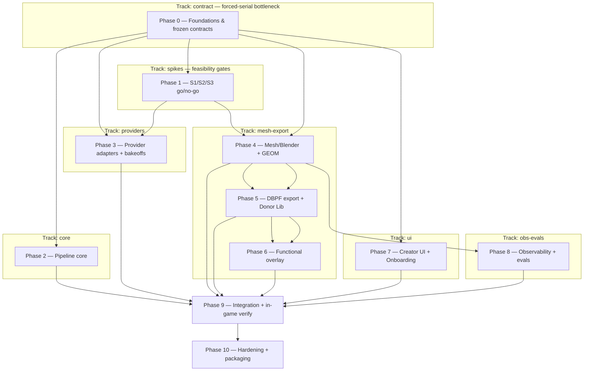

# IMPLEMENTATION_PLAN — AI Sims Creator

> **Phase note.** Spec-anchored build plan decomposed from the binding `ARCHITECTURE.md` (§1…§22 + Spec Anchor
> Index + Appendix A). **Build posture: production-grade** on an **open** surface — first target = full-fidelity
> real, in-game-placeable export for ALL items + as-many-functional-archetypes-as-feasible (PRD anti-overbuild
> guardrails owner-loosened). **Spikes S1/S2/S3 are feasibility go/no-go gates** (ARCHITECTURE §20) — breadth of
> placeability/behavior is unblocked only after they pass. Production concerns (error paths, idempotency,
> observability, security, durability, deploy/rollback) are first-class early tasks. **No demo phase** (the
> acceptance bar is the real test-install in-game verification, in the spine). Every phase anchors to the
> contract; drift surfaces at TDD Step 9.
>
> **Reading discipline.** Read by section, not whole.

> **Session protocol:** orchestrator `/orchestrate-start` · implementer `/session-start`; ends via
> `/session-end` + `/orchestrate-end`. (Standard — see template.)

> **Reference deadlines:** none — correctness-first, no hard timebox. Sequencing floor = the spike → mesh →
> export → functional → integration critical path (below).

> **Spec-anchor convention (architecture-as-contract).** Each phase carries `**Spec anchors:**` (the
> `ARCHITECTURE.md §` it implements), a `**Track:**` tag, and `**Depends on (phases):**`. Re-read anchors at
> session start; a behavior the anchors don't cover = a cross-doc invariant flag at Step 9.

---

## Currently in progress

**Phase 0 — contract track.** 0.1 (scaffold) + 0.2 (ErrorEnvelope) + 0.3 (IPC contract) **LANDED** on
`track/contract` (`143381a`, `c93215b`, `e7b628a`; + `b0c3803` spec-lint tooling). Commit gate operational
(hooks regenerated machine-valid; gitleaks blocking). Orchestrator round docs (ARCHITECTURE/CLAUDE/
IMPLEMENTATION_PLAN edits + 2 briefs + decision file) **accumulating uncommitted** for the `/orchestrate-end`
round commit + push (next trigger: context auto-cycle at ACTION, Phase-0 exit, or user return).

**Next session target:** `0.4a` (Domain types — 16 entities + state-machine enums + structural invariants +
`domain.schema.json`) **IN FLIGHT** (split from 0.4 per D16, lead-approved). `0.4b` (IPC completion: REST
response bodies + the str→domain-enum tightening of 0.3's 4 SSE fields + `GateKind` import + `ipc.schema.json`
re-freeze) follows, **depends on 0.4a**. Inv1 (full exportability gate) + Inv5 (ordered approval gates) are
PINNED, non-droppable **Phase-2** safety acceptance items (D16) — 0.4a encodes only the structural part.

---

## Carry-forward to upcoming briefs

- **ErrorEnvelope `code` consumer-tolerance (origin: 2026-06-17 · 0.2 / D10b).** UI SSE/IPC deserialization + the 0.6 TS codegen type MUST degrade gracefully on an unrecognized `code` → map to `SYSTEM`, so a future additive enum split (e.g. `PROVIDER_AUTH` + `PROVIDER_QUOTA`) is non-breaking. The 0.2 producer model stays a STRICT closed enum (RED #4 + `extra="forbid"`); tolerance lives in CONSUMERS. **Last-consumer-slice: 0.6** (codegen) + Phase 7 (UI deserialization). Strict model + tolerant consumers = the production-grade combo.
- **⚠ SAFETY-TRACKED (rule 5, non-droppable) — ErrorEnvelope redaction-egress (origin: 2026-06-17 · 0.2).** `creatorMessage` + `maintainerDetail` are free-text PII/secret-bearing egress surfaces — the §16 redaction chokepoint / §14 tracing MUST scrub them before any logs/traces/SSE egress. Marked at the model via inline code comment + anchored in `ARCHITECTURE.md §17`. **Encoded as a PINNED, non-waivable acceptance bullet in task 0.9** (the obs/redaction seam) — the redaction impl cannot ship without a test covering both fields. **Last-consumer-slice: 0.9.**
- **ErrorEnvelope JSON-Schema field titles (origin: 2026-06-17 · 0.2).** pydantic auto-derives schema `title`s from field names (`creatorMessage` → "Creatormessage"); these bake into the snapshot and surface in the 0.6 TS-codegen JSDoc. Set proper `Field(title=…)` (or handle in codegen) in **0.6** so generated consumer types read well — deferred to avoid churning the 0.2 freeze snapshot.

---

## Deliverable map

<!-- ▼ EXAMPLE BLOCK [id=deliverable-map]: deliverable map — project's real required outputs (customized). ▼ -->

| Deliverable | Status | Delivered by |
|---|---|---|
| Frozen contracts package (IPC, domain, provider, worker, registry, ErrorEnvelope) + py↔ts codegen | ❌ | Phase 0 |
| Spike verdicts S1 (GEOM/export go/no-go) · S2 (3D bakeoff) · S3 (tuning-clone) | ❌ | Phase 1 |
| Resumable pipeline core (LangGraph + Postgres + engine + reconciler) on mocks | ❌ | Phase 2 |
| Real provider adapters (image-gen, image-to-3D, LLM) + bakeoffs | ❌ | Phase 3 |
| Game-ready geometry (Blender cleanup + GEOM + LODs + render bridge) | ❌ | Phase 4 |
| Real, in-game-placeable DBPF export (clone-a-donor) + Donor Library | ❌ | Phase 5 |
| Functional overlay registry + working in-game behavior (as-many-as-feasible) | ❌ | Phase 6 |
| Full creator UI (11 screens) + Onboarding/Settings + dev panel | ❌ | Phase 7 |
| Observability (LangSmith, fail-open) + 9 eval harnesses + metric layer | ❌ | Phase 8 |
| Anchor (Y2K) end-to-end + in-game test-install verification | ❌ | Phase 9 |
| macOS signed/notarized bundle + rollback/migration | ❌ | Phase 10 |

<!-- ▲ END EXAMPLE BLOCK [id=deliverable-map] ▲ -->

---

<!-- ▼ EXAMPLE BLOCK [id=parallelization-plan]: Parallelization plan / Track map (team mode; customized). ▼ -->

## Parallelization plan (Track map)

> **Team mode.** Tracks fork **after Phase 0 freezes the shared contracts.** The mesh→export→functional chain
> is the critical path (highest risk, spike-gated); UI / core / providers / obs-evals run parallel to it.

**Phase/track DAG:**

> **Critical path:** Phase 0 → Phase 1 (S1 GEOM go/no-go) → Phase 4 → Phase 5 → Phase 6 → Phase 9 → Phase 10
> (the GEOM/export/functional chain — the serial floor; staff it first). **Forced-serial bottleneck:** Phase 0
> (shared contracts — every track waits on it); secondarily Phase 1 S1 (placeability gates the mesh-export track).

**Track map** (`<track>-<area>-<role>` per root CLAUDE.md naming):

| Track | Phases | Code area(s) | Worktree (branch) | Agent-team names |
|---|---|---|---|---|
| contract | 0 | `packages/contracts`, `services/pipeline/store` | `../AISimsStudio-contract` (`track/contract`) | `contract-contracts-orchestrator` / `-implementer` |
| spikes | 1 | `workers/blender`, `workers/export`, `services/pipeline/adapters` | `../AISimsStudio-spikes` (`track/spikes`) | `spikes-meshexport-orchestrator` / `-implementer` |
| core | 2 | `services/pipeline/{graph,engine,store}` | `../AISimsStudio-core` (`track/core`) | `core-pipeline-orchestrator` / `-implementer` |
| providers | 3 | `services/pipeline/adapters` | `../AISimsStudio-providers` (`track/providers`) | `providers-adapters-orchestrator` / `-implementer` |
| mesh-export | 4,5,6 | `workers/blender`, `workers/export`, `services/pipeline/registries` | `../AISimsStudio-meshexport` (`track/mesh-export`) | `mesh-export-workers-orchestrator` / `-implementer` |
| ui | 7 | `apps/desktop` | `../AISimsStudio-ui` (`track/ui`) | `ui-desktop-orchestrator` / `-implementer` |
| obs-evals | 8 | `evals`, `services/pipeline` (instrumentation) | `../AISimsStudio-obsevals` (`track/obs-evals`) | `obs-evals-evals-orchestrator` / `-implementer` |

> Phases 9 (integration) + 10 (hardening) are **single-track merge phases** — run after their upstream tracks
> land, in the integration tree, not parallel worktrees.

**Integration / merge order:** 1) **contract** (freeze shared contracts on the integration branch) → 2) spikes
verdict (S1/S2/S3) → 3) core + providers + ui + obs-evals (parallel) → 4) mesh-export chain → 5) Phase 9
integration → 6) Phase 10 hardening.

**Shared contracts across tracks (freeze in Phase 0 before forking):** `ErrorEnvelope` (§17), IPC schema (§4),
`ProviderJobRef` + provider interfaces (§7), `BlenderJob`/`ExportJob` + the **GEOM-bytes** payload (§8/§9),
registry-entry schemas (§11), the domain models in Appendix A (§12). All are §2.5-seam models → each defining
task's RED outline must include a **schema-snapshot test**.

<!-- ▲ END EXAMPLE BLOCK [id=parallelization-plan] ▲ -->

---

## Phase exit checklist (template — applies to every phase)

- [ ] All phase task checkboxes ticked (partial work stays unchecked + Log note).
- [ ] Acceptance criterion met (`/preflight` clean + manual smoke if runtime behavior).
- [ ] `/preflight` clean (incl. architecture-invariant tests).
- [ ] Cross-doc invariants verified (no model field change without an `ARCHITECTURE.md` edit same round).
- [ ] Reachability audit clean per touched area (`reachability-auditor`).
- [ ] Arch-drift audit clean over the phase's Spec anchors (`arch-drift-auditor`).
- [ ] Spec coverage: every phase anchor has a tagged test or waiver (`scripts/spec-lint.sh tests <phase>`).
- [ ] Dependency audit: no NEW findings vs accepted-risk baseline. _(production-grade)_
- [ ] Whole-system security review clean (qualifying phases — trust-boundary/secret/invariant tasks). _(production-grade)_
- [ ] Perf budgets met or regression flagged — **n/a for most phases: no numeric budgets (deliberate deferral, ARCHITECTURE §21)**; the UI-responsiveness *contract* gate (not a benchmark) applies where SSE/IPC is touched. _(production-grade)_
- [ ] Session doc(s) exist + list files created/modified.
- [ ] Commits pushed to origin.

---

## Final-submission acceptance criteria (project-level)

- [ ] Y2K anchor scenario runs **end-to-end** (PRD §6.2): prompt → plan → concepts → meshes → cleanup →
      previews → curate → export.
- [ ] **AC-001…018** (PRD §26) all pass.
- [ ] **Real, in-game-placeable** export verified by **test-install** for the anchor set (REQ-F-101, S1 PASS).
- [ ] **≥1 functional archetype behaves in-game** (REQ-F-102 / AC-013), with the registry proven extensible
      (S3); additional archetypes seeded as feasibility allows.
- [ ] All 9 eval harnesses (EVAL-001…009) runnable + green on the anchor set.
- [ ] Observability present (traces, lineage, review events), fail-open.
- [ ] macOS signed/notarized bundle installs + runs on a clean Apple-Silicon machine.
- [ ] No invariant/test/hardening task cut for scope.

---

## Phase 0 — Foundations & frozen contracts

**Goal:** Stand up the monorepo + freeze every shared contract (the §2.5 seams) so tracks can fork without
drift. No business logic — just the contracts, codegen, store skeleton, mock framework, and supervisor stubs.

**Spec anchors:** `ARCHITECTURE.md §2.5`, §4, §6, §7, §8, §9, §11, §12, §13, §16 (token boundary 0.3 + redaction 0.9), §17, §21, §3 (shell skeleton), §14 (seam).

**Track:** contract · **Depends on (phases):** none.

### 0.1 — Monorepo scaffold + toolchain

<!-- ▼ EXAMPLE BLOCK [id=task-entry-format]: task entry format — dense checkbox bullets, NOT a pre-written brief. ▼ -->
- [x] Create the §20 monorepo layout: `apps/desktop`, `services/pipeline/{graph,adapters,engine,registries,store}`, `workers/blender`, `workers/export`, `packages/contracts`, `evals`.
- [x] Pin toolchain: Python 3.13 (sidecar; bpy compatibility), Node (Electron + @s4tk worker), Blender 5.1.x detect, Postgres + pgvector bundle plan.
- [x] Files: NEW repo dirs, `pyproject.toml`/`package.json`(s), `.tool-versions`/pins (+ pnpm/uv workspaces, `.pre-commit-config.yaml` + gitleaks gate)
- [x] Cross-doc invariant: none
- [x] Depends on: none
- ✅ **LANDED** C1 `143381a` (chore(scaffold)). All 6 areas lint+typecheck+test green; Blender/Postgres deferred to Phase 10 (deploy notes).
<!-- ▲ END EXAMPLE BLOCK [id=task-entry-format] ▲ -->

### 0.2 — `ErrorEnvelope` (6th frozen contract)
- [x] Define `ErrorEnvelope{code(stable per-stage enum), category, retryable, creatorMessage, maintainerDetail, traceRef, suggestedAction}` (§17); enum covers PROVIDER_TIMEOUT/RATE_LIMIT, **PROVIDER_AUTH_QUOTA** (single — D10), PROVIDER_OUTAGE, ARTIFACT_EXPIRED, MALFORMED_OUTPUT, MESH_QA_FAILED, GEOM_EXPORT_FAILED, DBPF_WRITE_FAILED, TEST_INSTALL_FAILED, DISK_FULL, VALIDATION_FAILED, SYSTEM (13 closed).
- [ ] Carried in SSE `error` event, `Step.error`, `ValidationResult`; every stage (mock+real) emits it. *(contract defined in 0.2; runtime emit sites land 0.3 + 2.x)*
- [x] Files: NEW `packages/contracts/src/aisims_contracts/error.py` + checked-in JSON-Schema snapshot *(generated TS → 0.6 codegen)*
- [x] Cross-doc invariant: NEW (Appendix A; §2.5-seam → spec(§17) schema-snapshot test shipped) — orchestrator wrote the cross-doc row + `pin:` + the §17 redaction annotation
- [x] Depends on: 0.1
- ✅ **LANDED** C2 `c93215b` (feat(contracts)). 8 tests green + frozen snapshot; `extra="forbid"`; Q1=A/Q2=A; min_length=NO. Runtime emit + TS codegen deferred (0.3 / 0.6 / 2.x).

### 0.3 — IPC contract (REST + SSE + cancel + token + versioning)
- [x] Endpoint table (§4): projects/runs/gate/regenerate/include/functional/validate/export/test-install/rerun/cancel/settings — 14 endpoints, request models + per-endpoint `ErrorCode` map (⊆ §17) + **idempotency key** (13 mutating, LIST_PROJECTS read-only). *(REST response bodies → 0.4, Q1/D15)*
- [x] SSE event taxonomy (`progress|step-state|log|validation|cost|gate-needed|done|error`) typed payloads — discriminated union on `event`; resumable via `Last-Event-ID` (str `id`).
- [x] `contractVersion` ("1.0") in `HealthResponse`; **per-launch loopback token** wire convention (`X-AISims-Token` header) defined *(reject-on-missing enforcement → Phase 2)*.
- [x] Files: NEW `packages/contracts/src/aisims_contracts/ipc.py` + checked-in snapshot *(generated TS client → 0.6)*
- [x] Cross-doc invariant: NEW (§2.5-seam → spec(§4) schema-snapshot shipped) — orchestrator wrote the IPC cross-doc row + pin
- [x] Depends on: 0.2 (landed)
- ✅ **LANDED** `e7b628a` (feat(contracts)). 18 tests green; domain-independent (Q1/D15) — LogLevel/GateKind protocol enums (GateKind pins the 5 approval gates); domain `str` fields (StepStateEvent/DoneEvent.status, ValidationEvent.severity+scope) → mandatory 0.4 tighten; `FunctionalRequest.archetype` correctly an open-registry `str` (§11, not an enum); fraction [0,1]. Runtime routes/SSE/token-enforcement → Phase 2; TS client → 0.6.

### 0.4a — Domain types + Appendix-A models  *(split from 0.4 per D16; 0.4b depends on this)*
- [x] pydantic models for the **16 entities**: Project, CollectionPlan, StyleBible, ItemSpec, ConceptCandidate, MeshCandidate, AssetVariant, Swatch, FunctionalOverlay, PipelineRun, Step, ValidationResult, ExportArtifact, **ExportReport**, ReviewEvent, Trace (§12 / `docs/planning/DATA_MODEL.md`). 13 top-level carry `schemaVersion`; StyleBible/Swatch/ExportReport embedded (inherit parent's). Open-registry keys (`archetype`/`placementCategory`) `str` (Inv6). ProviderConfig/Secret OUT (§18).
- [x] **State-machine StrEnums** (membership-pinned, exact ==): ProjectState(8), ItemState(19 = 13 base + 6 audit), StepState(8), AssetVariantState(4), ConceptState(4), MeshState(4) + QaStatus(3) + CleanupStatus(4), OverlayState(4), ExportState(6), **+ ExportMode(3), Severity(4), ValidationScope(5)** = 13 enums. States only — transitions are Phase-2 engine.
- [x] **Invariants-as-types (structural):** Inv2 (`FunctionalOverlay.sourceItemId` same-identity str ref — safety-rule-2), Inv7 (`AssetVariant.swatches` ≥1), variant lineage (conceptRef+meshRef). **Inv1 (full exportability gate) + Inv5 (ordered gates) → Phase-2 safety pin (D16).**
- [x] Files: NEW `domain.py` + `test_domain.py` + `domain.schema.json` (spec(§12)). (TS codegen → 0.6.)
- [x] Cross-doc invariant: NEW (§2.5-seam → schema-snapshot) — orchestrator wrote the domain row + pin; Appendix-A §12 extended w/ ExportReport
- [x] Depends on: 0.1, 0.2 (landed)
- ✅ **LANDED** `4a69df5` (feat(contracts)). 25 contracts tests green; Trace.status→StepState; reviewer fixes in (MeshCandidate.userDecision, ExportMode enum). 0.4b (IPC completion) next.

### 0.4b — IPC contract completion (D15) — depends on 0.4a
- [ ] **IPC REST response bodies** for the 14 §4 endpoints (embed domain entities) → NEW `responses.py` (imports ipc + domain; keeps `ipc.py` domain-independent as 0.3 froze it).
- [ ] **[D15 · MANDATORY · PINNED] str→domain-enum tighten** 0.3's SSE fields: `StepStateEvent.status`→`StepState`; `DoneEvent.status`→run-terminal subset {succeeded,failed,cancelled}; `ValidationEvent.severity`→`Severity`; `ValidationEvent.scope`→`ValidationScope`. **Re-freeze `ipc.schema.json`.** No loose `str` domain-field survives.
- [ ] **Import `GateKind` from `aisims_contracts.ipc`** wherever the domain gate model needs the 5 gates — do NOT redefine (no duplicate §2.5-seam enum).
- [ ] Files: NEW `responses.py` + `test_responses.py`; MOD `ipc.py`/`test_ipc.py`/`ipc.schema.json` (re-frozen), `__init__.py`
- [ ] Cross-doc invariant: CHANGED (IPC re-freeze — orchestrator updates the IPC row)
- [ ] Depends on: 0.4a, 0.3

### 0.5 — Provider + worker + registry contracts
- [ ] `Image3DProvider`/`ImageGenProvider` (`submit/poll/fetch` + `ProviderJobRef{provider,model,jobId,submittedAt,expiresAt?}` + PollStatus + cost/latency); `LLMProvider` (`complete/structured`) — §7.
- [ ] `BlenderJob`/`BlenderReport` (+ **GEOM-bytes** payload) and `ExportJob`/`ExportReport` worker envelopes (§8/§9).
- [ ] Registry-entry JSON schemas + rule sub-grammars for PlacementType/FunctionalArchetype/DonorMapping (§11) + load-time validator; `registryVersion`.
- [ ] Files: NEW `packages/contracts/{providers,workers,registries}.py` + generated TS
- [ ] Cross-doc invariant: NEW (all §2.5-seam → schema-snapshot tests)
- [ ] Depends on: 0.2, 0.4

### 0.6 — py↔ts codegen + CI drift gate
- [ ] pydantic = single source → JSON Schema → generated TS (UI) + Node (worker) types; **CI gate fails on drift** (§4).
- [ ] Files: NEW codegen script + CI workflow
- [ ] Cross-doc invariant: none (tooling)
- [ ] Depends on: 0.2, 0.3, 0.4, 0.5

### 0.7 — Postgres store skeleton + Alembic + versioning
- [ ] Repository layer (sidecar = sole writer); Alembic baseline; data-dir **version stamp** + startup compat check; project `schemaVersion`/`registryVersion` stamps; write-bytes-then-commit-row artifact ordering (§13).
- [ ] Files: NEW `services/pipeline/store/*`, `migrations/*`
- [ ] Cross-doc invariant: extended (mirrors §12 domain models)
- [ ] Depends on: 0.4

### 0.8 — Mock-adapter framework + failure injection
- [ ] Mock impls behind every provider/worker interface (PIPE-002); deterministic **failure-injection mode** spanning the `ErrorEnvelope` taxonomy (REQ-T-101).
- [ ] Files: NEW `services/pipeline/adapters/mock/*`
- [ ] Cross-doc invariant: none
- [ ] Depends on: 0.5, 0.2

### 0.9 — Supervisor + observability seam (skeletons)
- [ ] Supervisor: free-port pick, spawn + `/health` + restart-with-backoff + process-tree teardown for Postgres/sidecar/Blender/@s4tk (§6, REQ-O-103). Single-writer lock w/ PID+heartbeat.
- [ ] Thin tracing seam → LangSmith, **fail-open** (background queue + export timeout + drop-on-timeout) (§14); redaction chokepoint (secrets accessor never enters State/logs) (§16).
- [ ] **[SAFETY-RULE-5 · PINNED · NON-DROPPABLE]** Redaction chokepoint MUST scrub `ErrorEnvelope.creatorMessage` + `maintainerDetail` (free-text PII/secret-bearing egress surfaces) before ANY egress (logs/traces/SSE) — **pin:** a redaction test asserting both fields are scrubbed; this acceptance bullet cannot be waived. (origin 0.2; §16/§17 redaction-required marker.)
- [ ] Files: NEW `services/pipeline/engine/supervisor.py`, `services/pipeline/obs/*`
- [ ] Cross-doc invariant: none
- [ ] Depends on: 0.1

### Acceptance criteria (0)
- [ ] All 0.X ticked. Contracts compile in py + generated TS; CI drift gate green. Mock framework runs a no-op flow. Postgres skeleton migrates + opens with version stamp. Schema-snapshot tests exist for every §2.5-seam model.

---

## Phase 1 — Feasibility spikes (S1 / S2 / S3)  ⟢ go/no-go gates

**Goal:** Prove the three feasibility unknowns before committing breadth (ARCHITECTURE §20, §22, RISKS R1–R3).
Each spike has a binary PASS criterion; a FAIL triggers the recorded fallback (escalate as a Finding).

**Spec anchors:** `ARCHITECTURE.md §8`, §9, §10, §11, §20, §22.

**Track:** spikes · **Depends on (phases):** 0.

### 1.1 — S1: GEOM/DBPF export placeability (THE gate)
- [ ] PASS = @s4tk clone-a-donor + a **headless-Mac GEOM path** produces an object that **places in Build/Buy via test-install** in a real Sims 4 install.
- [ ] Probe at least one fallback runs headless on Mac if the primary GEOM path fails (custom GEOM writer / pinned-old-Blender microservice / Windows-helper VM) — record which.
- [ ] Acceptance: emit a written **S1 verdict** (pass + chosen GEOM approach, or fail + chosen fallback) into `docs/sessions/`.
- [ ] Files: NEW `workers/blender/spike_geom.py`, `workers/export/spike_clone.{ts,js}`, a donor fixture
- [ ] Cross-doc invariant: none (spike)
- [ ] Depends on: 0.5

### 1.2 — S2: image-to-3D bakeoff
- [ ] PASS = Hunyuan3D-2.x / Tripo3D v2.5 / TRELLIS (via fal + WaveSpeed) produce a mesh that clears the §8 game-ready gate on real Sims props; record winner + per-model cost/quality.
- [ ] Exercise the async submit/poll/`ProviderJobRef` reconcile path (incl. Tripo 24h URL expiry).
- [ ] Files: NEW `services/pipeline/adapters/image3d/*` (real), `evals` bakeoff harness stub
- [ ] Cross-doc invariant: none (spike; real adapter lands in Phase 3)
- [ ] Depends on: 0.5
- [ ] Implements: EVAL-003

### 1.3 — S3: functional tuning-clone (one archetype)
- [ ] PASS = one archetype (likely light or mirror) **behaves in-game** via donor tuning-clone, proving the §11 graft schema + eligibility/validation sub-grammars.
- [ ] Files: NEW `workers/export/spike_tuning.{ts,js}`, one FunctionalArchetype registry entry
- [ ] Cross-doc invariant: none (spike; engine lands in Phase 6)
- [ ] Depends on: 1.1
- [ ] Implements: EVAL-007

### Acceptance criteria (1)
- [ ] S1/S2/S3 verdicts written + reviewed at a human gate. If any FAIL, the fallback is chosen and the affected downstream phase re-scoped (Finding). **Breadth phases (4/5/6) do not start placeability/behavior work until S1/S3 pass** (mocked work may proceed).

---

## Phase 2 — Pipeline core (graph · engine · reconciler · store)

**Goal:** The resumable, observable orchestration spine on mocks — LangGraph graph, job/run engine, bounded-
parallel scheduling, reconcile-and-resume, human gates — provably resumable end-to-end without cloud.

**Spec anchors:** `ARCHITECTURE.md §5`, §6, §12, §13, §17.

**Track:** core · **Depends on (phases):** 0.

### 2.1 — LangGraph StateGraph + checkpointer
- [ ] One node/subgraph per stage; typed State references domain entities by id (§5). Checkpointer = `langgraph-checkpoint-postgres` with **ownership partition** (checkpoint = graph position only); **verify parity vs SQLite saver** (ADR-002 note) — flag if unavailable.
- [ ] Approval gates = `interrupt()`/`Command(resume)` for plan/concept/mesh/overlay/export.
- [ ] Files: NEW `services/pipeline/graph/*`
- [ ] Cross-doc invariant: extended (State mirrors §12)
- [ ] Depends on: 0.4, 0.7

### 2.2 — Two-phase cloud node pattern (idempotent + reconcilable)
- [ ] `@task`-wrapped idempotent submit → persist `ProviderJobRef` **before any side effect** → poll/reconcile node; `durability='sync'` for cloud/long stages (prevents double-billing on replay, R9).
- [ ] Files: NEW `services/pipeline/graph/cloud_node.py`
- [ ] Cross-doc invariant: none
- [ ] Depends on: 2.1, 0.5

### 2.3 — Job/run engine: bounded-parallel + two caps
- [ ] Schedule items bounded-parallel with **separate cloud-submit and local-Blender caps** (config knobs, §21); one active project; block-and-queue on saturation; per-item failure isolation.
- [ ] Files: NEW `services/pipeline/engine/scheduler.py`
- [ ] Cross-doc invariant: none
- [ ] Depends on: 2.1
- [ ] Implements: REQ-NF-101

### 2.4 — Startup reconciler + stale-lock recovery
- [ ] Decision-table (§6): job_id pollable→re-poll; expired/GC'd→failed+regenerate; succeeded-but-artifact-missing→re-fetch then regenerate. Single-writer lock w/ PID+heartbeat reclaimable on reopen.
- [ ] Files: NEW `services/pipeline/engine/reconciler.py`
- [ ] Cross-doc invariant: none
- [ ] Depends on: 2.2, 0.9
- [ ] Implements: REQ-NF-102

### 2.5 — Error taxonomy handling + watchdog + bounded repair + cancel
- [ ] Provider-error classification (transient/rate-limited/terminal-config); hang/no-progress watchdog (workers + cloud polls); bounded LLM repair loop (max-K); cancel semantics (§17).
- [ ] Files: NEW `services/pipeline/engine/{errors,watchdog,cancel}.py`
- [ ] Cross-doc invariant: extended (`ErrorEnvelope` from §17)
- [ ] Depends on: 2.3, 0.2

### Acceptance criteria (2)
- [ ] All 2.X ticked. A full mock collection runs on the graph; kill mid-run → reopen → reconcile + resume from last completed step with **no lost accepted assets and no double-submit** (the reconcile-resume contract test). Gates pause/resume across process exit.
- [ ] **[SAFETY-RULE-1 · PINNED · NON-DROPPABLE · D16] Full exportability gate.** 0.4a type-encodes only the structural part (export-ready requires a selected-variant ref). The Phase-2 engine validator MUST complete the 3-condition gate — an item is exportable **only if** `included ∧ has a selected AssetVariant ∧ no blocking validation` (Inv1) — pinned by a test asserting all three conditions gate export. Don't let the safety gate fall through the 0.4→Phase-2 handoff.
- [ ] **[SAFETY-RULE-6 · PINNED · NON-DROPPABLE · D16] Ordered approval gates (Inv5).** The 5 gates enforce strict order plan→concept→mesh→overlay→export (no mesh before concept-approved; no overlay before variant-selected; no export before export-approval) — enforced by the Phase-2 state machine / LangGraph interrupts, pinned by a test. `GateKind` (the pinned set, from the 0.3 contract) is the canonical enum.

---

## Phase 3 — Provider adapters + bakeoffs

**Goal:** Real, model-agnostic provider adapters behind the frozen interfaces, with bakeoff selection and
provider-output validation.

**Spec anchors:** `ARCHITECTURE.md §7`, §16, §17.

**Track:** providers · **Depends on (phases):** 0, 1 (S2 informs defaults).

### 3.1 — Image-to-3D adapters (fal + WaveSpeed)
- [ ] Real `Image3DProvider`: Hunyuan3D-2.x + Tripo3D v2.5 (co-primary) via fal + WaveSpeed; async submit/poll/webhook + reconcile; Tripo 24h URL handling.
- [ ] Files: NEW `services/pipeline/adapters/image3d/{fal,wavespeed}.py`
- [ ] Cross-doc invariant: extended (provider interface §7)
- [ ] Depends on: 0.5, 1.2
- [ ] Implements: REQ-F-105 (input side), EVAL-003

### 3.2 — Concept-image adapter (model registry) + silhouette gate
- [ ] Real `ImageGenProvider`: WaveSpeed default (FLUX.2 [pro] `transparent_bg`) + Replicate/fal/OpenRouter alternates; rembg fallback; pinned seed; N-candidate + silhouette-quality score gate.
- [ ] Files: NEW `services/pipeline/adapters/imagegen/*`
- [ ] Cross-doc invariant: extended (§7)
- [ ] Depends on: 0.5
- [ ] Implements: EVAL-002

### 3.3 — LLM adapter (Claude + OpenRouter)
- [ ] `LLMProvider` with both providers; structured-output validation before state write; keychain keys; (subscription-auth = research-required, API-key default).
- [ ] Files: NEW `services/pipeline/adapters/llm/*`
- [ ] Cross-doc invariant: extended (§7)
- [ ] Depends on: 0.5
- [ ] Implements: REQ-I-102

### 3.4 — Provider-output validation + cost/latency capture
- [ ] Max-bytes streaming cap + magic-byte/content-type check + path sanitization before persisting/feeding Blender (§16); latency recorded for every cloud op, cost best-effort + price-table estimate fallback (§21).
- [ ] Files: NEW `services/pipeline/adapters/validation.py`
- [ ] Cross-doc invariant: none
- [ ] Depends on: 3.1, 3.2, 3.3
- [ ] Implements: REQ-NF-103 (cost data)

### Acceptance criteria (3)
- [ ] All 3.X ticked. Each adapter has mock+real parity; a bakeoff run ranks models; provider-output validation rejects malformed/oversized responses; cost/latency captured per op.

---

## Phase 4 — Mesh / Blender: game-ready GEOM + render bridge

**Goal:** Turn an image-to-3D mesh into **game-ready geometry** (the §8 hard gate) headlessly on Apple Silicon,
plus the render bridge evals depend on.

**Spec anchors:** `ARCHITECTURE.md §8`, §16, §17.

**Track:** mesh-export · **Depends on (phases):** 0, 1 (S1/S2 PASS).

### 4.1 — Blender CLI worker + BlenderJob contract
- [ ] `blender --background --factory-startup --python` worker (Blender 5.1/Py3.13); `BlenderJob`/`BlenderReport` over job-file/result-file; hang watchdog + process-tree kill (§8/§17).
- [ ] Files: NEW `workers/blender/runner.py`, `workers/blender/job.py`
- [ ] Cross-doc invariant: extended (`BlenderJob` §8, §2.5-seam → snapshot test)
- [ ] Depends on: 0.5, 1.1

### 4.2 — Game-ready gate (cleanup + LODs)
- [ ] Rescale to donor bbox, floor origin, **normal recalc/transfer**, UV validation (uv_0+uv_1), meshgroup-count match, 3–4 LOD + shadow-LOD gen, per-tile poly budget; emit `gateMetrics`.
- [ ] Files: NEW `workers/blender/gameready.py`
- [ ] Cross-doc invariant: none
- [ ] Depends on: 4.1
- [ ] Implements: REQ-F-105, EVAL-005

### 4.3 — GEOM export stage + immediate structural validation
- [ ] Distinct GEOM-export step producing GEOM bytes + **fast structural GEOM check** (fail at GEOM, not at install); vendored/pinned GEOM exporter (or fallback per S1 verdict).
- [ ] Files: NEW `workers/blender/geom_export.py`
- [ ] Cross-doc invariant: extended (GEOM-bytes payload §8)
- [ ] Depends on: 4.2
- [ ] Implements: EVAL-004

### 4.4 — Render bridge + Blender spike arms (CLI/bpy × det/MCP-repair)
- [ ] Multi-view render (headless GPU broken on Mac → Blender renderer); EVAL-004 arms {CLI vs bpy} × {deterministic vs **+MCP-repair** hybrid} per PRD §15.4/§17.2 (CLI default; record verdict).
- [ ] Files: NEW `workers/blender/render.py`, spike-arm scripts
- [ ] Cross-doc invariant: none
- [ ] Depends on: 4.1
- [ ] Implements: EVAL-004

### Acceptance criteria (4)
- [ ] All 4.X ticked. A real generated mesh passes the game-ready gate; GEOM structural check catches a bad mesh at the GEOM step; render bridge produces multi-view PNGs (feeds Phase 8).

---

## Phase 5 — Sims export (clone-a-donor) + Donor Library

**Goal:** Produce **real, in-game-placeable** DBPF packages via clone-a-donor with atomic writes, backed by a
Donor Library that indexes the user's game install.

**Spec anchors:** `ARCHITECTURE.md §9`, §10, §11, §16.

**Track:** mesh-export · **Depends on (phases):** 0, 1 (S1 PASS), 4 (GEOM bytes).

### 5.1 — Donor Library (scan/index + resolution)
- [ ] Scan/index the user's Sims 4 install (FullBuild) into a local donor catalog; resolve+validate DonorMapping entries; **missing/DLC-gated/unowned donor behavior** (convert-to-nearest w/ inline confirm, or mark `unsupported`) (§10, PRD §10.3).
- [ ] Files: NEW `services/pipeline/registries/donor_index.py`, `workers/export/donor_scan.{ts,js}`
- [ ] Cross-doc invariant: extended (DonorMapping §11)
- [ ] Depends on: 0.5, 1.1
- [ ] Implements: REQ-F-103

### 5.2 — @s4tk clone-and-replace packager (atomic)
- [ ] Open donor read-only → swap GEOM/DST textures/thumbnail/COBJ, preserve OBJD-tuning/FTPT/RIG/SLOT → **temp-write→fsync→DBPF round-trip validate→atomic-rename**; required-resource-set assertion (§9).
- [ ] Files: NEW `workers/export/packager.{ts,js}`, `ExportJob` handler
- [ ] Cross-doc invariant: extended (`ExportJob` §9, §2.5-seam → snapshot test)
- [ ] Depends on: 5.1, 4.3
- [ ] Implements: REQ-F-101, REQ-F-104 (multi-swatch)

### 5.3 — Validation center (multi-scope) + DBPF round-trip gate
- [ ] Concept/mesh/item/overlay/project + export validation; block-on-critical; **DBPF round-trip** (reparse with @s4tk, assert resource set + OBJD-tuning resolves + GEOM normals/UV/meshgroups) (§15 automatable tier).
- [ ] Files: NEW `services/pipeline/validation/*`
- [ ] Cross-doc invariant: extended (ValidationResult §12)
- [ ] Depends on: 5.2
- [ ] Implements: FR-VAL-*, EVAL-008 (automatable)

### Acceptance criteria (5)
- [ ] All 5.X ticked. A cleaned mesh exports to a `.package` that **passes DBPF round-trip**; atomic-write leaves no half-file on crash; donor-missing path degrades gracefully. (In-game placeability verified in Phase 9.)

---

## Phase 6 — Functional overlay: registry + tuning-clone

**Goal:** Generic, registry-driven functional-overlay engine (donor tuning-clone) — seed as many working
archetypes as feasible (S3 proved the schema).

**Spec anchors:** `ARCHITECTURE.md §11`, §9, §12.

**Track:** mesh-export · **Depends on (phases):** 1 (S3 PASS), 5.

### 6.1 — FunctionalArchetype registry + eligibility/graft engine
- [ ] Generic engine driven by registry entries (donor + tuningGraftRules + eligibilityPredicate + validationRules); overlay = extension of same ItemSpec identity (§11/§12).
- [ ] Files: NEW `services/pipeline/registries/functional.py`, `workers/export/tuning_graft.{ts,js}`
- [ ] Cross-doc invariant: extended (FunctionalArchetype §11, FunctionalOverlay §12)
- [ ] Depends on: 1.3, 5.2
- [ ] Implements: REQ-F-102, REQ-F-106

### 6.2 — Seed archetypes (as many as feasible) + overlay validation
- [ ] Seed registry: audio/light/mirror/moodlet (+ computer-prop if feasible); compatibility validation (FR-FUNC-004); export modes decor/functional/both; `invalid→draft` reconfigure path.
- [ ] Files: NEW registry config entries + per-archetype donor mappings + tests
- [ ] Cross-doc invariant: none (config)
- [ ] Depends on: 6.1
- [ ] Implements: EVAL-007, AC-013

### Acceptance criteria (6)
- [ ] All 6.X ticked. ≥1 archetype produces a valid overlay exporting as decor/functional/both; adding an archetype is registry+donor+test (no engine change). In-game behavior verified in Phase 9.

---

## Phase 7 — Creator UI + Onboarding/Settings

**Goal:** The full creator surface (11 screens + dev panel) + the **Onboarding/Settings** subsystem, built
against mock adapters first; thin reconnectable observer over SSE.

**Spec anchors:** `ARCHITECTURE.md §3`, §4, §18.

**Track:** ui · **Depends on (phases):** 0.

### 7.1 — Electron shell + SSE observer + reconnect
- [ ] Electron + web UI; SSE subscription + `Last-Event-ID` reconnect-replay; loopback token; **UI-responsiveness contract test** (slow mock stage must not block command-ack/SSE heartbeat, §21).
- [ ] Files: NEW `apps/desktop/*`
- [ ] Cross-doc invariant: none (consumes IPC §4)
- [ ] Depends on: 0.3, 0.6
- [ ] Implements: REQ-I-101

### 7.2 — Onboarding / first-run / Settings (+ privacy opt-out)
- [ ] API-key entry→keychain w/ per-provider test-call; Sims-install + Mods-path picker; Blender/Postgres readiness + remediation; **system-readiness gate** before New Project; privacy/telemetry disclosure + tracing opt-out (§18).
- [ ] Files: NEW `apps/desktop/onboarding/*`, `apps/desktop/settings/*`
- [ ] Cross-doc invariant: none
- [ ] Depends on: 7.1
- [ ] Implements: REQ-S-101 (entry), REQ-O-102 (opt-out)

### 7.3 — Creator screens (UI-001…010) on mocks
- [ ] Dashboard, wizard, plan review, generation workspace, concept review, collection board, item detail, functional wizard, validation center, export center; Creator/Advanced mode; every error-surfacing state driven by a mock failure (§15).
- [ ] Files: NEW `apps/desktop/screens/*`
- [ ] Cross-doc invariant: none
- [ ] Depends on: 7.1, 0.8

### 7.4 — Dev panel (UI-011)
- [ ] Runs/traces/job history/tool calls/artifact paths/validation logs/eval results/adapter config; rerun step/full; switch mock↔real; raw state.
- [ ] Files: NEW `apps/desktop/devpanel/*`
- [ ] Cross-doc invariant: none
- [ ] Depends on: 7.1
- [ ] Implements: FR-DEV-*

### Acceptance criteria (7)
- [ ] All 7.X ticked. Full prompt→export flow navigable on mocks with no developer tools; onboarding blocks generation until prerequisites met; UI survives a sidecar restart (reconnect-replay).

---

## Phase 8 — Observability + evals

**Goal:** LangSmith-native eval backbone + the framework-agnostic metric component layer + the 9 harnesses;
fail-open tracing wired through the pipeline.

**Spec anchors:** `ARCHITECTURE.md §14`, §15, §12.

**Track:** obs-evals · **Depends on (phases):** 0, 4 (render bridge — F→D edge).

### 8.1 — LangSmith wiring (fail-open) + lineage + ReviewEvents
- [ ] Trace every stage (callback/OTel) over the thin seam; artifact-reference lineage; Postgres-authoritative Trace summaries + ReviewEvents; fail-open verified (offline/slow run completes).
- [ ] Files: NEW `services/pipeline/obs/langsmith.py`
- [ ] Cross-doc invariant: extended (Trace/ReviewEvent §12)
- [ ] Depends on: 0.9
- [ ] Implements: OBS-001…005, REQ-O-102

### 8.2 — Metric component layer (mesh + image + render-compare)
- [ ] trimesh + Open3D (Chamfer/Hausdorff/F-score) + PyMeshLab; torchmetrics/IQA-PyTorch/open_clip; rembg/BiRefNet IoU; Blender render-bridge fidelity; wrapped as LangSmith custom evaluators.
- [ ] Files: NEW `evals/metrics/*`
- [ ] Cross-doc invariant: none
- [ ] Depends on: 4.4
- [ ] Implements: EVAL-002/003/005

### 8.3 — The 9 harnesses + CI gate + reference-mesh set
- [ ] EVAL-001…009 on LangSmith datasets/`evaluate_comparative`/annotation queues + `@pytest.mark.langsmith`; EVAL-006 = registry-seed test set; EVAL-007/008 split (automatable + manual tiers); named CC0/hand-authored reference-mesh benchmark set (license + DVC location).
- [ ] Files: NEW `evals/harnesses/*`, `evals/fixtures/*`
- [ ] Cross-doc invariant: none
- [ ] Depends on: 8.2, 5.3
- [ ] Implements: EVAL-001…009, REQ-T-101

### Acceptance criteria (8)
- [ ] All 8.X ticked. Traces+lineage visible; fail-open proven; all 9 harnesses runnable + gate CI; reference set in place.

---

## Phase 9 — Integration + in-game verification

**Goal:** Replace mocks with real adapters end-to-end; run the **Y2K anchor scenario** and verify **real
in-game placeability + functional behavior** via test-install.

**Spec anchors:** `ARCHITECTURE.md §2`, §8, §9, §15, §18, §20.

**Track:** integration (serial) · **Depends on (phases):** 2, 3, 4, 5, 6, 7, 8.

### 9.1 — Wire UI ↔ real pipeline (swap mocks → real, in order)
- [ ] Connect real planner→concept→image-to-3D→cleanup→preview→archetype→overlay→validation→export per PRD §25.3 order; mock/real toggle retained.
- [ ] Files: extended adapter wiring/config
- [ ] Cross-doc invariant: none
- [ ] Depends on: 2.5, 3.4, 5.3, 6.2, 7.3

### 9.2 — Anchor (Y2K) end-to-end + test-install verification
- [ ] Full anchor collection prompt→export; **test-install to Mods folder + manual in-game placeability/behavior check** → ReviewEvents; verification states (test-installed→in-game-verified/failed).
- [ ] Files: NEW anchor fixture + verification flow wiring
- [ ] Cross-doc invariant: none
- [ ] Depends on: 9.1
- [ ] Implements: REQ-O-101, AC-001…018, EVAL-008 (manual tier)

### Acceptance criteria (9)
- [ ] All 9.X ticked. Anchor scenario runs end-to-end on the real system; ≥1 decorative item **places in-game** and ≥1 functional archetype **behaves in-game** (test-install verified). AC-001…018 pass.

---

## Phase 10 — Hardening + packaging

**Goal:** Production-grade close-out — security review, deploy/packaging/notarization, rollback/migration,
deferred-seam disposition.

**Spec anchors:** `ARCHITECTURE.md §16`, §19, §13, §20, §21.

**Track:** hardening (serial) · **Depends on (phases):** 9.

### 10.1 — Whole-system security review + trust-boundary verification
- [ ] Verify the 6 trust boundaries (token, provider-output validation, redaction, deterministic-validation-before-write, donor read-only/atomic Mods write, keychain); `/security-review` over the branch; secret-scan logs/traces/DB.
- [ ] Files: extended; `docs/audits/*`
- [ ] Cross-doc invariant: none
- [ ] Depends on: 9.2
- [ ] Implements: §16, RISKS R11

### 10.2 — macOS packaging + notarization + bundled Postgres
- [ ] Electron + deep-signed/notarized sidecar + bundled Postgres(+pgvector) + Blender; signing inventory of every nested binary; `notarytool`+staple; **clean-machine install smoke test in CI**; first-run `initdb` + pinned PG major.
- [ ] Files: NEW CI packaging workflow, signing scripts
- [ ] Cross-doc invariant: none
- [ ] Depends on: 9.2
- [ ] Implements: §19, RISKS R4

### 10.3 — Rollback / migration / data-version compat
- [ ] Tested Alembic `downgrade()` per rev + pre-migration auto-snapshot + restore; data-dir version compat check (open/migrate/refuse); dependency-changed→re-validate donors/GEOM; app-update drains in-flight runs.
- [ ] Files: extended migrations + `services/pipeline/store/migrate.py`
- [ ] Cross-doc invariant: none
- [ ] Depends on: 9.2
- [ ] Implements: REQ-D-101, §19

### 10.4 — Deferred-seam disposition + DISK_FULL path
- [ ] Confirm flagged deferrals left as clean seams (GC, hard cost caps, a11y/i18n beyond baseline, undo, Windows); implement the DISK_FULL error path (§17) even though GC is deferred.
- [ ] Files: extended error handling
- [ ] Cross-doc invariant: none
- [ ] Depends on: 10.1
- [ ] Implements: §20, §17

### Acceptance criteria (10)
- [ ] All 10.X ticked. Security review clean; signed/notarized bundle installs on a clean Apple-Silicon machine; rollback/restore tested; deferrals recorded as seams. Project-level acceptance criteria met.

---

## Trims / Nice-to-Haves Catalog

_(Empty at project start; populated as scope cuts surface.)_

---

## Decisions tabled

- **Full schema-snapshot coverage (all Appendix-A models)** — start with snapshot tests on the §2.5-seam
  models only (the shared contracts); revisit extending to *every* Appendix-A model off accumulated
  `/phase-exit` verdicts. _(deliberate, user-approved exception to start-empty — seam models exist.)_

---

## Log

### 2026-06-17 — Phase 0 contracts round 1 (0.1–0.4a): scaffold + 4 frozen §2.5 contracts

- **Landed:** 0.1 monorepo scaffold + pinned strict-typing toolchain + pre-commit gate (`143381a`); 0.2 ErrorEnvelope (`c93215b`); 0.3 IPC contract (`e7b628a`); 0.4a domain model — 16 entities + 13 state enums + structural invariants (`4a69df5`). Plus `b0c3803` spec-lint tooling fix. All §2.5-seam contracts frozen with `spec(§X)` schema-snapshot guards; full preflight green (6 areas, 25 contracts tests).
- **Decisions (lead D-log):** D7/D8 pre-commit-in-scope hook fix; D10 ErrorEnvelope enum = single `PROVIDER_AUTH_QUOTA` + no schemaVersion; D11 schemaVersion on persisted-only (embedded value objects inherit); D15 IPC domain-independent (0.3) + mandatory domain-enum tightening (0.4b); D16 split 0.4 → 0.4a/0.4b + Inv1/Inv5 pinned Phase-2 safety items.
- **Scope shifts:** 0.4 split → 0.4a (domain, landed) + 0.4b (IPC completion, next). IPC REST response bodies deferred 0.3→0.4b. Inv1 (exportability gate) + Inv5 (ordered gates) → pinned non-droppable Phase-2 acceptance items; ErrorEnvelope redaction → pinned 0.9 safety item.
- **Infra:** the stale cross-machine `commit-msg` hook (blocked all commits) resolved in-scope via a real pre-commit setup (ruff + mypy + conventional-commits) + gitleaks; spec-lint numeric-task-ID fix.
- **Lessons banked:** §1–§5 (snapshot-freeze discipline · enum discipline · boundary strictness · contract-scope · seam enum-ownership) with pin/grep enforcement.
- **Next session target:** 0.4b (IPC completion — REST response bodies + the 4-field str→domain-enum tighten + `GateKind` import + `ipc.schema.json` re-freeze; depends on 0.4a; design signed off via D15/D16). Then 0.5–0.9.
- **Context cycle:** round closed at orchestrator WARN (71%) on the clean 0.4a boundary (no slice in flight); fresh successors pick up 0.4b from the tracker + `docs/contract-001-errorenvelope-seam-decisions.md`.
- **Reference:** implementer session doc `docs/sessions/contract-001-2026-06-17-phase-0-frozen-contracts.md`.
