# AI Sims Creator — Architecture Diagrams

## 1. Document Status

- **Project:** AI Sims Creator
- **Document Type:** Architecture Diagrams
- **Document Version:** 1.0
- **Status:** Draft for review
- **Depends On:** AI Sims Creator PRD v1.0, MVP Specification v1.0, TAD v1.0
- **Precedes:** API Specification
- **Purpose:** Provide visual reference diagrams for every major architectural concept in the TAD. Diagrams are authored in Mermaid so they are version-controllable, editable, and render natively in GitHub, Claude Code, and most markdown viewers.
- **Intended Audience:** Project maintainer, Claude Code, future contributors.

---

## 2. Diagram Conventions

### 2.1 Shape Language

| Shape | Meaning |
|---|---|
| Rectangle | Module, component, service |
| Rounded rectangle | Entry point, UI screen, user-facing surface |
| Cylinder | Data store (SQLite, file system, cache) |
| Parallelogram / hexagon | External system (API, user's Sims install, Blender) |
| Circle | State (in state diagrams) |
| Diamond | Decision point |

### 2.2 Arrow Language

| Arrow | Meaning |
|---|---|
| Solid arrow `-->` | Synchronous call, direct data flow, or dependency |
| Dashed arrow `-.->` | Asynchronous event, notification, or progress message |
| Thick arrow `==>` | Primary user-driven flow (emphasized path) |

### 2.3 Color Coding

Colors are applied via Mermaid `classDef` for visual grouping. The scheme used throughout:

- **Frontend / UI** — blue
- **Sidecar / Python** — green
- **External systems** — gray
- **Data stores / persistence** — orange
- **AI-driven stages** — purple
- **Deterministic stages** — teal
- **Admin-only** — red

---

## 3. System Architecture

### 3.1 Container Diagram

Top-level view: what processes exist, who talks to whom, and where data crosses process boundaries.

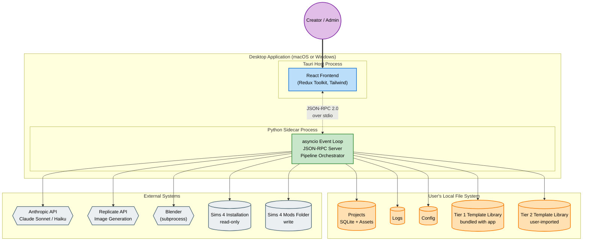
```mermaid
graph TB
    User((Creator / Admin))

    subgraph Desktop["Desktop Application (macOS or Windows)"]
        subgraph Tauri["Tauri Host Process"]
            Frontend["React Frontend<br/>(Redux Toolkit, Tailwind)"]
        end

        subgraph Python["Python Sidecar Process"]
            Sidecar["asyncio Event Loop<br/>JSON-RPC Server<br/>Pipeline Orchestrator"]
        end

        Frontend <-. "JSON-RPC 2.0<br/>over stdio" .-> Sidecar
    end

    subgraph LocalFS["User's Local File System"]
        ProjectStore[("Projects<br/>SQLite + Assets")]
        Logs[("Logs")]
        Config[("Config")]
        TemplateLib[("Tier 1 Template Library<br/>bundled with app")]
        Tier2Lib[("Tier 2 Template Library<br/>user-imported")]
    end

    subgraph External["External Systems"]
        AnthropicAPI{{"Anthropic API<br/>Claude Sonnet / Haiku"}}
        ReplicateAPI{{"Replicate API<br/>Image Generation"}}
        Blender{{"Blender<br/>(subprocess)"}}
        SimsInstall[("Sims 4 Installation<br/>read-only")]
        ModsFolder[("Sims 4 Mods Folder<br/>write")]
    end

    User ==> Frontend

    Sidecar --> ProjectStore
    Sidecar --> Logs
    Sidecar --> Config
    Sidecar --> TemplateLib
    Sidecar --> Tier2Lib

    Sidecar --> AnthropicAPI
    Sidecar --> ReplicateAPI
    Sidecar --> Blender
    Sidecar --> SimsInstall
    Sidecar --> ModsFolder

    classDef frontend fill:#bbdefb,stroke:#1976d2,stroke-width:2px,color:#000
    classDef sidecar fill:#c8e6c9,stroke:#388e3c,stroke-width:2px,color:#000
    classDef external fill:#eceff1,stroke:#546e7a,stroke-width:2px,color:#000
    classDef datastore fill:#ffe0b2,stroke:#f57c00,stroke-width:2px,color:#000
    classDef userNode fill:#e1bee7,stroke:#7b1fa2,stroke-width:2px,color:#000

    class Frontend frontend
    class Sidecar sidecar
    class AnthropicAPI,ReplicateAPI,Blender,SimsInstall,ModsFolder external
    class ProjectStore,Logs,Config,TemplateLib,Tier2Lib datastore
    class User userNode
```

### 3.2 Sidecar Internal Component Diagram

Modules inside the Python sidecar and how they compose.

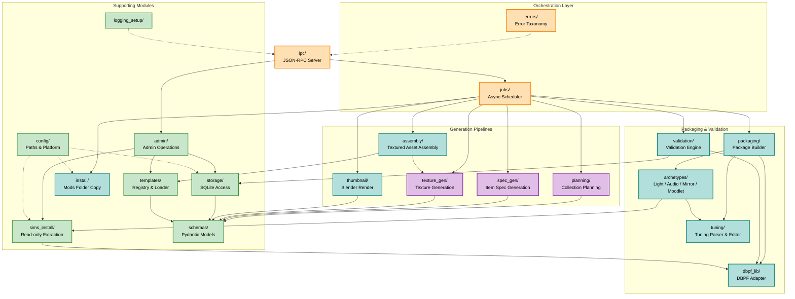
```mermaid
graph TB
    IPC["ipc/<br/>JSON-RPC Server"]

    subgraph Orchestration["Orchestration Layer"]
        Jobs["jobs/<br/>Async Scheduler"]
        Errors["errors/<br/>Error Taxonomy"]
    end

    subgraph Pipelines["Generation Pipelines"]
        Planning["planning/<br/>Collection Planning"]
        SpecGen["spec_gen/<br/>Item Spec Generation"]
        TextureGen["texture_gen/<br/>Texture Generation"]
        Thumbnail["thumbnail/<br/>Blender Render"]
        Assembly["assembly/<br/>Textured Asset Assembly"]
    end

    subgraph Packaging["Packaging & Validation"]
        DBPFLib["dbpf_lib/<br/>DBPF Adapter"]
        PkgMod["packaging/<br/>Package Builder"]
        Tuning["tuning/<br/>Tuning Parser & Editor"]
        Archetypes["archetypes/<br/>Light / Audio / Mirror / Moodlet"]
        Validation["validation/<br/>Validation Engine"]
    end

    subgraph Supporting["Supporting Modules"]
        Storage["storage/<br/>SQLite Access"]
        Templates["templates/<br/>Registry & Loader"]
        SimsInstallMod["sims_install/<br/>Read-only Extraction"]
        Install["install/<br/>Mods Folder Copy"]
        Config["config/<br/>Paths & Platform"]
        Schemas["schemas/<br/>Pydantic Models"]
        Logging["logging_setup/"]
        Admin["admin/<br/>Admin Operations"]
    end

    IPC --> Jobs
    IPC --> Admin
    Jobs --> Planning
    Jobs --> SpecGen
    Jobs --> TextureGen
    Jobs --> Thumbnail
    Jobs --> Assembly
    Jobs --> PkgMod
    Jobs --> Validation
    Jobs --> Install

    Planning --> Schemas
    SpecGen --> Schemas
    TextureGen --> Schemas
    Thumbnail --> Schemas

    Assembly --> Templates
    Assembly --> TextureGen
    PkgMod --> DBPFLib
    PkgMod --> Tuning
    PkgMod --> Archetypes
    Archetypes --> SimsInstallMod
    Archetypes --> Tuning
    Validation --> Storage
    Validation --> DBPFLib

    Storage --> Schemas
    Templates --> Schemas
    SimsInstallMod --> DBPFLib

    Admin --> Templates
    Admin --> SimsInstallMod
    Admin --> Storage

    Errors -.-> IPC
    Logging -.-> IPC
    Config -.-> Storage
    Config -.-> SimsInstallMod
    Config -.-> Install

    classDef pipeline fill:#e1bee7,stroke:#7b1fa2,stroke-width:2px,color:#000
    classDef deterministic fill:#b2dfdb,stroke:#00796b,stroke-width:2px,color:#000
    classDef support fill:#c8e6c9,stroke:#388e3c,stroke-width:2px,color:#000
    classDef infra fill:#ffe0b2,stroke:#f57c00,stroke-width:2px,color:#000

    class Planning,SpecGen,TextureGen pipeline
    class Thumbnail,Assembly,PkgMod,DBPFLib,Tuning,Archetypes,Validation,Install deterministic
    class Storage,Templates,SimsInstallMod,Schemas,Config,Logging,Admin support
    class IPC,Jobs,Errors infra
```

### 3.3 Frontend Component Diagram

React application structure, including Redux slices, screens, and the IPC client.

```mermaid
graph TB
    subgraph FrontendApp["React Frontend"]
        Router["React Router<br/>(memory mode)"]

        subgraph Store["Redux Store"]
            ProjectSlice["projectSlice"]
            GenSlice["generationSlice"]
            UISlice["uiSlice"]
            TemplatesSlice["templatesSlice"]
            ConfigSlice["configSlice"]
            LogsSlice["logsSlice"]
            ArchSlice["archetypesSlice"]
        end

        subgraph CreatorScreens["Creator Screens"]
            Home["HomeScreen"]
            NewProj["NewProjectWizard"]
            PlanReview["PlanReviewScreen"]
            Board["CollectionBoardScreen"]
            ItemDet["ItemDetailScreen"]
            FuncUpgr["FunctionalUpgradeWizard"]
            Export["ExportScreen"]
            Verify["VerificationScreen"]
        end

        subgraph AdminScreens["Admin Screens"]
            AdminGate["AdminModeGate"]
            AdminTpl["AdminTemplateBrowser"]
            AdminEdit["AdminTemplateEditor"]
            AdminImp["AdminMeshImporter"]
            AdminLog["AdminLogsViewer"]
            AdminJob["AdminJobHistory"]
            AdminRef["AdminReferenceBrowser"]
            AdminCfg["AdminConfigPanel"]
        end

        IPCClient["IPC Client<br/>request / subscribe"]
    end

    Router --> Home
    Router --> NewProj
    Router --> PlanReview
    Router --> Board
    Router --> ItemDet
    Router --> FuncUpgr
    Router --> Export
    Router --> Verify
    Router --> AdminGate
    AdminGate --> AdminTpl
    AdminGate --> AdminEdit
    AdminGate --> AdminImp
    AdminGate --> AdminLog
    AdminGate --> AdminJob
    AdminGate --> AdminRef
    AdminGate --> AdminCfg

    Home -.-> ProjectSlice
    NewProj -.-> ProjectSlice
    PlanReview -.-> ProjectSlice
    PlanReview -.-> GenSlice
    Board -.-> ProjectSlice
    Board -.-> GenSlice
    ItemDet -.-> ProjectSlice
    ItemDet -.-> GenSlice
    FuncUpgr -.-> ArchSlice
    Export -.-> ProjectSlice
    Verify -.-> ProjectSlice
    AdminTpl -.-> TemplatesSlice
    AdminLog -.-> LogsSlice
    AdminCfg -.-> ConfigSlice

    Store -.-> IPCClient
    IPCClient ==> Sidecar["Python Sidecar<br/>(JSON-RPC via stdio)"]

    classDef ui fill:#bbdefb,stroke:#1976d2,stroke-width:2px,color:#000
    classDef store fill:#ffe0b2,stroke:#f57c00,stroke-width:2px,color:#000
    classDef admin fill:#ffcdd2,stroke:#c62828,stroke-width:2px,color:#000
    classDef external fill:#eceff1,stroke:#546e7a,stroke-width:2px,color:#000

    class Home,NewProj,PlanReview,Board,ItemDet,FuncUpgr,Export,Verify,Router ui
    class AdminGate,AdminTpl,AdminEdit,AdminImp,AdminLog,AdminJob,AdminRef,AdminCfg admin
    class ProjectSlice,GenSlice,UISlice,TemplatesSlice,ConfigSlice,LogsSlice,ArchSlice store
    class IPCClient,Sidecar external
```

### 3.4 Deployment Topology

Where files live on the user's machine after installation.

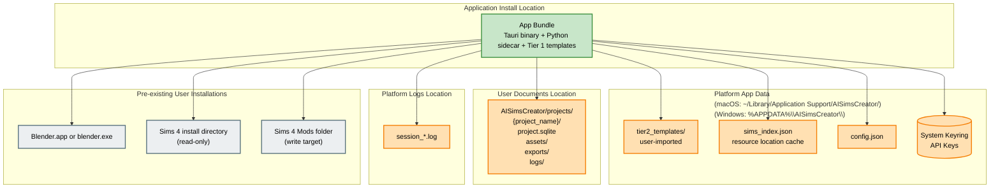
```mermaid
graph TB
    subgraph AppInstall["Application Install Location"]
        AppBundle["App Bundle<br/>Tauri binary + Python sidecar + Tier 1 templates"]
    end

    subgraph AppData["Platform App Data<br/>(macOS: ~/Library/Application Support/AISimsCreator/)<br/>(Windows: %APPDATA%\\AISimsCreator\\)"]
        Tier2Store["tier2_templates/<br/>user-imported"]
        SimsIndex["sims_index.json<br/>resource location cache"]
        ConfigStore["config.json"]
        APIKeys[("System Keyring<br/>API Keys")]
    end

    subgraph DocsLoc["User Documents Location"]
        ProjectsRoot["AISimsCreator/projects/<br/>{project_name}/<br/>  project.sqlite<br/>  assets/<br/>  exports/<br/>  logs/"]
    end

    subgraph PlatLogs["Platform Logs Location"]
        LogFiles["session_*.log"]
    end

    subgraph ExternalInstalls["Pre-existing User Installations"]
        BlenderInst["Blender.app or blender.exe"]
        SimsInst["Sims 4 install directory<br/>(read-only)"]
        ModsDir["Sims 4 Mods folder<br/>(write target)"]
    end

    AppBundle --> Tier2Store
    AppBundle --> ProjectsRoot
    AppBundle --> LogFiles
    AppBundle --> SimsIndex
    AppBundle --> ConfigStore
    AppBundle --> APIKeys
    AppBundle --> BlenderInst
    AppBundle --> SimsInst
    AppBundle --> ModsDir

    classDef app fill:#c8e6c9,stroke:#388e3c,stroke-width:2px,color:#000
    classDef data fill:#ffe0b2,stroke:#f57c00,stroke-width:2px,color:#000
    classDef external fill:#eceff1,stroke:#546e7a,stroke-width:2px,color:#000

    class AppBundle app
    class Tier2Store,SimsIndex,ConfigStore,APIKeys,ProjectsRoot,LogFiles data
    class BlenderInst,SimsInst,ModsDir external
```

---

## 4. Data Architecture

### 4.1 Core Entity Relationships

Entity-relationship view of the primary persisted domain model.

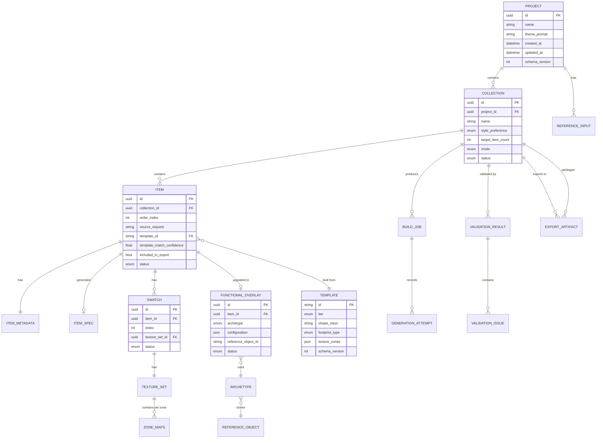
```mermaid
erDiagram
    PROJECT ||--o{ COLLECTION : "contains"
    PROJECT ||--o{ REFERENCE_INPUT : "has"
    COLLECTION ||--o{ ITEM : "contains"
    ITEM ||--|| ITEM_METADATA : "has"
    ITEM ||--o| ITEM_SPEC : "generated"
    ITEM ||--o{ SWATCH : "has"
    ITEM ||--o| FUNCTIONAL_OVERLAY : "upgraded to"
    SWATCH ||--|| TEXTURE_SET : "has"
    TEXTURE_SET ||--o{ ZONE_MAPS : "contains per zone"
    ITEM }o--|| TEMPLATE : "built from"
    FUNCTIONAL_OVERLAY }o--|| ARCHETYPE : "uses"
    ARCHETYPE }o--|| REFERENCE_OBJECT : "clones"
    COLLECTION ||--o{ BUILD_JOB : "produces"
    COLLECTION ||--o{ VALIDATION_RESULT : "validated by"
    COLLECTION ||--o{ EXPORT_ARTIFACT : "exports to"
    BUILD_JOB ||--o{ GENERATION_ATTEMPT : "records"
    VALIDATION_RESULT ||--o{ VALIDATION_ISSUE : "contains"
    EXPORT_ARTIFACT }o--|| COLLECTION : "packages"

    PROJECT {
        uuid id PK
        string name
        string theme_prompt
        datetime created_at
        datetime updated_at
        int schema_version
    }
    COLLECTION {
        uuid id PK
        uuid project_id FK
        string name
        enum style_preference
        int target_item_count
        enum mode
        enum status
    }
    ITEM {
        uuid id PK
        uuid collection_id FK
        int order_index
        string source_request
        string template_id FK
        float template_match_confidence
        bool included_in_export
        enum status
    }
    SWATCH {
        uuid id PK
        uuid item_id FK
        int index
        uuid texture_set_id FK
        enum status
    }
    FUNCTIONAL_OVERLAY {
        uuid id PK
        uuid item_id FK
        enum archetype
        json configuration
        string reference_object_id
        enum status
    }
    TEMPLATE {
        string id PK
        enum tier
        string shape_class
        enum footprint_type
        json texture_zones
        int schema_version
    }
```

### 4.2 Project Folder Layout

Directory tree showing how a single project is stored on disk.

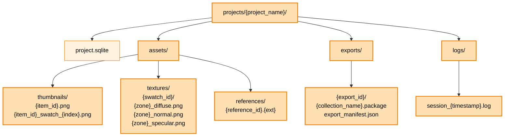
```mermaid
graph TB
    Root["projects/{project_name}/"]
    Root --> DB["project.sqlite"]
    Root --> Assets["assets/"]
    Root --> Exports["exports/"]
    Root --> ProjectLogs["logs/"]

    Assets --> Thumbs["thumbnails/<br/>{item_id}.png<br/>{item_id}_swatch_{index}.png"]
    Assets --> Textures["textures/<br/>{swatch_id}/<br/>  {zone}_diffuse.png<br/>  {zone}_normal.png<br/>  {zone}_specular.png"]
    Assets --> Refs["references/<br/>{reference_id}.{ext}"]

    Exports --> ExportDir["{export_id}/<br/>{collection_name}.package<br/>export_manifest.json"]

    ProjectLogs --> SessionLog["session_{timestamp}.log"]

    classDef folder fill:#ffe0b2,stroke:#f57c00,stroke-width:2px,color:#000
    class Root,Assets,Exports,ProjectLogs,Thumbs,Textures,Refs,ExportDir,SessionLog folder
    classDef file fill:#fff3e0,stroke:#f57c00,stroke-width:1px,color:#000
    class DB file
```

---

## 5. Pipeline Sequence Diagrams

### 5.1 Project Creation and Collection Planning

From the user entering a prompt to an approved plan ready for generation.

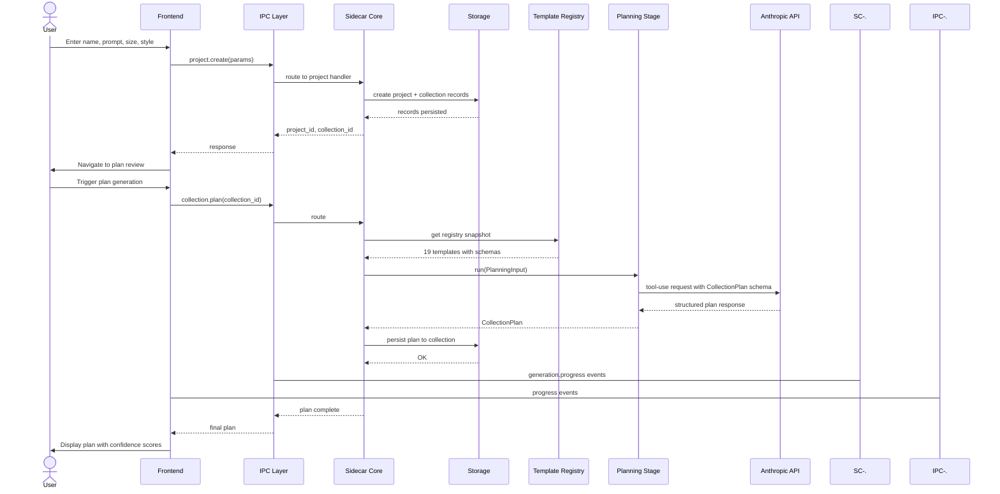
```mermaid
sequenceDiagram
    actor User
    participant FE as Frontend
    participant IPC as IPC Layer
    participant SC as Sidecar Core
    participant Store as Storage
    participant Tpl as Template Registry
    participant Plan as Planning Stage
    participant Claude as Anthropic API

    User->>FE: Enter name, prompt, size, style
    FE->>IPC: project.create(params)
    IPC->>SC: route to project handler
    SC->>Store: create project + collection records
    Store-->>SC: records persisted
    SC-->>IPC: project_id, collection_id
    IPC-->>FE: response
    FE->>User: Navigate to plan review

    User->>FE: Trigger plan generation
    FE->>IPC: collection.plan(collection_id)
    IPC->>SC: route
    SC->>Tpl: get registry snapshot
    Tpl-->>SC: 19 templates with schemas
    SC->>Plan: run(PlanningInput)
    Plan->>Claude: tool-use request with CollectionPlan schema
    Claude-->>Plan: structured plan response
    Plan-->>SC: CollectionPlan
    SC->>Store: persist plan to collection
    Store-->>SC: OK
    SC-.->IPC: generation.progress events
    IPC-.->FE: progress events
    SC-->>IPC: plan complete
    IPC-->>FE: final plan
    FE->>User: Display plan with confidence scores
```

### 5.2 Collection Generation (Main Pipeline)

After plan approval, the full generation flow across all items and swatches.

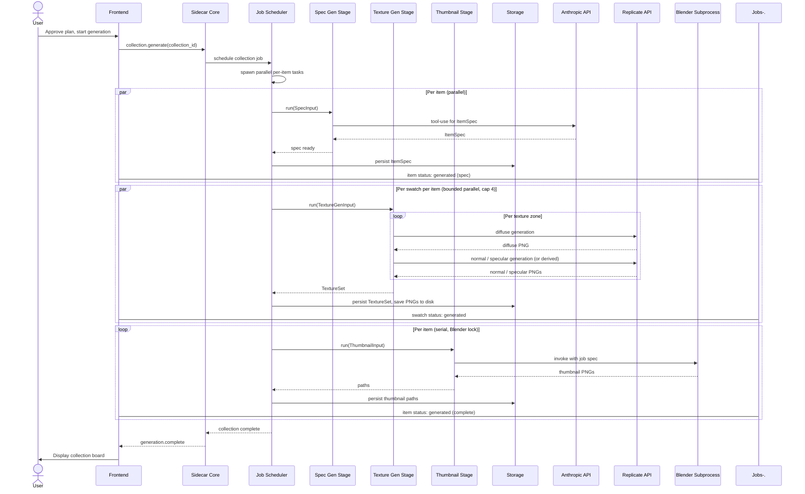
```mermaid
sequenceDiagram
    actor User
    participant FE as Frontend
    participant SC as Sidecar Core
    participant Jobs as Job Scheduler
    participant Spec as Spec Gen Stage
    participant Tex as Texture Gen Stage
    participant Thumb as Thumbnail Stage
    participant Store as Storage
    participant Claude as Anthropic API
    participant Rep as Replicate API
    participant Blend as Blender Subprocess

    User->>FE: Approve plan, start generation
    FE->>SC: collection.generate(collection_id)
    SC->>Jobs: schedule collection job
    Jobs->>Jobs: spawn parallel per-item tasks

    par Per item (parallel)
        Jobs->>Spec: run(SpecInput)
        Spec->>Claude: tool-use for ItemSpec
        Claude-->>Spec: ItemSpec
        Spec-->>Jobs: spec ready
        Jobs->>Store: persist ItemSpec
        Jobs-.->FE: item status: generated (spec)
    end

    par Per swatch per item (bounded parallel, cap 4)
        Jobs->>Tex: run(TextureGenInput)
        loop Per texture zone
            Tex->>Rep: diffuse generation
            Rep-->>Tex: diffuse PNG
            Tex->>Rep: normal / specular generation (or derived)
            Rep-->>Tex: normal / specular PNGs
        end
        Tex-->>Jobs: TextureSet
        Jobs->>Store: persist TextureSet, save PNGs to disk
        Jobs-.->FE: swatch status: generated
    end

    loop Per item (serial, Blender lock)
        Jobs->>Thumb: run(ThumbnailInput)
        Thumb->>Blend: invoke with job spec
        Blend-->>Thumb: thumbnail PNGs
        Thumb-->>Jobs: paths
        Jobs->>Store: persist thumbnail paths
        Jobs-.->FE: item status: generated (complete)
    end

    Jobs-->>SC: collection complete
    SC-->>FE: generation.complete
    FE->>User: Display collection board
```

### 5.3 Per-Item Regeneration

Isolated regeneration of a single item without affecting others.

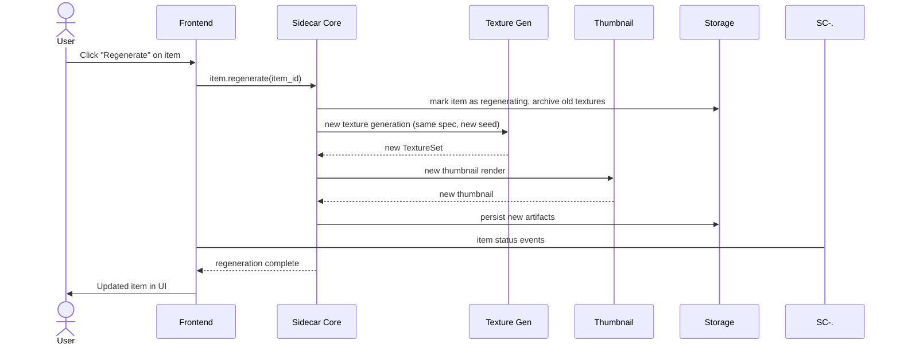
```mermaid
sequenceDiagram
    actor User
    participant FE as Frontend
    participant SC as Sidecar Core
    participant Tex as Texture Gen
    participant Thumb as Thumbnail
    participant Store as Storage

    User->>FE: Click "Regenerate" on item
    FE->>SC: item.regenerate(item_id)
    SC->>Store: mark item as regenerating, archive old textures
    SC->>Tex: new texture generation (same spec, new seed)
    Tex-->>SC: new TextureSet
    SC->>Thumb: new thumbnail render
    Thumb-->>SC: new thumbnail
    SC->>Store: persist new artifacts
    SC-.->FE: item status events
    SC-->>FE: regeneration complete
    FE->>User: Updated item in UI
```

### 5.4 Functional Overlay Creation

Upgrading a decor item to a functional object.

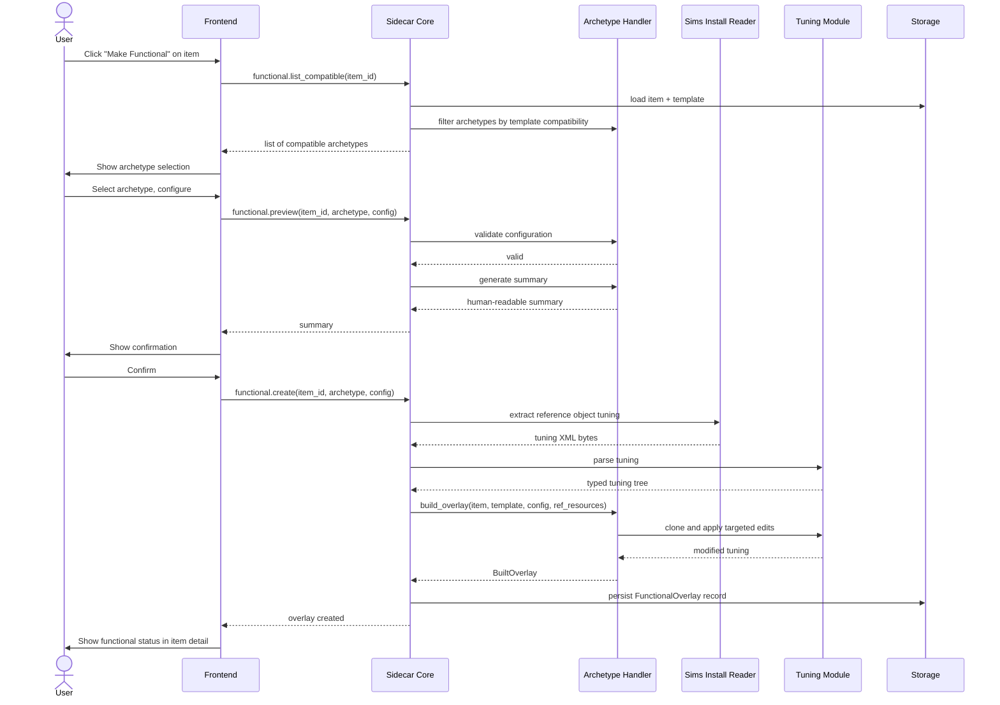
```mermaid
sequenceDiagram
    actor User
    participant FE as Frontend
    participant SC as Sidecar Core
    participant Arch as Archetype Handler
    participant SimsInst as Sims Install Reader
    participant Tun as Tuning Module
    participant Store as Storage

    User->>FE: Click "Make Functional" on item
    FE->>SC: functional.list_compatible(item_id)
    SC->>Store: load item + template
    SC->>Arch: filter archetypes by template compatibility
    SC-->>FE: list of compatible archetypes
    FE->>User: Show archetype selection

    User->>FE: Select archetype, configure
    FE->>SC: functional.preview(item_id, archetype, config)
    SC->>Arch: validate configuration
    Arch-->>SC: valid
    SC->>Arch: generate summary
    Arch-->>SC: human-readable summary
    SC-->>FE: summary
    FE->>User: Show confirmation

    User->>FE: Confirm
    FE->>SC: functional.create(item_id, archetype, config)
    SC->>SimsInst: extract reference object tuning
    SimsInst-->>SC: tuning XML bytes
    SC->>Tun: parse tuning
    Tun-->>SC: typed tuning tree
    SC->>Arch: build_overlay(item, template, config, ref_resources)
    Arch->>Tun: clone and apply targeted edits
    Tun-->>Arch: modified tuning
    Arch-->>SC: BuiltOverlay
    SC->>Store: persist FunctionalOverlay record
    SC-->>FE: overlay created
    FE->>User: Show functional status in item detail
```

### 5.5 Validation and Export

From pre-export validation to auto-install.

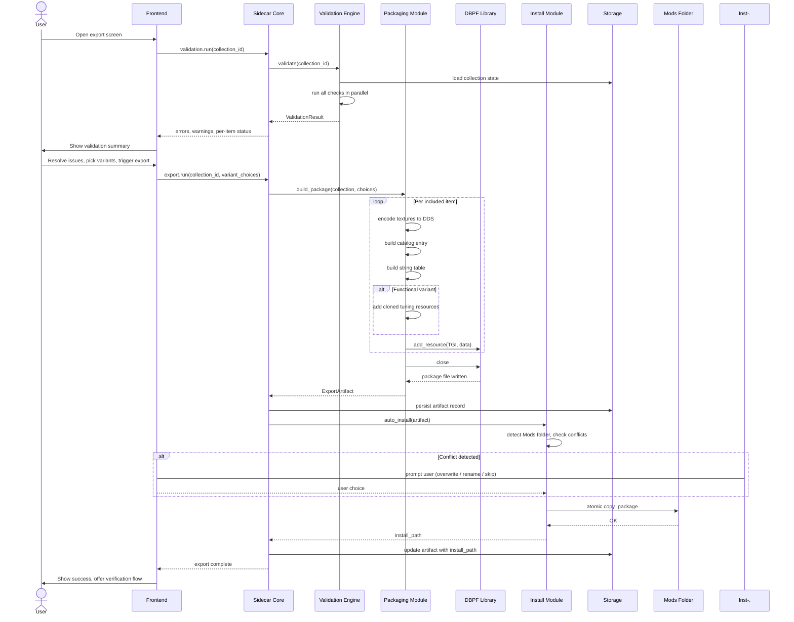
```mermaid
sequenceDiagram
    actor User
    participant FE as Frontend
    participant SC as Sidecar Core
    participant Val as Validation Engine
    participant Pkg as Packaging Module
    participant DBPF as DBPF Library
    participant Inst as Install Module
    participant Store as Storage
    participant Mods as Mods Folder

    User->>FE: Open export screen
    FE->>SC: validation.run(collection_id)
    SC->>Val: validate(collection_id)
    Val->>Store: load collection state
    Val->>Val: run all checks in parallel
    Val-->>SC: ValidationResult
    SC-->>FE: errors, warnings, per-item status
    FE->>User: Show validation summary

    User->>FE: Resolve issues, pick variants, trigger export
    FE->>SC: export.run(collection_id, variant_choices)
    SC->>Pkg: build_package(collection, choices)

    loop Per included item
        Pkg->>Pkg: encode textures to DDS
        Pkg->>Pkg: build catalog entry
        Pkg->>Pkg: build string table
        alt Functional variant
            Pkg->>Pkg: add cloned tuning resources
        end
        Pkg->>DBPF: add_resource(TGI, data)
    end

    Pkg->>DBPF: close
    DBPF-->>Pkg: .package file written
    Pkg-->>SC: ExportArtifact
    SC->>Store: persist artifact record

    SC->>Inst: auto_install(artifact)
    Inst->>Inst: detect Mods folder, check conflicts
    alt Conflict detected
        Inst-.->FE: prompt user (overwrite / rename / skip)
        FE-->>Inst: user choice
    end
    Inst->>Mods: atomic copy .package
    Mods-->>Inst: OK
    Inst-->>SC: install_path
    SC->>Store: update artifact with install_path
    SC-->>FE: export complete

    FE->>User: Show success, offer verification flow
```

### 5.6 Deterministic Rebuild

The admin-triggered rebuild pathway that produces byte-identical output.

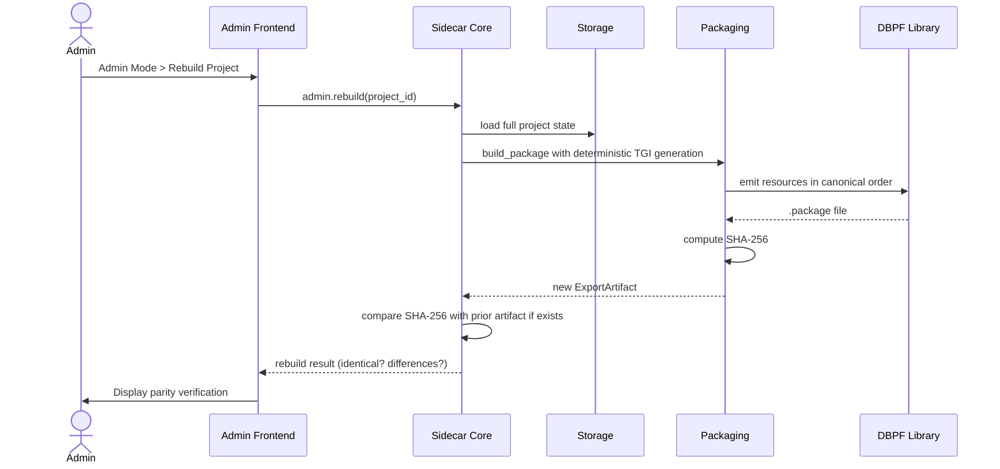
```mermaid
sequenceDiagram
    actor Admin
    participant FE as Admin Frontend
    participant SC as Sidecar Core
    participant Store as Storage
    participant Pkg as Packaging
    participant DBPF as DBPF Library

    Admin->>FE: Admin Mode > Rebuild Project
    FE->>SC: admin.rebuild(project_id)
    SC->>Store: load full project state
    SC->>Pkg: build_package with deterministic TGI generation
    Pkg->>DBPF: emit resources in canonical order
    DBPF-->>Pkg: .package file
    Pkg->>Pkg: compute SHA-256
    Pkg-->>SC: new ExportArtifact
    SC->>SC: compare SHA-256 with prior artifact if exists
    SC-->>FE: rebuild result (identical? differences?)
    FE->>Admin: Display parity verification
```

### 5.7 IPC Message Flow

Request-response and notification pattern over stdio.

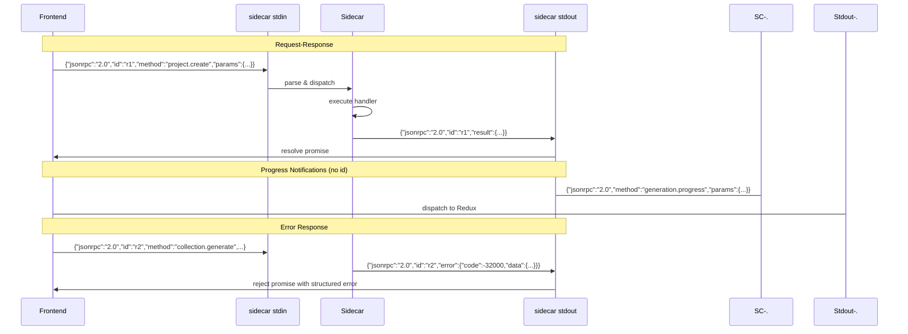
```mermaid
sequenceDiagram
    participant FE as Frontend
    participant Stdin as sidecar stdin
    participant SC as Sidecar
    participant Stdout as sidecar stdout

    Note over FE,Stdout: Request-Response
    FE->>Stdin: {"jsonrpc":"2.0","id":"r1","method":"project.create","params":{...}}
    Stdin->>SC: parse & dispatch
    SC->>SC: execute handler
    SC->>Stdout: {"jsonrpc":"2.0","id":"r1","result":{...}}
    Stdout->>FE: resolve promise

    Note over FE,Stdout: Progress Notifications (no id)
    SC-.->Stdout: {"jsonrpc":"2.0","method":"generation.progress","params":{...}}
    Stdout-.->FE: dispatch to Redux

    Note over FE,Stdout: Error Response
    FE->>Stdin: {"jsonrpc":"2.0","id":"r2","method":"collection.generate",...}
    SC->>Stdout: {"jsonrpc":"2.0","id":"r2","error":{"code":-32000,"data":{...}}}
    Stdout->>FE: reject promise with structured error
```

---

## 6. State Machines

### 6.1 Item Lifecycle

Every `Item` transitions through a defined set of states.

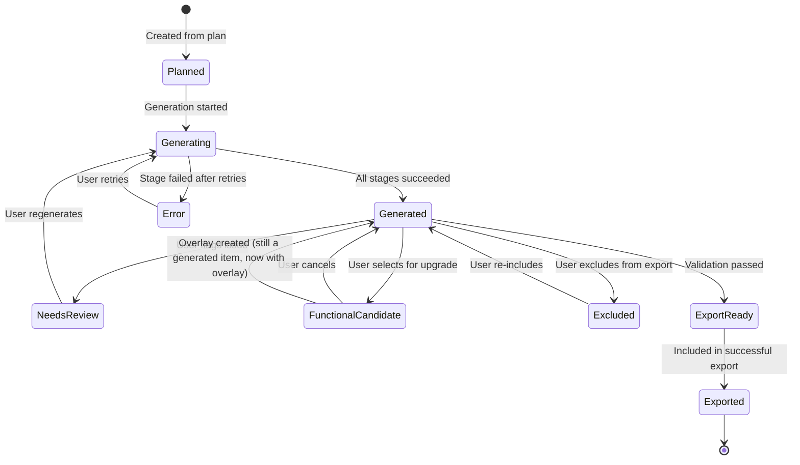
```mermaid
stateDiagram-v2
    [*] --> Planned: Created from plan
    Planned --> Generating: Generation started
    Generating --> Generated: All stages succeeded
    Generating --> Error: Stage failed after retries
    Generated --> NeedsReview: User flags issue
    Generated --> FunctionalCandidate: User selects for upgrade
    FunctionalCandidate --> Generated: User cancels
    FunctionalCandidate --> Generated: Overlay created (still a generated item, now with overlay)
    Generated --> Excluded: User excludes from export
    Excluded --> Generated: User re-includes
    NeedsReview --> Generating: User regenerates
    Error --> Generating: User retries
    Generated --> ExportReady: Validation passed
    ExportReady --> Exported: Included in successful export
    Exported --> [*]
```

### 6.2 Collection Lifecycle

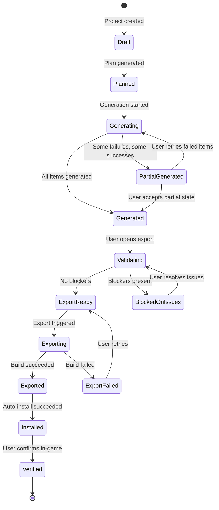
```mermaid
stateDiagram-v2
    [*] --> Draft: Project created
    Draft --> Planned: Plan generated
    Planned --> Generating: Generation started
    Generating --> Generated: All items generated
    Generating --> PartialGenerated: Some failures, some successes
    PartialGenerated --> Generating: User retries failed items
    PartialGenerated --> Generated: User accepts partial state
    Generated --> Validating: User opens export
    Validating --> ExportReady: No blockers
    Validating --> BlockedOnIssues: Blockers present
    BlockedOnIssues --> Validating: User resolves issues
    ExportReady --> Exporting: Export triggered
    Exporting --> Exported: Build succeeded
    Exporting --> ExportFailed: Build failed
    ExportFailed --> ExportReady: User retries
    Exported --> Installed: Auto-install succeeded
    Installed --> Verified: User confirms in-game
    Verified --> [*]
```

### 6.3 BuildJob Lifecycle

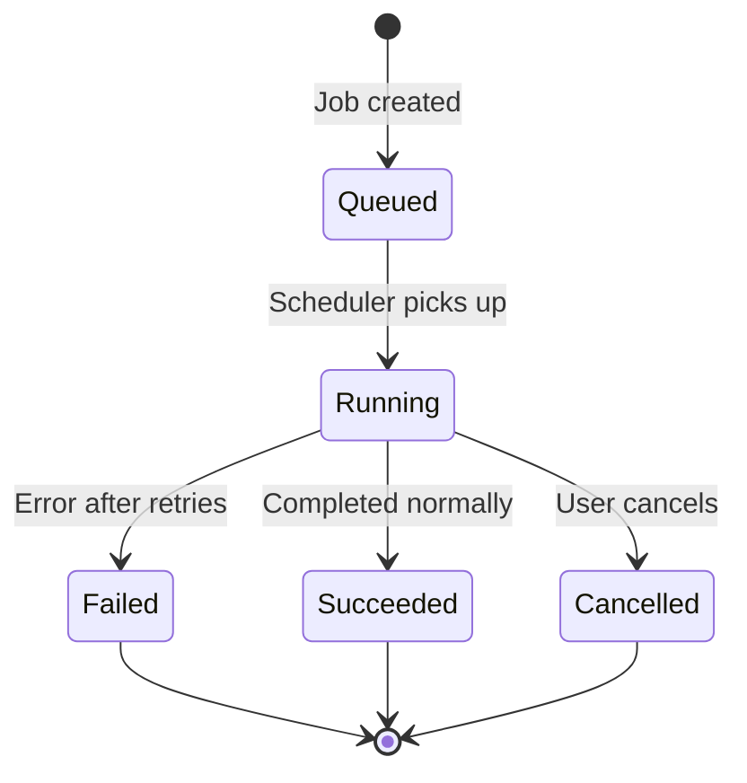
```mermaid
stateDiagram-v2
    [*] --> Queued: Job created
    Queued --> Running: Scheduler picks up
    Running --> Succeeded: Completed normally
    Running --> Failed: Error after retries
    Running --> Cancelled: User cancels
    Failed --> [*]
    Succeeded --> [*]
    Cancelled --> [*]
```

### 6.4 Swatch Lifecycle

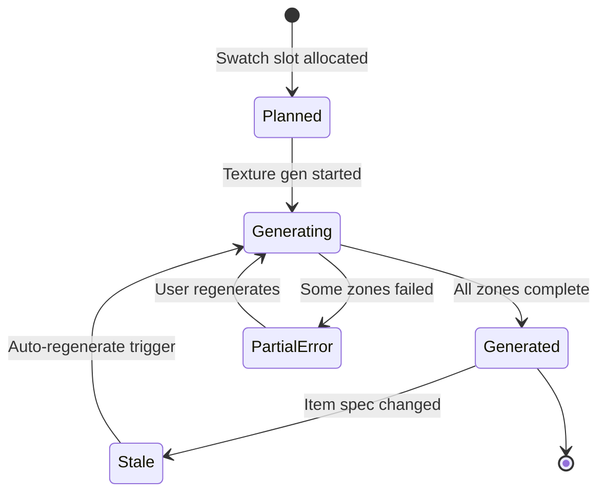
```mermaid
stateDiagram-v2
    [*] --> Planned: Swatch slot allocated
    Planned --> Generating: Texture gen started
    Generating --> Generated: All zones complete
    Generating --> PartialError: Some zones failed
    PartialError --> Generating: User regenerates
    Generated --> Stale: Item spec changed
    Stale --> Generating: Auto-regenerate trigger
    Generated --> [*]
```

### 6.5 Functional Overlay Lifecycle

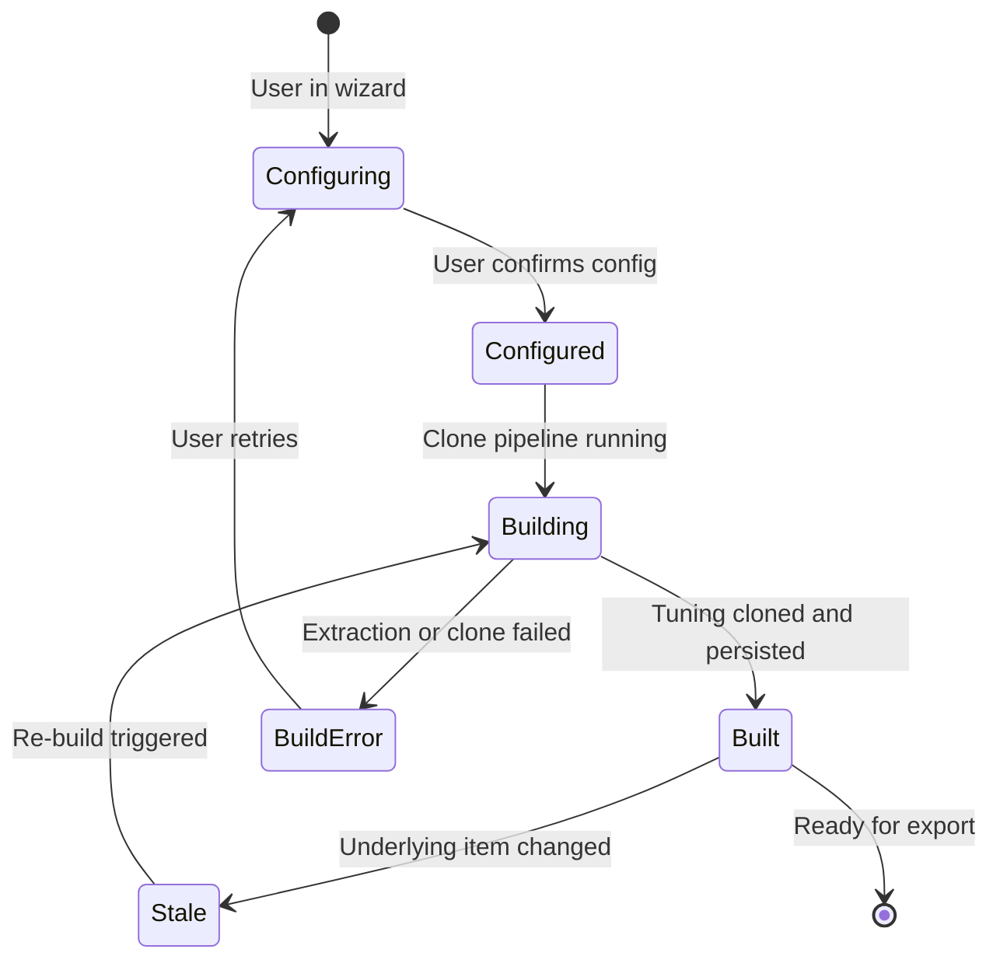
```mermaid
stateDiagram-v2
    [*] --> Configuring: User in wizard
    Configuring --> Configured: User confirms config
    Configured --> Building: Clone pipeline running
    Building --> Built: Tuning cloned and persisted
    Building --> BuildError: Extraction or clone failed
    BuildError --> Configuring: User retries
    Built --> Stale: Underlying item changed
    Stale --> Building: Re-build triggered
    Built --> [*]: Ready for export
```

---

## 7. Template Library Architecture

### 7.1 Tier Structure and Promotion Flow

How templates exist in two tiers and move between them.

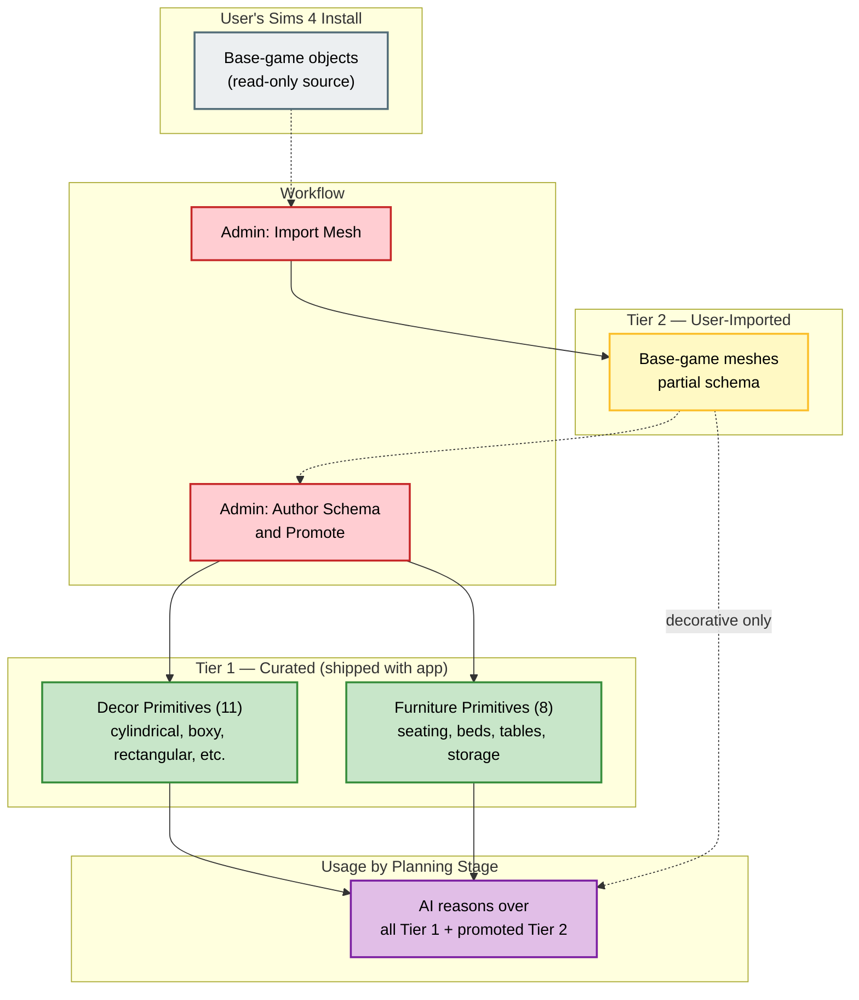
```mermaid
graph TB
    subgraph T1["Tier 1 — Curated (shipped with app)"]
        T1Decor["Decor Primitives (11)<br/>cylindrical, boxy, rectangular, etc."]
        T1Furn["Furniture Primitives (8)<br/>seating, beds, tables, storage"]
    end

    subgraph T2["Tier 2 — User-Imported"]
        T2Raw["Base-game meshes<br/>partial schema"]
    end

    subgraph Sims["User's Sims 4 Install"]
        BaseObjs["Base-game objects<br/>(read-only source)"]
    end

    subgraph Flow["Workflow"]
        AdminImport["Admin: Import Mesh"]
        AdminPromote["Admin: Author Schema<br/>and Promote"]
    end

    subgraph Usage["Usage by Planning Stage"]
        PlanningStage["AI reasons over<br/>all Tier 1 + promoted Tier 2"]
    end

    BaseObjs -.-> AdminImport
    AdminImport --> T2Raw
    T2Raw -.-> AdminPromote
    AdminPromote --> T1Decor
    AdminPromote --> T1Furn

    T1Decor --> PlanningStage
    T1Furn --> PlanningStage
    T2Raw -.->|decorative only| PlanningStage

    classDef tier1 fill:#c8e6c9,stroke:#388e3c,stroke-width:2px,color:#000
    classDef tier2 fill:#fff9c4,stroke:#fbc02d,stroke-width:2px,color:#000
    classDef external fill:#eceff1,stroke:#546e7a,stroke-width:2px,color:#000
    classDef workflow fill:#ffcdd2,stroke:#c62828,stroke-width:2px,color:#000
    classDef usage fill:#e1bee7,stroke:#7b1fa2,stroke-width:2px,color:#000

    class T1Decor,T1Furn tier1
    class T2Raw tier2
    class BaseObjs external
    class AdminImport,AdminPromote workflow
    class PlanningStage usage
```

### 7.2 Template Resolution Path

How the planning stage turns a user's request into a template choice.

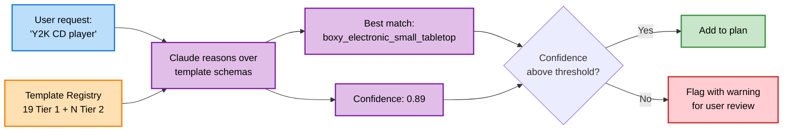
```mermaid
graph LR
    UserReq["User request:<br/>'Y2K CD player'"]
    ClaudeReason["Claude reasons over<br/>template schemas"]
    Registry["Template Registry<br/>19 Tier 1 + N Tier 2"]
    Match["Best match:<br/>boxy_electronic_small_tabletop"]
    Confidence["Confidence: 0.89"]

    UserReq --> ClaudeReason
    Registry --> ClaudeReason
    ClaudeReason --> Match
    ClaudeReason --> Confidence

    Match --> Decision{"Confidence<br/>above threshold?"}
    Confidence --> Decision
    Decision -->|Yes| Proceed["Add to plan"]
    Decision -->|No| Warn["Flag with warning<br/>for user review"]

    classDef input fill:#bbdefb,stroke:#1976d2,stroke-width:2px,color:#000
    classDef ai fill:#e1bee7,stroke:#7b1fa2,stroke-width:2px,color:#000
    classDef data fill:#ffe0b2,stroke:#f57c00,stroke-width:2px,color:#000
    classDef outcome fill:#c8e6c9,stroke:#388e3c,stroke-width:2px,color:#000
    classDef warning fill:#ffcdd2,stroke:#c62828,stroke-width:2px,color:#000

    class UserReq input
    class ClaudeReason,Match,Confidence ai
    class Registry data
    class Proceed outcome
    class Warn warning
```

---

## 8. AI Stage Orchestration

### 8.1 AI Stage Input / Output Overview

Where AI touches the system and what flows through each stage.

```mermaid
graph TB
    UserPrompt["User prompt +<br/>desired item count"]

    subgraph Stage1["Stage 1: Collection Planning"]
        PlanIn["PlanningInput<br/>(prompt, count, registry, style)"]
        Sonnet1["Claude Sonnet 4.6<br/>(tool use: submit_plan)"]
        PlanOut["CollectionPlan<br/>(items, template IDs, confidence)"]
    end

    subgraph Stage2["Stage 2: Per-Item Spec (parallel)"]
        SpecIn["SpecInput<br/>(request, template schema, collection ctx)"]
        Sonnet2["Claude Sonnet 4.6<br/>(tool use: submit_item_spec)"]
        SpecOut["ItemSpec<br/>(zone prompts, metadata)"]
    end

    subgraph Stage3["Stage 3: Texture Gen (parallel per swatch per zone)"]
        TexIn["TextureGenInput<br/>(zone prompts, template)"]
        Image["Replicate Image Model<br/>(Flux or alternative)"]
        TexOut["TextureSet<br/>(diffuse, normal, specular PNGs)"]
    end

    subgraph Deterministic["Deterministic Stages (no AI)"]
        Thumb["Blender thumbnail render"]
        DBPFBuild["DBPF packaging"]
        TuningClone["Tuning clone"]
        Validate["Validation"]
    end

    subgraph Support["Supporting AI Uses"]
        HaikuRewrite["Claude Haiku 4.5<br/>validation message rewriting"]
        HaikuRephrase["Claude Haiku 4.5<br/>content policy retry rephrase"]
        SonnetRepair["Claude Sonnet 4.6<br/>repair suggestions"]
        SonnetTuning["Claude Sonnet 4.6<br/>tuning value suggestions"]
    end

    UserPrompt --> PlanIn
    PlanIn --> Sonnet1
    Sonnet1 --> PlanOut

    PlanOut --> SpecIn
    SpecIn --> Sonnet2
    Sonnet2 --> SpecOut

    SpecOut --> TexIn
    TexIn --> Image
    Image --> TexOut

    TexOut --> Thumb
    Thumb --> DBPFBuild
    SonnetTuning -.-> TuningClone
    TuningClone --> DBPFBuild
    DBPFBuild --> Validate

    Validate -.-> HaikuRewrite
    Image -.-> HaikuRephrase
    Validate -.-> SonnetRepair

    classDef input fill:#bbdefb,stroke:#1976d2,stroke-width:2px,color:#000
    classDef ai fill:#e1bee7,stroke:#7b1fa2,stroke-width:2px,color:#000
    classDef det fill:#b2dfdb,stroke:#00796b,stroke-width:2px,color:#000
    classDef output fill:#c8e6c9,stroke:#388e3c,stroke-width:2px,color:#000

    class UserPrompt,PlanIn,SpecIn,TexIn input
    class Sonnet1,Sonnet2,Image,HaikuRewrite,HaikuRephrase,SonnetRepair,SonnetTuning ai
    class Thumb,DBPFBuild,TuningClone,Validate det
    class PlanOut,SpecOut,TexOut output
```

### 8.2 Retry and Failure Handling Per Stage

```mermaid
graph TB
    Start["Stage begins"]
    Attempt["Execute primary call"]
    Check{"Success?"}
    Retry{"Retriable?<br/>Under retry cap?"}
    Backoff["Exponential backoff<br/>1s → 4s → 16s"]
    Fallback{"Stage-specific<br/>fallback?"}
    Rephrase["Haiku rephrase<br/>(content policy)"]
    Success["Return output"]
    FailItem["Mark target entity<br/>needs-review / error"]
    Surface["Surface structured error<br/>to user"]

    Start --> Attempt
    Attempt --> Check
    Check -->|Yes| Success
    Check -->|No| Retry
    Retry -->|Yes| Backoff
    Backoff --> Attempt
    Retry -->|No| Fallback
    Fallback -->|Content policy| Rephrase
    Rephrase --> Attempt
    Fallback -->|None applicable| FailItem
    FailItem --> Surface

    classDef ok fill:#c8e6c9,stroke:#388e3c,stroke-width:2px,color:#000
    classDef fail fill:#ffcdd2,stroke:#c62828,stroke-width:2px,color:#000
    classDef decision fill:#fff9c4,stroke:#fbc02d,stroke-width:2px,color:#000
    classDef action fill:#bbdefb,stroke:#1976d2,stroke-width:2px,color:#000

    class Success ok
    class FailItem,Surface fail
    class Check,Retry,Fallback decision
    class Start,Attempt,Backoff,Rephrase action
```

---

## 9. Admin Mode Architecture

### 9.1 Admin Mode Access Gating

How admin mode is entered and restricted.

```mermaid
stateDiagram-v2
    [*] --> CreatorMode: App launched
    CreatorMode --> AdminMode: Keyboard shortcut<br/>or menu action
    AdminMode --> CreatorMode: Exit action<br/>or app restart

    state CreatorMode {
        [*] --> CreatorScreens
        CreatorScreens --> CreatorScreens: All creator actions
    }

    state AdminMode {
        [*] --> AdminGate
        AdminGate --> AdminScreens: Admin mode flag active
        AdminScreens --> AdminScreens: Admin actions allowed
        AdminScreens --> AdminGate: Navigate between admin screens
    }

    note right of AdminMode
        Sidecar checks flag on<br/>every admin.* IPC call.<br/>Calls rejected if flag<br/>not active.
    end note
```

### 9.2 Admin Mode Operations

```mermaid
graph TB
    AdminEntry["Admin Mode Entry<br/>⌘⇧A / Ctrl+Shift+A"]

    AdminEntry --> TplMgmt["Template Management"]
    AdminEntry --> Diag["Diagnostics"]
    AdminEntry --> Cfg["Configuration"]
    AdminEntry --> Ref["Reference Inspection"]

    TplMgmt --> Browse["Browse all templates<br/>(T1 and T2)"]
    TplMgmt --> Import["Import base-game mesh<br/>(creates T2)"]
    TplMgmt --> Promote["Author schema<br/>and promote T2 → T1"]
    TplMgmt --> Edit["Edit existing template<br/>metadata"]

    Diag --> Logs["View logs<br/>(filter by level, stage, item)"]
    Diag --> Jobs["Job history<br/>with artifacts"]
    Diag --> Rebuild["Deterministic rebuild<br/>project"]
    Diag --> Cost["Cost summary<br/>per session / project"]

    Cfg --> Paths["Path overrides<br/>(Sims, Mods, Blender)"]
    Cfg --> Models["Model selection<br/>overrides"]
    Cfg --> Policy["Retry policies"]
    Cfg --> Keys["API key management"]

    Ref --> BrowseRef["Browse base-game objects<br/>by category"]
    Ref --> InspectTun["Inspect reference<br/>tuning XML"]

    classDef entry fill:#ffcdd2,stroke:#c62828,stroke-width:2px,color:#000
    classDef group fill:#ffcdd2,stroke:#c62828,stroke-width:1px,color:#000
    classDef action fill:#f8bbd0,stroke:#c62828,stroke-width:1px,color:#000

    class AdminEntry entry
    class TplMgmt,Diag,Cfg,Ref group
    class Browse,Import,Promote,Edit,Logs,Jobs,Rebuild,Cost,Paths,Models,Policy,Keys,BrowseRef,InspectTun action
```

---

## 10. Error Flow

### 10.1 Error Propagation and Messaging

How errors move from the point of failure to the user or admin.

```mermaid
graph TB
    Failure["Error occurs<br/>(API, I/O, validation)"]

    Failure --> Classify["Classify<br/>(error taxonomy)"]
    Classify --> Wrap["Wrap in structured error<br/>code + message_user + message_admin"]
    Wrap --> Log["Log via structlog"]
    Wrap --> CheckMode{"Admin mode<br/>active?"}

    CheckMode -->|No| UserMsg["User-facing message<br/>+ suggested action"]
    CheckMode -->|Yes| FullDetail["Full error detail<br/>+ stack trace<br/>+ retry/rebuild context"]

    UserMsg --> CreatorUI["Creator UI displays<br/>friendly error toast"]
    FullDetail --> AdminUI["Admin UI displays<br/>full diagnostic pane"]

    Log --> LogFile[("Session log file")]

    classDef err fill:#ffcdd2,stroke:#c62828,stroke-width:2px,color:#000
    classDef action fill:#bbdefb,stroke:#1976d2,stroke-width:2px,color:#000
    classDef decision fill:#fff9c4,stroke:#fbc02d,stroke-width:2px,color:#000
    classDef outcome fill:#c8e6c9,stroke:#388e3c,stroke-width:2px,color:#000
    classDef data fill:#ffe0b2,stroke:#f57c00,stroke-width:2px,color:#000

    class Failure err
    class Classify,Wrap,Log action
    class CheckMode decision
    class UserMsg,FullDetail,CreatorUI,AdminUI outcome
    class LogFile data
```

---

## 11. MVP Phase Dependencies

### 11.1 Phase Sequence and Gates

How the eight MVP phases depend on each other.

```mermaid
graph TB
    P0["Phase 0<br/>Foundation"]
    P1["Phase 1<br/>Milestone Zero:<br/>Texturing POC"]
    POCGate{"POC<br/>Visual Quality<br/>Gate"}
    Abort["Abort or revise<br/>approach"]
    P2["Phase 2<br/>Template Library"]
    P3["Phase 3<br/>Decorative Pipeline"]
    P4["Phase 4<br/>Validation + Export + Install"]
    P5["Phase 5<br/>Functional Overlay"]
    P6["Phase 6<br/>Admin Mode"]
    P7["Phase 7<br/>Cross-Platform Polish"]
    Release["MVP v1.0<br/>Release"]

    P0 --> P1
    P1 --> POCGate
    POCGate -->|Pass| P2
    POCGate -->|Fail| Abort
    P2 --> P3
    P3 --> P4
    P4 --> P5
    P5 --> P6
    P6 --> P7
    P7 --> Release

    classDef phase fill:#c8e6c9,stroke:#388e3c,stroke-width:2px,color:#000
    classDef gate fill:#fff9c4,stroke:#fbc02d,stroke-width:3px,color:#000
    classDef fail fill:#ffcdd2,stroke:#c62828,stroke-width:2px,color:#000
    classDef release fill:#e1bee7,stroke:#7b1fa2,stroke-width:3px,color:#000

    class P0,P1,P2,P3,P4,P5,P6,P7 phase
    class POCGate gate
    class Abort fail
    class Release release
```

### 11.2 Task-to-Task Dependencies Within Critical Phase (Phase 3)

Detailed dependency graph for Phase 3 as a representative example of intra-phase structure.

```mermaid
graph TB
    T31["3.1<br/>Anthropic API integration"]
    T32["3.2<br/>Collection planning stage"]
    T33["3.3<br/>Per-item spec gen stage"]
    T34["3.4<br/>Texture gen pipeline"]
    T35["3.5<br/>Thumbnail rendering"]
    T36["3.6<br/>Collection orchestration"]
    T37["3.7<br/>Plan review UI"]
    T38["3.8<br/>Collection board UI"]
    T39["3.9<br/>Item detail UI"]
    T310["3.10<br/>Metadata editing"]
    T311["3.11<br/>Progress event system"]
    T312["3.12<br/>Style parameter plumbing"]

    T31 --> T32
    T31 --> T33
    T32 --> T36
    T33 --> T34
    T33 --> T36
    T34 --> T35
    T34 --> T36
    T35 --> T36
    T32 --> T37
    T36 --> T38
    T36 --> T39
    T36 --> T311
    T39 --> T310
    T33 --> T312
    T34 --> T312

    classDef task fill:#c8e6c9,stroke:#388e3c,stroke-width:2px,color:#000
    class T31,T32,T33,T34,T35,T36,T37,T38,T39,T310,T311,T312 task
```

---

## 12. Cross-Platform Deployment

### 12.1 Path Resolution Per Platform

Side-by-side view of platform-specific paths.

```mermaid
graph TB
    subgraph Mac["macOS"]
        MacApp["App Data:<br/>~/Library/Application Support/AISimsCreator/"]
        MacLogs["Logs:<br/>~/Library/Logs/AISimsCreator/"]
        MacProj["Projects:<br/>~/Documents/AISimsCreator/projects/"]
        MacSims["Sims Install:<br/>/Applications/The Sims 4.app/"]
        MacMods["Mods Folder:<br/>~/Documents/Electronic Arts/The Sims 4/Mods/"]
        MacBlend["Blender:<br/>/Applications/Blender.app/"]
        MacKeychain[("Keychain<br/>API keys")]
    end

    subgraph Win["Windows"]
        WinApp["App Data:<br/>%APPDATA%\\AISimsCreator\\"]
        WinLogs["Logs:<br/>%APPDATA%\\AISimsCreator\\logs\\"]
        WinProj["Projects:<br/>%USERPROFILE%\\Documents\\AISimsCreator\\projects\\"]
        WinSims["Sims Install:<br/>via registry lookup"]
        WinMods["Mods Folder:<br/>%USERPROFILE%\\Documents\\Electronic Arts\\The Sims 4\\Mods\\"]
        WinBlend["Blender:<br/>C:\\Program Files\\Blender Foundation\\"]
        WinCred[("Credential Manager<br/>API keys")]
    end

    subgraph Shared["Shared Abstraction"]
        PathModule["config/paths.py<br/>returns correct paths per OS"]
        KeyringModule["keyring library<br/>platform-agnostic interface"]
    end

    PathModule --> MacApp
    PathModule --> MacLogs
    PathModule --> MacProj
    PathModule --> MacSims
    PathModule --> MacMods
    PathModule --> MacBlend
    PathModule --> WinApp
    PathModule --> WinLogs
    PathModule --> WinProj
    PathModule --> WinSims
    PathModule --> WinMods
    PathModule --> WinBlend

    KeyringModule --> MacKeychain
    KeyringModule --> WinCred

    classDef mac fill:#bbdefb,stroke:#1976d2,stroke-width:2px,color:#000
    classDef win fill:#c8e6c9,stroke:#388e3c,stroke-width:2px,color:#000
    classDef shared fill:#ffe0b2,stroke:#f57c00,stroke-width:2px,color:#000

    class MacApp,MacLogs,MacProj,MacSims,MacMods,MacBlend,MacKeychain mac
    class WinApp,WinLogs,WinProj,WinSims,WinMods,WinBlend,WinCred win
    class PathModule,KeyringModule shared
```

---

## 13. Security and Privacy Boundaries

### 13.1 Data Flow Across Trust Boundaries

Which data leaves the user's machine and under what circumstances.

```mermaid
graph TB
    subgraph Local["Fully Local — Never Leaves Machine"]
        UserProjects["User projects<br/>(prompts, edits, metadata)"]
        GeneratedAssets["Generated textures,<br/>thumbnails, packages"]
        Logs["Logs"]
        Config["Configuration"]
        Keys["API Keys<br/>(in platform keyring)"]
    end

    subgraph Sent["Sent to External Services<br/>(minimum necessary)"]
        PromptsToClaude["Prompts + template schemas<br/>→ Anthropic"]
        PromptsToRep["Texture generation prompts<br/>→ Replicate"]
        ResultsFromRep["Generated images<br/>← Replicate"]
    end

    subgraph Never["Never Transmitted"]
        NoTelem["No telemetry"]
        NoAnalytics["No analytics"]
        NoCrash["No crash reports"]
        NoUsage["No usage statistics"]
    end

    UserProjects -.->|prompt portion only| PromptsToClaude
    UserProjects -.->|texture prompts only| PromptsToRep
    ResultsFromRep -.-> GeneratedAssets

    classDef local fill:#c8e6c9,stroke:#388e3c,stroke-width:2px,color:#000
    classDef sent fill:#fff9c4,stroke:#fbc02d,stroke-width:2px,color:#000
    classDef never fill:#ffcdd2,stroke:#c62828,stroke-width:2px,color:#000

    class UserProjects,GeneratedAssets,Logs,Config,Keys local
    class PromptsToClaude,PromptsToRep,ResultsFromRep sent
    class NoTelem,NoAnalytics,NoCrash,NoUsage never
```

### 13.2 File System Access Permissions

```mermaid
graph LR
    subgraph ReadWrite["Read + Write"]
        AppData["App Data<br/>config, T2 templates, index cache"]
        ProjectFolder["Project Folders"]
        LogsRW["Logs"]
        ModsFolderW["Mods Folder<br/>(only for own exports)"]
    end

    subgraph ReadOnly["Read-Only"]
        AppBundle["App Bundle<br/>(Tier 1 templates)"]
        SimsInstallRO["Sims 4 Installation"]
        BlenderRO["Blender executable"]
    end

    subgraph Denied["No Access"]
        Other["Any other directory<br/>(user docs, other apps, system)"]
    end

    Sidecar["Python Sidecar"]

    Sidecar ==> ReadWrite
    Sidecar --> ReadOnly
    Sidecar -.->|enforced| Denied

    classDef rw fill:#c8e6c9,stroke:#388e3c,stroke-width:2px,color:#000
    classDef ro fill:#fff9c4,stroke:#fbc02d,stroke-width:2px,color:#000
    classDef denied fill:#ffcdd2,stroke:#c62828,stroke-width:2px,color:#000
    classDef component fill:#bbdefb,stroke:#1976d2,stroke-width:2px,color:#000

    class AppData,ProjectFolder,LogsRW,ModsFolderW rw
    class AppBundle,SimsInstallRO,BlenderRO ro
    class Other denied
    class Sidecar component
```

---

## 14. Diagram Index

Quick reference.

| § | Diagram | Kind | Shows |
|---|---|---|---|
| 3.1 | Container Diagram | Flowchart | Processes, external systems, top-level data stores |
| 3.2 | Sidecar Component | Flowchart | Python modules and dependencies |
| 3.3 | Frontend Component | Flowchart | React screens, Redux slices, IPC client |
| 3.4 | Deployment Topology | Flowchart | Where files live on disk |
| 4.1 | Entity Relationships | ER | Domain entities and their cardinalities |
| 4.2 | Project Folder Layout | Tree | Per-project directory structure |
| 5.1 | Project Creation | Sequence | New project → approved plan |
| 5.2 | Collection Generation | Sequence | Approved plan → generated collection |
| 5.3 | Per-Item Regeneration | Sequence | Single item regen isolated |
| 5.4 | Functional Overlay | Sequence | Decor → functional upgrade |
| 5.5 | Validation and Export | Sequence | Validate → build → auto-install |
| 5.6 | Deterministic Rebuild | Sequence | Admin rebuild with parity check |
| 5.7 | IPC Message Flow | Sequence | stdio JSON-RPC mechanics |
| 6.1 | Item Lifecycle | State | Item state transitions |
| 6.2 | Collection Lifecycle | State | Collection state transitions |
| 6.3 | BuildJob Lifecycle | State | Job state transitions |
| 6.4 | Swatch Lifecycle | State | Swatch state transitions |
| 6.5 | Functional Overlay Lifecycle | State | Overlay state transitions |
| 7.1 | Template Tier Flow | Flowchart | Tier 1/2 relationships and promotion |
| 7.2 | Template Resolution | Flowchart | Request → template match logic |
| 8.1 | AI Stages Overview | Flowchart | Where AI fits in the pipeline |
| 8.2 | Retry and Failure | Flowchart | Per-stage retry policy |
| 9.1 | Admin Mode Gating | State | Creator ↔ admin mode |
| 9.2 | Admin Operations | Flowchart | Admin action inventory |
| 10.1 | Error Flow | Flowchart | Error path from failure to user |
| 11.1 | Phase Dependencies | Flowchart | MVP phase gating |
| 11.2 | Phase 3 Task Deps | Flowchart | Representative intra-phase deps |
| 12.1 | Cross-Platform Paths | Flowchart | macOS vs Windows path resolution |
| 13.1 | Data Trust Boundaries | Flowchart | What leaves the machine |
| 13.2 | File Access Permissions | Flowchart | R/W, RO, and denied paths |

---

## 15. Diagram Maintenance

These diagrams are intended to be living artifacts. When the TAD changes, the corresponding diagrams in this document should be updated. Pull requests that modify core architecture are expected to update both the TAD and the Architecture Diagrams document in the same commit.

Mermaid diagrams render natively in:

- GitHub markdown
- Claude Code
- VS Code with Mermaid preview extension
- Most static site generators (MkDocs, Docusaurus, etc.)

No separate rendering step is required for development.

---

*End of Architecture Diagrams v1.0*
