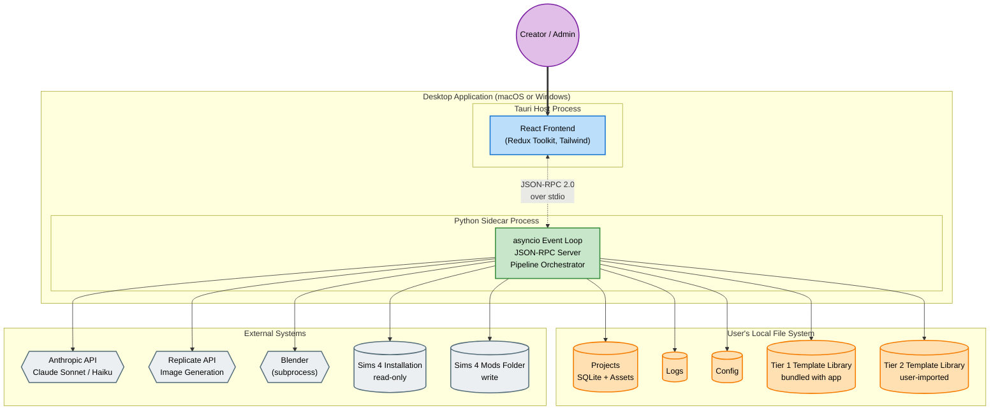
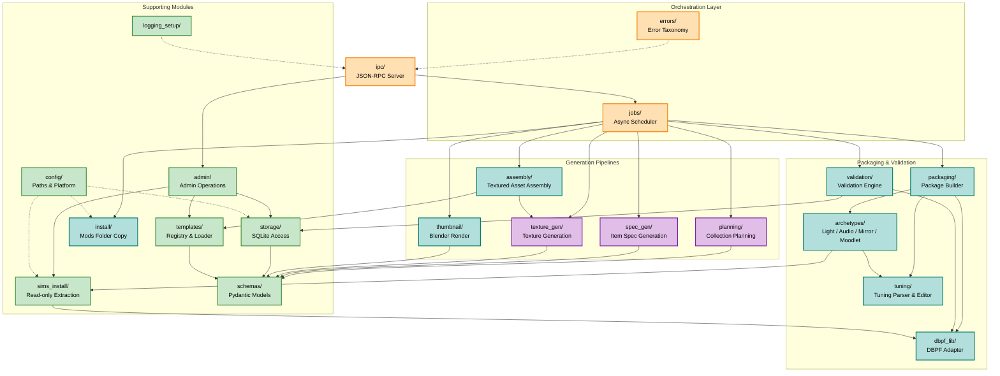
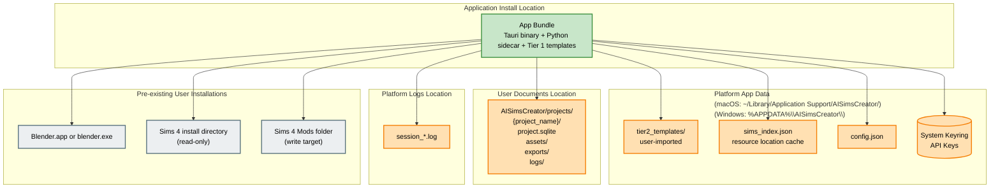

# Diagrams — System Architecture

> **Source:** `docs/MONOLITHIC/Architecture_Diagrams.md` · **Area:** Diagrams · **Sections:** §3

> Container diagram, sidecar internal components, frontend components, deployment topology.

---

## 3. System Architecture

### 3.1 Container Diagram

Top-level view: what processes exist, who talks to whom, and where data crosses process boundaries.

### 3.2 Sidecar Internal Component Diagram

Modules inside the Python sidecar and how they compose.

### 3.3 Frontend Component Diagram

React application structure, including Redux slices, screens, and the IPC client.

```mermaid
graph TB
    subgraph FrontendApp["React Frontend"]
        Router["React Router<br/>(memory mode)"]

        subgraph Store["Redux Store"]
            ProjectSlice["projectSlice"]
            GenSlice["generationSlice"]
            UISlice["uiSlice"]
            TemplatesSlice["templatesSlice"]
            ConfigSlice["configSlice"]
            LogsSlice["logsSlice"]
            ArchSlice["archetypesSlice"]
        end

        subgraph CreatorScreens["Creator Screens"]
            Home["HomeScreen"]
            NewProj["NewProjectWizard"]
            PlanReview["PlanReviewScreen"]
            Board["CollectionBoardScreen"]
            ItemDet["ItemDetailScreen"]
            FuncUpgr["FunctionalUpgradeWizard"]
            Export["ExportScreen"]
            Verify["VerificationScreen"]
        end

        subgraph AdminScreens["Admin Screens"]
            AdminGate["AdminModeGate"]
            AdminTpl["AdminTemplateBrowser"]
            AdminEdit["AdminTemplateEditor"]
            AdminImp["AdminMeshImporter"]
            AdminLog["AdminLogsViewer"]
            AdminJob["AdminJobHistory"]
            AdminRef["AdminReferenceBrowser"]
            AdminCfg["AdminConfigPanel"]
        end

        IPCClient["IPC Client<br/>request / subscribe"]
    end

    Router --> Home
    Router --> NewProj
    Router --> PlanReview
    Router --> Board
    Router --> ItemDet
    Router --> FuncUpgr
    Router --> Export
    Router --> Verify
    Router --> AdminGate
    AdminGate --> AdminTpl
    AdminGate --> AdminEdit
    AdminGate --> AdminImp
    AdminGate --> AdminLog
    AdminGate --> AdminJob
    AdminGate --> AdminRef
    AdminGate --> AdminCfg

    Home -.-> ProjectSlice
    NewProj -.-> ProjectSlice
    PlanReview -.-> ProjectSlice
    PlanReview -.-> GenSlice
    Board -.-> ProjectSlice
    Board -.-> GenSlice
    ItemDet -.-> ProjectSlice
    ItemDet -.-> GenSlice
    FuncUpgr -.-> ArchSlice
    Export -.-> ProjectSlice
    Verify -.-> ProjectSlice
    AdminTpl -.-> TemplatesSlice
    AdminLog -.-> LogsSlice
    AdminCfg -.-> ConfigSlice

    Store -.-> IPCClient
    IPCClient ==> Sidecar["Python Sidecar<br/>(JSON-RPC via stdio)"]

    classDef ui fill:#bbdefb,stroke:#1976d2,stroke-width:2px,color:#000
    classDef store fill:#ffe0b2,stroke:#f57c00,stroke-width:2px,color:#000
    classDef admin fill:#ffcdd2,stroke:#c62828,stroke-width:2px,color:#000
    classDef external fill:#eceff1,stroke:#546e7a,stroke-width:2px,color:#000

    class Home,NewProj,PlanReview,Board,ItemDet,FuncUpgr,Export,Verify,Router ui
    class AdminGate,AdminTpl,AdminEdit,AdminImp,AdminLog,AdminJob,AdminRef,AdminCfg admin
    class ProjectSlice,GenSlice,UISlice,TemplatesSlice,ConfigSlice,LogsSlice,ArchSlice store
    class IPCClient,Sidecar external
```

### 3.4 Deployment Topology

Where files live on the user's machine after installation.

---
