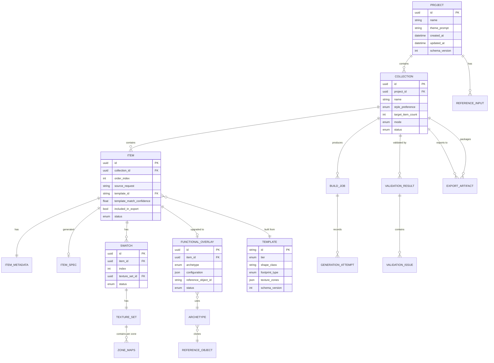
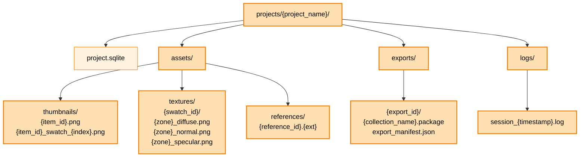

# Diagrams — Data Architecture

> **Source:** `docs/MONOLITHIC/Architecture_Diagrams.md` · **Area:** Diagrams · **Sections:** §4

> Core entity-relationship diagram and project folder layout tree.

---

## 4. Data Architecture

### 4.1 Core Entity Relationships

Entity-relationship view of the primary persisted domain model.

### 4.2 Project Folder Layout

Directory tree showing how a single project is stored on disk.

---
