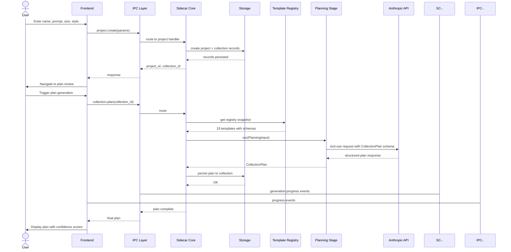
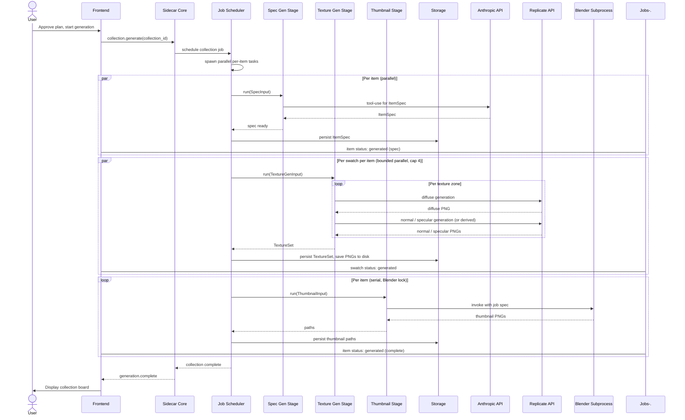
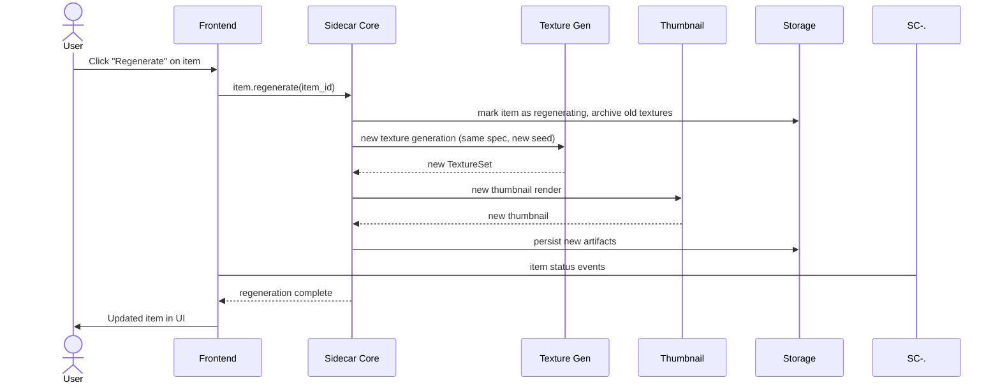
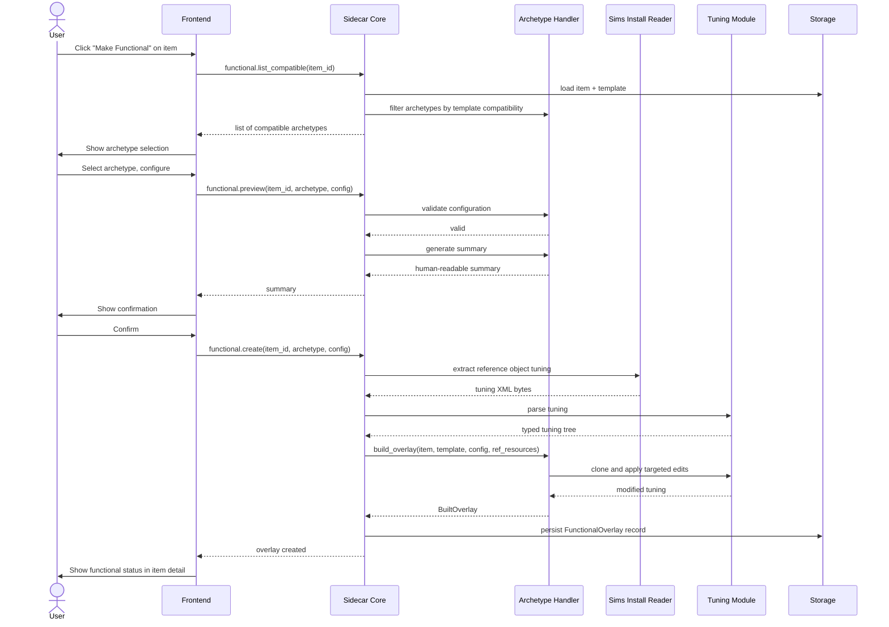
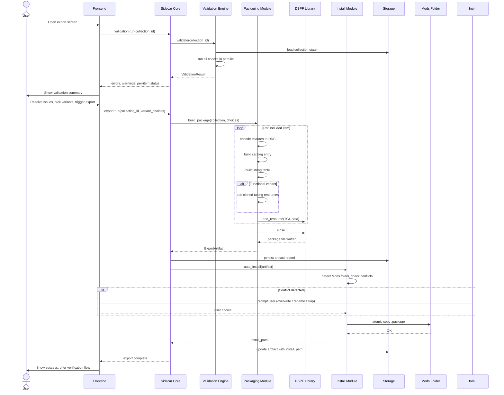
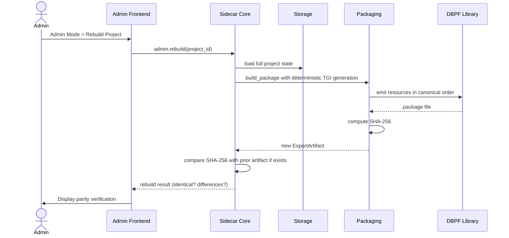
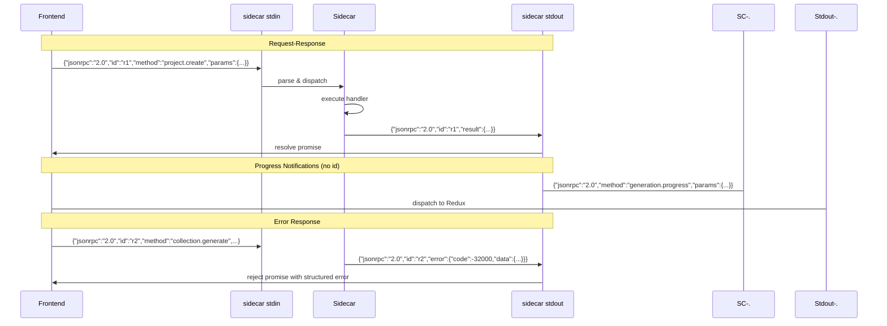

# Diagrams — Pipeline Sequence Diagrams

> **Source:** `docs/MONOLITHIC/Architecture_Diagrams.md` · **Area:** Diagrams · **Sections:** §5

> Project creation, collection generation, per-item regen, functional overlay, validation and export, deterministic rebuild, IPC message flow.

---

## 5. Pipeline Sequence Diagrams

### 5.1 Project Creation and Collection Planning

From the user entering a prompt to an approved plan ready for generation.

### 5.2 Collection Generation (Main Pipeline)

After plan approval, the full generation flow across all items and swatches.

### 5.3 Per-Item Regeneration

Isolated regeneration of a single item without affecting others.

### 5.4 Functional Overlay Creation

Upgrading a decor item to a functional object.

### 5.5 Validation and Export

From pre-export validation to auto-install.

### 5.6 Deterministic Rebuild

The admin-triggered rebuild pathway that produces byte-identical output.

### 5.7 IPC Message Flow

Request-response and notification pattern over stdio.

---
