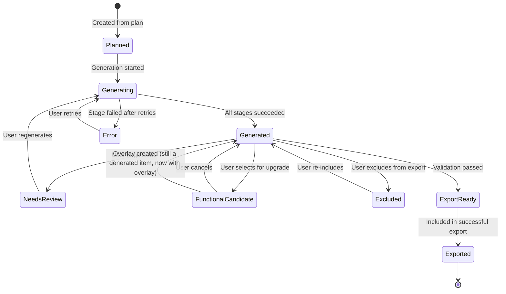
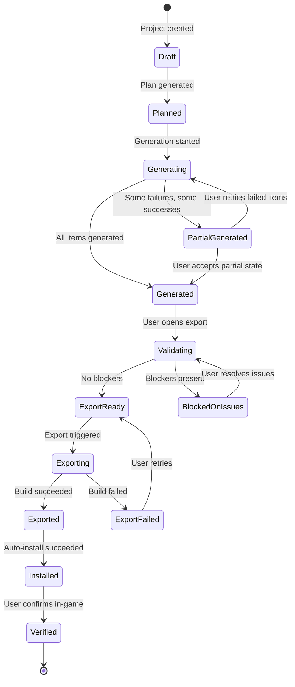
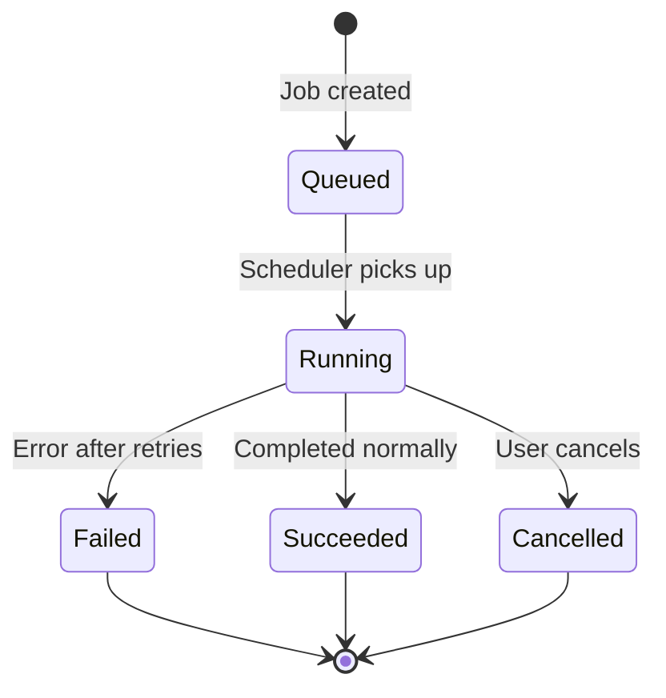
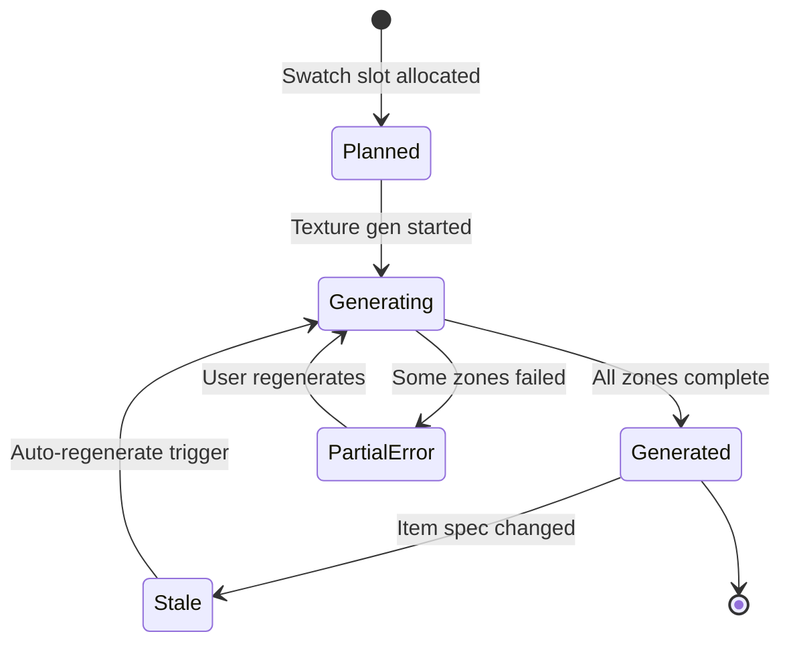
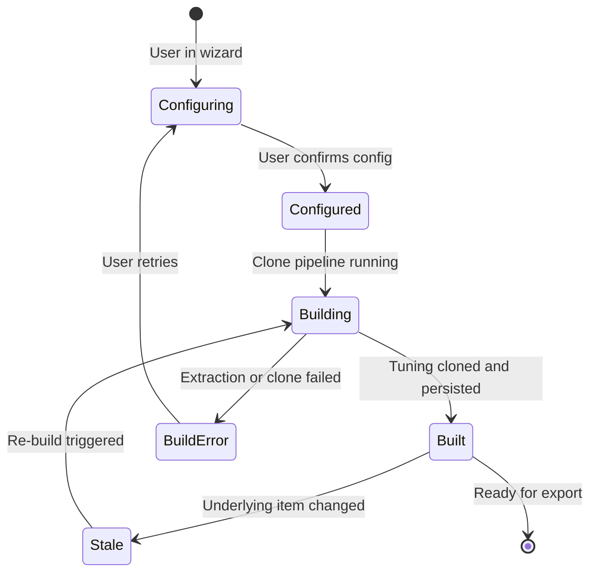

# Diagrams — State Machines

> **Source:** `docs/MONOLITHIC/Architecture_Diagrams.md` · **Area:** Diagrams · **Sections:** §6

> Item, Collection, BuildJob, Swatch, and FunctionalOverlay lifecycles.

---

## 6. State Machines

### 6.1 Item Lifecycle

Every `Item` transitions through a defined set of states.

### 6.2 Collection Lifecycle

### 6.3 BuildJob Lifecycle

### 6.4 Swatch Lifecycle

### 6.5 Functional Overlay Lifecycle

---
