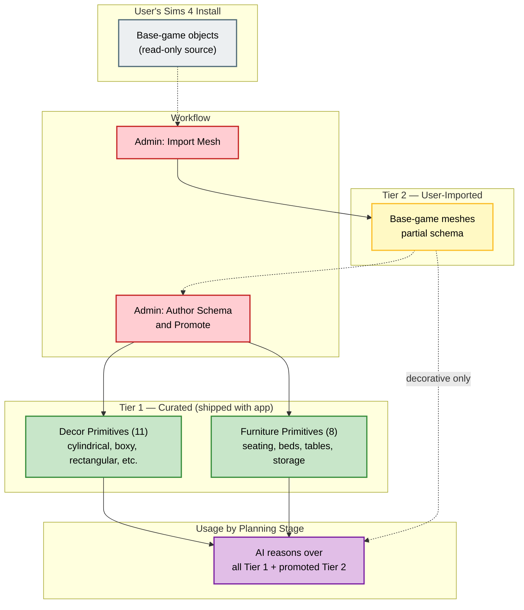
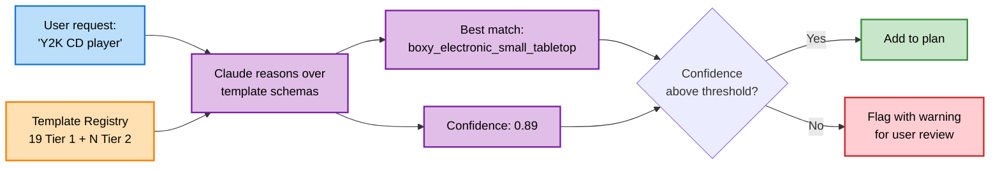

# Diagrams — Template Library Architecture

> **Source:** `docs/MONOLITHIC/Architecture_Diagrams.md` · **Area:** Diagrams · **Sections:** §7

> Tier structure and promotion flow, template resolution path.

---

## 7. Template Library Architecture

### 7.1 Tier Structure and Promotion Flow

How templates exist in two tiers and move between them.

### 7.2 Template Resolution Path

How the planning stage turns a user's request into a template choice.

---
