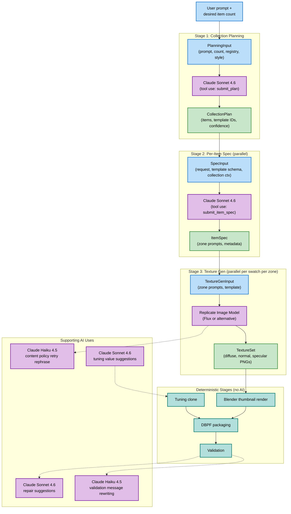
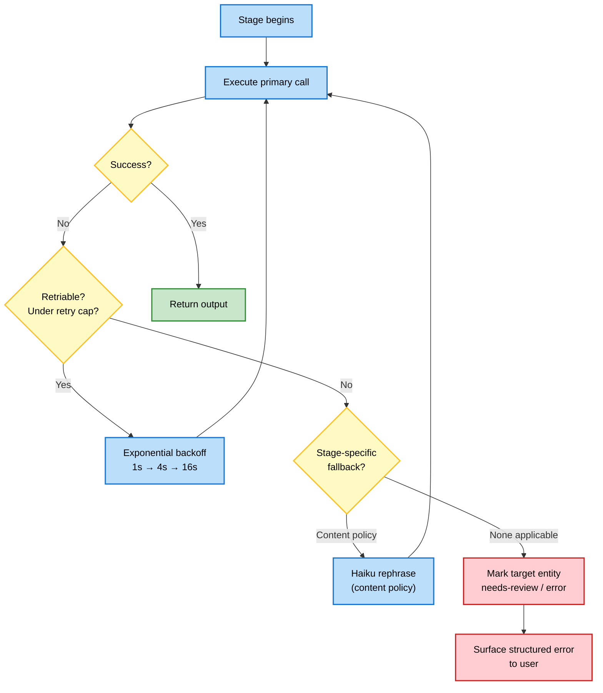

# Diagrams — AI Stage Orchestration

> **Source:** `docs/MONOLITHIC/Architecture_Diagrams.md` · **Area:** Diagrams · **Sections:** §8

> AI stage input/output overview and retry/failure handling.

---

## 8. AI Stage Orchestration

### 8.1 AI Stage Input / Output Overview

Where AI touches the system and what flows through each stage.

### 8.2 Retry and Failure Handling Per Stage

---
