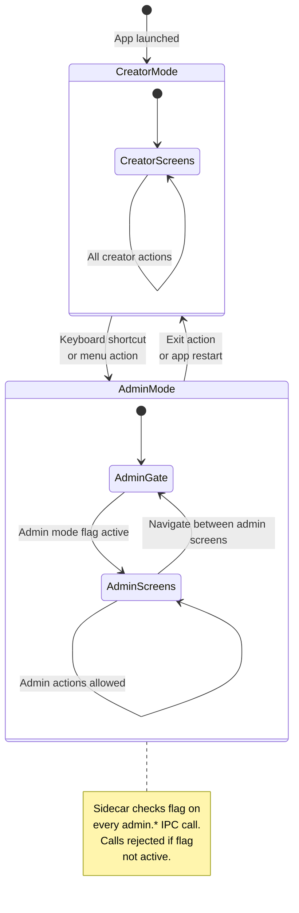

# Diagrams — Admin Mode Architecture

> **Source:** `docs/MONOLITHIC/Architecture_Diagrams.md` · **Area:** Diagrams · **Sections:** §9

> Admin mode access gating state diagram and admin operations inventory.

---

## 9. Admin Mode Architecture

### 9.1 Admin Mode Access Gating

How admin mode is entered and restricted.

### 9.2 Admin Mode Operations

```mermaid
graph TB
    AdminEntry["Admin Mode Entry<br/>⌘⇧A / Ctrl+Shift+A"]

    AdminEntry --> TplMgmt["Template Management"]
    AdminEntry --> Diag["Diagnostics"]
    AdminEntry --> Cfg["Configuration"]
    AdminEntry --> Ref["Reference Inspection"]

    TplMgmt --> Browse["Browse all templates<br/>(T1 and T2)"]
    TplMgmt --> Import["Import base-game mesh<br/>(creates T2)"]
    TplMgmt --> Promote["Author schema<br/>and promote T2 → T1"]
    TplMgmt --> Edit["Edit existing template<br/>metadata"]

    Diag --> Logs["View logs<br/>(filter by level, stage, item)"]
    Diag --> Jobs["Job history<br/>with artifacts"]
    Diag --> Rebuild["Deterministic rebuild<br/>project"]
    Diag --> Cost["Cost summary<br/>per session / project"]

    Cfg --> Paths["Path overrides<br/>(Sims, Mods, Blender)"]
    Cfg --> Models["Model selection<br/>overrides"]
    Cfg --> Policy["Retry policies"]
    Cfg --> Keys["API key management"]

    Ref --> BrowseRef["Browse base-game objects<br/>by category"]
    Ref --> InspectTun["Inspect reference<br/>tuning XML"]

    classDef entry fill:#ffcdd2,stroke:#c62828,stroke-width:2px,color:#000
    classDef group fill:#ffcdd2,stroke:#c62828,stroke-width:1px,color:#000
    classDef action fill:#f8bbd0,stroke:#c62828,stroke-width:1px,color:#000

    class AdminEntry entry
    class TplMgmt,Diag,Cfg,Ref group
    class Browse,Import,Promote,Edit,Logs,Jobs,Rebuild,Cost,Paths,Models,Policy,Keys,BrowseRef,InspectTun action
```

---
