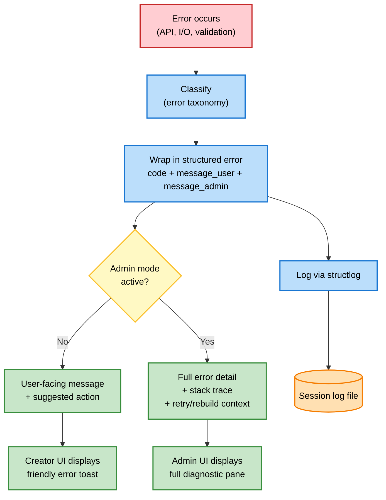

# Diagrams — Error Flow

> **Source:** `docs/MONOLITHIC/Architecture_Diagrams.md` · **Area:** Diagrams · **Sections:** §10

> Error propagation and messaging from failure to creator/admin UI.

---

## 10. Error Flow

### 10.1 Error Propagation and Messaging

How errors move from the point of failure to the user or admin.

---
