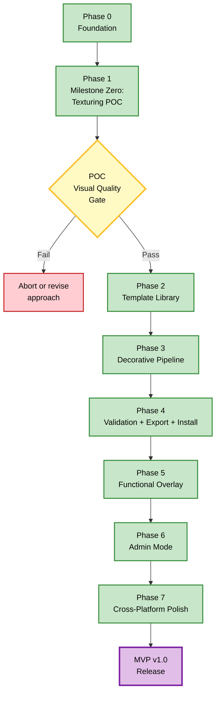
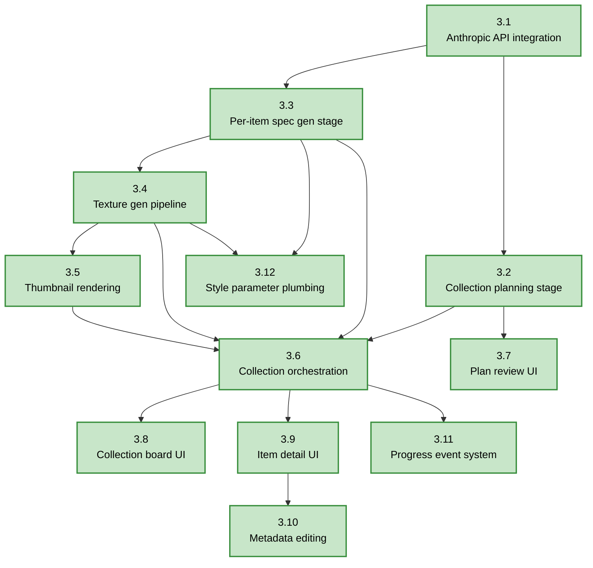

# Diagrams — MVP Phase Dependencies

> **Source:** `docs/MONOLITHIC/Architecture_Diagrams.md` · **Area:** Diagrams · **Sections:** §11

> Phase sequence and gates, and a representative intra-phase task dependency graph (Phase 3).

---

## 11. MVP Phase Dependencies

### 11.1 Phase Sequence and Gates

How the eight MVP phases depend on each other.

### 11.2 Task-to-Task Dependencies Within Critical Phase (Phase 3)

Detailed dependency graph for Phase 3 as a representative example of intra-phase structure.

---
