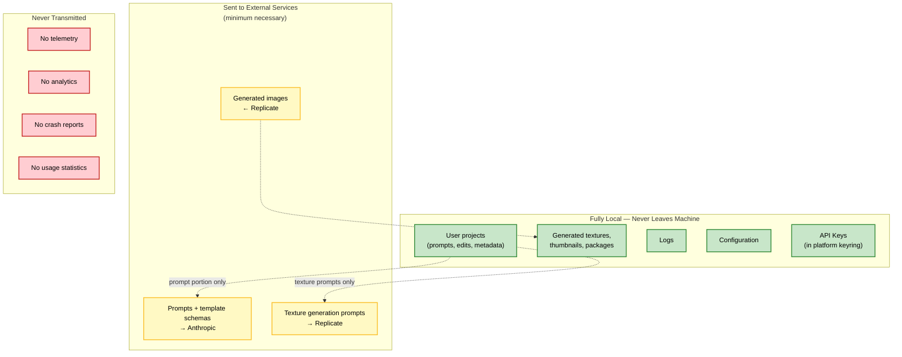
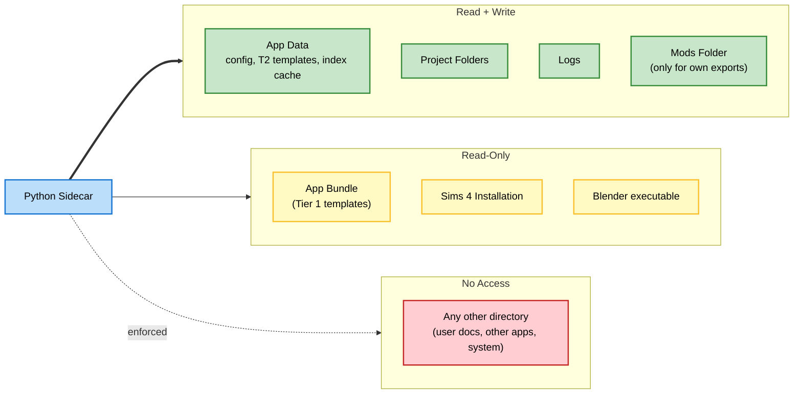

# Diagrams — Cross-Platform and Security Boundaries

> **Source:** `docs/MONOLITHIC/Architecture_Diagrams.md` · **Area:** Diagrams · **Sections:** §12, §13

> Cross-platform path resolution per OS, data trust boundaries, file system access permissions.

---

## 12. Cross-Platform Deployment

### 12.1 Path Resolution Per Platform

Side-by-side view of platform-specific paths.

```mermaid
graph TB
    subgraph Mac["macOS"]
        MacApp["App Data:<br/>~/Library/Application Support/AISimsCreator/"]
        MacLogs["Logs:<br/>~/Library/Logs/AISimsCreator/"]
        MacProj["Projects:<br/>~/Documents/AISimsCreator/projects/"]
        MacSims["Sims Install:<br/>/Applications/The Sims 4.app/"]
        MacMods["Mods Folder:<br/>~/Documents/Electronic Arts/The Sims 4/Mods/"]
        MacBlend["Blender:<br/>/Applications/Blender.app/"]
        MacKeychain[("Keychain<br/>API keys")]
    end

    subgraph Win["Windows"]
        WinApp["App Data:<br/>%APPDATA%\\AISimsCreator\\"]
        WinLogs["Logs:<br/>%APPDATA%\\AISimsCreator\\logs\\"]
        WinProj["Projects:<br/>%USERPROFILE%\\Documents\\AISimsCreator\\projects\\"]
        WinSims["Sims Install:<br/>via registry lookup"]
        WinMods["Mods Folder:<br/>%USERPROFILE%\\Documents\\Electronic Arts\\The Sims 4\\Mods\\"]
        WinBlend["Blender:<br/>C:\\Program Files\\Blender Foundation\\"]
        WinCred[("Credential Manager<br/>API keys")]
    end

    subgraph Shared["Shared Abstraction"]
        PathModule["config/paths.py<br/>returns correct paths per OS"]
        KeyringModule["keyring library<br/>platform-agnostic interface"]
    end

    PathModule --> MacApp
    PathModule --> MacLogs
    PathModule --> MacProj
    PathModule --> MacSims
    PathModule --> MacMods
    PathModule --> MacBlend
    PathModule --> WinApp
    PathModule --> WinLogs
    PathModule --> WinProj
    PathModule --> WinSims
    PathModule --> WinMods
    PathModule --> WinBlend

    KeyringModule --> MacKeychain
    KeyringModule --> WinCred

    classDef mac fill:#bbdefb,stroke:#1976d2,stroke-width:2px,color:#000
    classDef win fill:#c8e6c9,stroke:#388e3c,stroke-width:2px,color:#000
    classDef shared fill:#ffe0b2,stroke:#f57c00,stroke-width:2px,color:#000

    class MacApp,MacLogs,MacProj,MacSims,MacMods,MacBlend,MacKeychain mac
    class WinApp,WinLogs,WinProj,WinSims,WinMods,WinBlend,WinCred win
    class PathModule,KeyringModule shared
```

---

## 13. Security and Privacy Boundaries

### 13.1 Data Flow Across Trust Boundaries

Which data leaves the user's machine and under what circumstances.

### 13.2 File System Access Permissions

---
